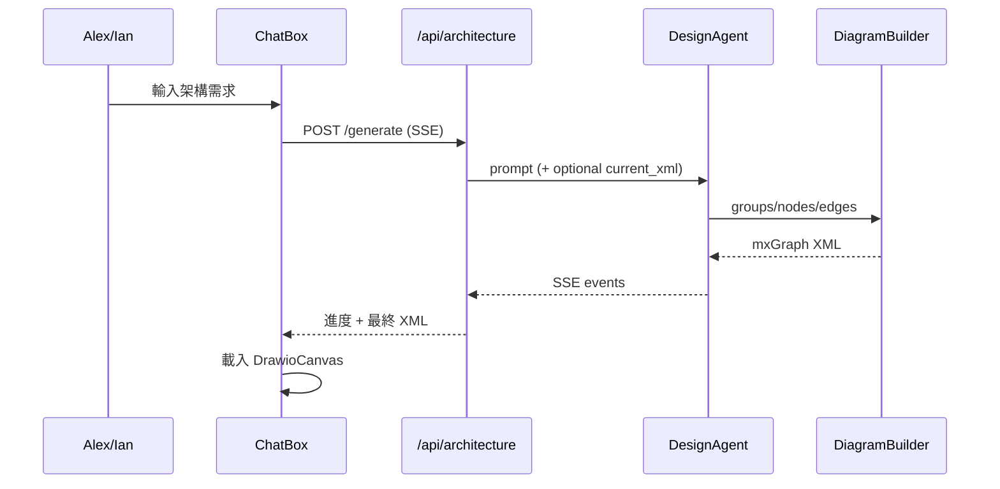

# A1 Business Logic Model — Flows & API

### 1. 自然語言產圖

### 2. API 契約

| Method | Path | 權限 | 說明 |
|---|---|---|---|
| POST | `/api/architecture/generate` | JWT + A1.edit | SSE：全量或局部（`current_xml`）產圖 |

### 3. 與現有程式對照

| 層 | 檔案 | 職責 |
|---|---|---|
| BE | `services/design_agent.py` | Agent SDK + OpenRouter |
| BE | `services/diagram_builder.py` | 座標／n8n icon／XML |
| BE | `services/agent_router.py` | JWT + SSE 適配 |
| BE | `prompts/aws_architecture_system_prompt.md` | system prompt |
| FE | `components/ChatBox.tsx` | 送出請求、吃 SSE |

### 4. 狀態（Construction）

Code done（Agent SDK Phase 1+2）；待手動 E2E。見 `a1/code/agent-sdk-summary.md`、`a1-core-gap-summary.md`。
