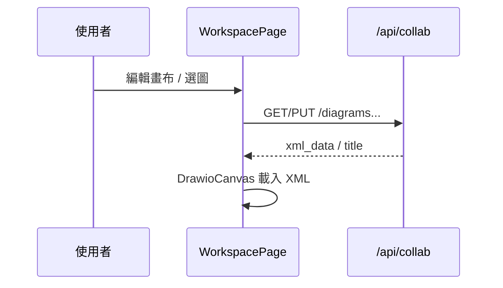

# A2 Business Logic Model — Flows & API

## 中文版

### 1. 儲存與切圖



### 2. AI 局部修改（跨 A1）

```text
WorkspacePage/ChatBox
  → POST /api/architecture/generate { prompt, current_xml }
  → SSE XML → 畫布更新 →（可選）PUT 存檔
```

### 3. API 契約（A2 擁有）

| Method | Path | 說明 |
|---|---|---|
| GET/POST | `/api/collab/diagrams` | 列表／建立 |
| GET/PUT/DELETE | `/api/collab/diagrams/{id}` | 讀／更新／刪 |
| （相關） | 改標題等 | 見 collab_router |

產圖 SSE 屬 A1；bootstrap／chat 屬 A4；share／WS 屬 A5。

### 4. 程式對照

| 層 | 檔案 |
|---|---|
| BE | `services/collab_router.py`（diagrams） |
| BE | `services/agent_router.py`（partial，A1） |
| FE | `WorkspacePage.tsx`、`DrawioCanvas.tsx`、`ChatBox.tsx` |

### 5. 狀態

核心完成；框選抽取、AI Undo 待補。見 `a2/code/canvas-editing-summary.md`。

---

## English Version

Diagram CRUD under `/api/collab/diagrams`; partial AI via A1 generate. Status and file map: see Chinese section.
