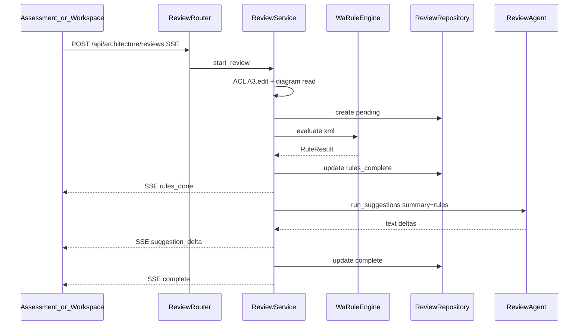

# A3 Business Logic Model — Flows & API

> Unit `U-A3` · Story A3 MVP


### 1. 主流程（AWS）



### 2. Agent 失敗／重試建議

```text
rules_done 已送出
  → Agent error
  → DB status=rules_only + error_message
  → SSE error
  → FE「重試建議」→ POST .../reviews/{id}/retry-suggestions (SSE)
  → 僅 ReviewAgent；成功 → complete
```

### 3. 非 AWS provider

```text
POST { provider: gcp|azure }
  → create ArchitectureReview status=unsupported
  → SSE unsupported（或 JSON 同步回）
  → 不呼叫 WaRuleEngine / ReviewAgent
```

### 4. API 契約

| Method | Path | 權限 | 說明 |
|---|---|---|---|
| POST | `/api/architecture/reviews` | A3.edit + diagram read | 發起；**SSE**（aws）或 unsupported 事件 |
| GET | `/api/architecture/reviews` | A3.view + diagram read | `?diagram_id=`；預設排除 archived |
| GET | `/api/architecture/reviews/{id}` | A3.view + diagram read | 詳情（含 archived） |
| POST | `/api/architecture/reviews/{id}/retry-suggestions` | A3.edit + diagram read | 僅 `rules_only`；SSE |

Query 選項（list）：`include_archived=true` 可選。

### 5. 規則包目錄（MVP 目標，Code Gen 實作）

約 15–20 條，示例碼（非完整清單）：

| code | pillar | 啟發式意圖 |
|---|---|---|
| `REL-SINGLE-AZ` | reliability | 單 AZ／無多 AZ 標註 |
| `REL-DB-NO-STANDBY` | reliability | DB 無備援／replica 標註 |
| `REL-NO-BACKUP` | reliability | 無 backup／snapshot 標註 |
| `SEC-PUBLIC-SG` | security | 安全組／0.0.0.0 公開樣式 |
| `SEC-NO-WAF` | security | 邊緣入口無 WAF |
| `SEC-NO-IAM-HINT` | security | 無 IAM／角色標註 |
| `COST-OVERSIZE-HINT` | cost_optimization | 明顯過大 instance 標籤 |
| `COST-NO-LIFECYCLE` | cost_optimization | 儲存無 lifecycle |
| `PERF-NO-CACHE` | performance_efficiency | 讀多路徑無 cache |
| `PERF-SINGLE-REGION-LAT` | performance_efficiency | 單一區域延遲風險標註 |
| `OE-NO-MONITOR` | operational_excellence | 無 CloudWatch／監控節點 |
| `OE-NO-ALARM` | operational_excellence | 無 alarm／pager 標註 |
| … | … | 補足至 15–20 |

### 6. 程式對照（目標）

| 層 | 目標檔／元件 |
|---|---|
| Router | `backend/services/review_router.py`（或掛 architecture 子路由） |
| Service | `review_service.py` |
| Rules | `wa_rule_engine.py` |
| Agent | `review_agent.py`（Agent SDK，對齊 `design_agent` 環境） |
| Model | `ArchitectureReview` in `models.py` |
| FE | `AssessmentPage`、Workspace CTA／按鈕、Sidebar |

### 7. 與其他 Unit

| Unit | 互動 |
|---|---|
| U-A2 | 讀 `xml_data`、diagram 列表 ACL |
| U-J | A3 RBAC、Pending 拒絕 |
| U-A1 | 產圖後 CTA；**不**呼叫 DesignAgent；同 SDK 家族 |
