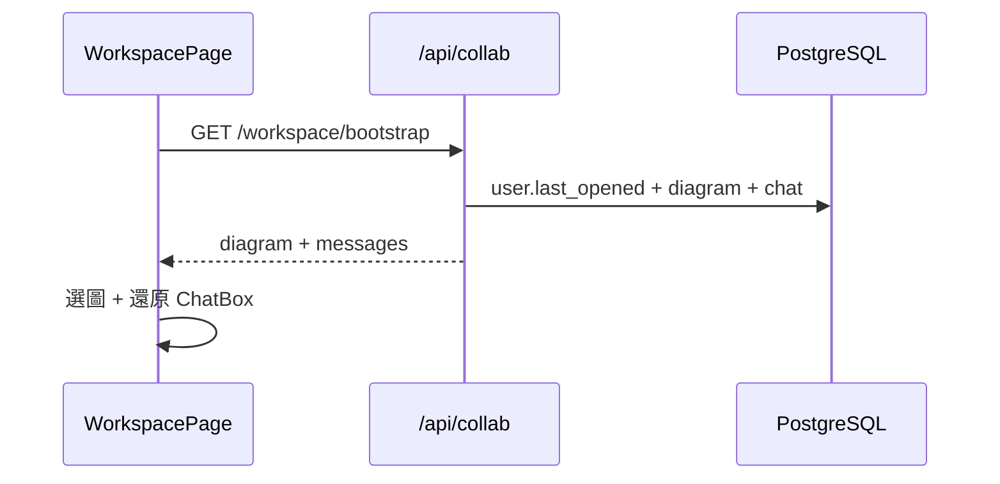

# A4 Business Logic Model — Flows & API

## 中文版

### 1. Bootstrap 還原

### 2. API 契約

| Method | Path | 說明 |
|---|---|---|
| GET | `/api/collab/workspace/bootstrap` | last_opened + diagram + messages |
| GET/PUT/DELETE | `/api/collab/diagrams/{id}/chat` | 讀／寫／清空聊天 |
| PUT | `/api/collab/workspace/last-opened` | 更新上次開啟圖 |

### 3. 程式對照

| 層 | 檔案 |
|---|---|
| BE | `models.UserDiagramChat`、`database._ensure_a4_schema`、`collab_router` |
| FE | `WorkspacePage` bootstrap／切圖／清空；`ChatBox`「清空對話」 |

### 4. 狀態

Code done；待手動 E2E。見 `a4/code/chat-persistence-summary.md`。

---

## English Version

Bootstrap restores last-opened diagram and chat; chat CRUD + last-opened endpoints under `/api/collab`. See Chinese for paths and ownership.
