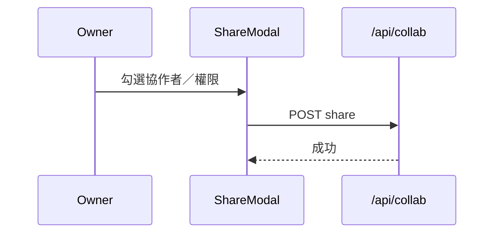
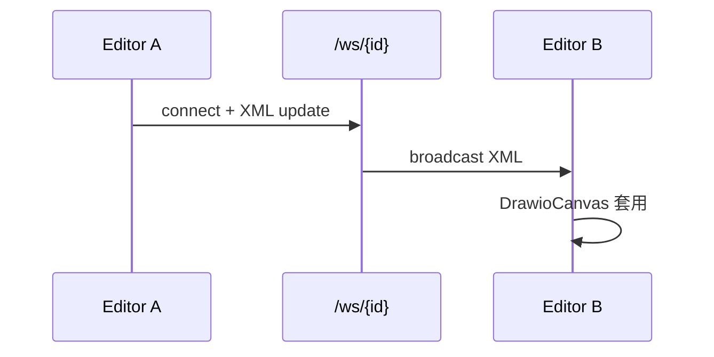

# A5 Business Logic Model — Flows & API

### 1. 分享

### 2. 即時共編

### 3. API 契約

| 類型 | Path | 說明 |
|---|---|---|
| REST | share 相關（`collab_router`） | 建立／查詢分享 |
| WS | `/api/collab/ws/{workspace_id}` | XML 廣播 |

### 4. 程式對照

| 層 | 檔案 |
|---|---|
| BE | `services/collab_router.py`（share、WS、ACL） |
| FE | `ShareModal.tsx`、`hooks/useCollaboration.ts`、`WorkspacePage` 狀態列 |

### 5. 狀態

分享＋XML 同步 ✅；游標 ❌；WS JWT ⏳。見 `a5/code/sharing-collab-summary.md`。
