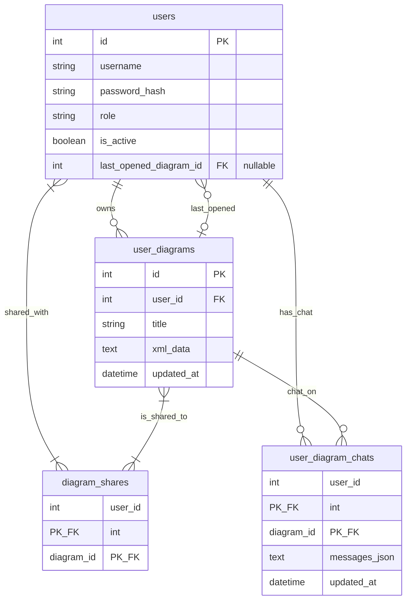

# Cloud-360 Database Schema (A2 Collaboration + A4 Chat Persistence)

## 中文版

本文件紀錄 A2（多份草稿儲存、精準權限分享）與 A4（user × diagram 聊天持久化、上次開啟圖）的資料庫 Schema。

### 1. 核心關聯圖 (ERD)

### 2. 資料表詳細說明

#### 2.1 `users`
身分驗證與角色；A4 新增 `last_opened_diagram_id`（可空 FK → `user_diagrams.id`，`ON DELETE SET NULL`）。

#### 2.2 `user_diagrams`
每張架構草稿：`id`、`user_id`（Owner）、`title`、`xml_data`、`updated_at`。僅 Owner 可覆寫與分享。

#### 2.3 `diagram_shares`
多對多分享：複合 PK `(user_id, diagram_id)`。

#### 2.4 `user_diagram_chats`（A4）
每位使用者在每張圖上的獨立聊天：複合 PK `(user_id, diagram_id)`；`messages_json` 存 `[{role, content}, ...]`；`updated_at`。

### 3. 權限與 API 重點

- 唯有 Owner 可分享：`POST /api/collab/diagrams/{id}/share`
- 讀寫圖／聊天：Owner 或 `diagram_shares` 成員，否則 403
- Bootstrap：`GET /api/collab/workspace/bootstrap` 還原 last_opened + 該圖 messages
- 清空聊天：`DELETE /api/collab/diagrams/{id}/chat`（不刪 XML）
- WebSocket：`/api/collab/ws/{diagramId}` 僅同步 XML

### 4. 對照實作

- ORM：`backend/models.py`（`User`、`UserDiagram`、`UserDiagramChat`）
- 啟動補 schema：`backend/database.py` → `_ensure_a4_schema()`
- 靜態 SQL：`schema.sql`

---

## English Version

Documents A2 (draft storage, share ACL) and A4 (chat keyed by user × diagram, last-opened diagram).

### 1. ERD

Same Mermaid diagram as Chinese §1.

### 2. Tables

- **users**: auth/roles; A4 adds nullable `last_opened_diagram_id` FK.
- **user_diagrams**: draft XML owned by `user_id`.
- **diagram_shares**: M2M share ACL.
- **user_diagram_chats**: per-user-per-diagram `messages_json` + `updated_at`.

### 3. Permissions / API

Owner-only share; owner or sharee for diagram/chat (else 403); bootstrap restores last-opened + messages; DELETE chat clears messages only; WebSocket syncs XML only.

### 4. Implementation

`backend/models.py`, `backend/database.py` (`_ensure_a4_schema`), `schema.sql`.
