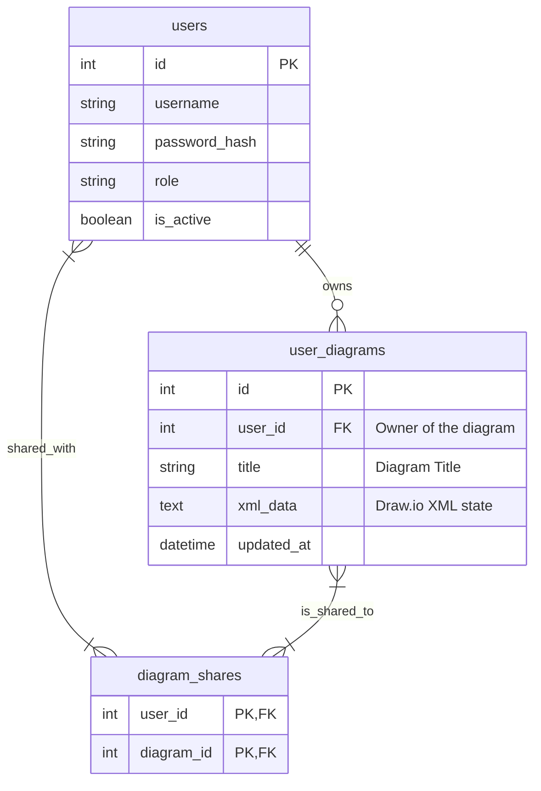

# Cloud-360 資料庫 Schema 設計文件 (A2 共同編輯與分享)

本文件紀錄為了達成 A2 (AI + draw.io 畫布協同編輯) 中「多份草稿儲存」與「精準權限分享」功能所設計的資料庫 Schema。

## 1. 核心關聯圖 (ERD)



## 2. 資料表詳細說明

### 2.1 `users` (使用者表)
系統原本的使用者資料表，用於身分驗證與角色權限管控。

### 2.2 `user_diagrams` (使用者架構圖表)
負責儲存每一張架構草稿的核心表。
- **id** `(Integer)`: 主鍵 (Primary Key)。
- **user_id** `(Integer)`: 外部鍵 (Foreign Key)，關聯至 `users.id`，代表此圖表的擁有者 (Owner)。只有 Owner 可以執行覆寫與權限分享。
- **title** `(String)`: 架構圖名稱，預設為「未命名架構圖」。
- **xml_data** `(Text)`: 存放 Draw.io 產出的原始 XML 資料，為畫布的完整狀態。
- **updated_at** `(DateTime)`: 最後修改時間，用於在前端列表排序。

### 2.3 `diagram_shares` (圖表分享權限關聯表)
用於實作多對多 (Many-to-Many) 分享機制的關聯表 (Association Table)。
- **user_id** `(Integer)`: 外部鍵 (Foreign Key)，關聯至 `users.id`，代表「被分享」的對象。
- **diagram_id** `(Integer)`: 外部鍵 (Foreign Key)，關聯至 `user_diagrams.id`，代表「被分享」的圖表。
- 複合主鍵 (`user_id`, `diagram_id`) 確保同一位使用者不會被重複分享同一張圖表。

## 3. SQLAlchemy 模型定義對照 (`backend/models.py`)

```python
diagram_shares = Table(
    "diagram_shares",
    Base.metadata,
    Column("user_id", Integer, ForeignKey("users.id"), primary_key=True),
    Column("diagram_id", Integer, ForeignKey("user_diagrams.id"), primary_key=True)
)

class UserDiagram(Base):
    __tablename__ = "user_diagrams"

    id = Column(Integer, primary_key=True, index=True)
    user_id = Column(Integer, ForeignKey("users.id"), nullable=False)
    title = Column(String, nullable=False, default="未命名架構圖")
    xml_data = Column(Text, nullable=False)
    updated_at = Column(DateTime(timezone=True), server_default=func.now(), onupdate=func.now())

    owner = relationship("User")
    shared_users = relationship("User", secondary=diagram_shares, backref="shared_diagrams")
```

## 4. 權限與 API 邏輯重點
- **唯有 Owner 可分享**：`/api/collab/diagrams/{id}/share` 限制只有 `diagram.user_id == current_user.id` 時才能新增 `shared_users`。
- **讀取與寫入權限**：在 `GET` 與 `PUT` 存取特定圖表時，檢查邏輯為 `if diagram.user_id != current_user.id and diagram not in current_user.shared_diagrams: raise 403`。
- **WebSocket 頻道隔離**：協作連線使用 `/api/collab/ws/{diagramId}` 作為 Channel ID，只有取得圖表讀寫權限並進入同一畫布的使用者，才會在 WebSocket 收到 XML 同步事件。
