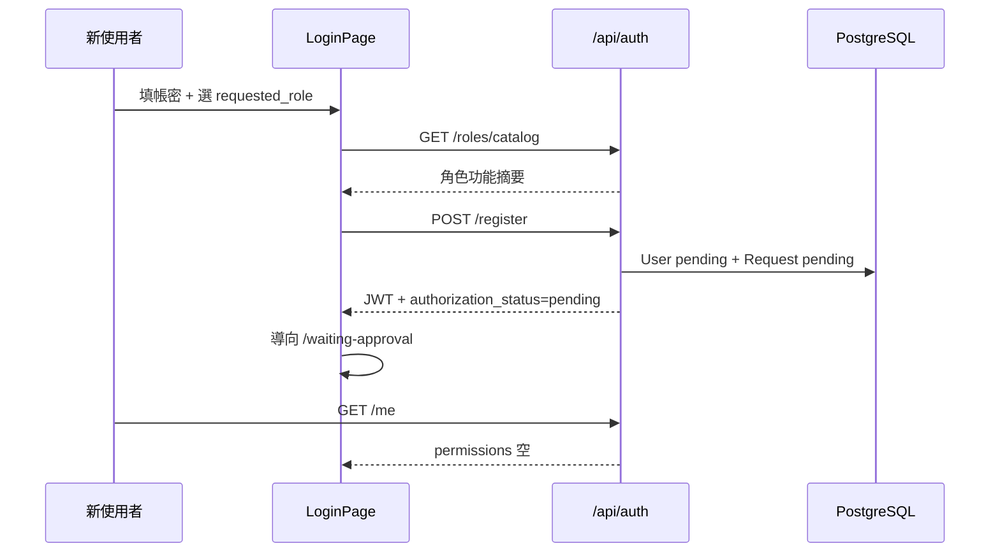
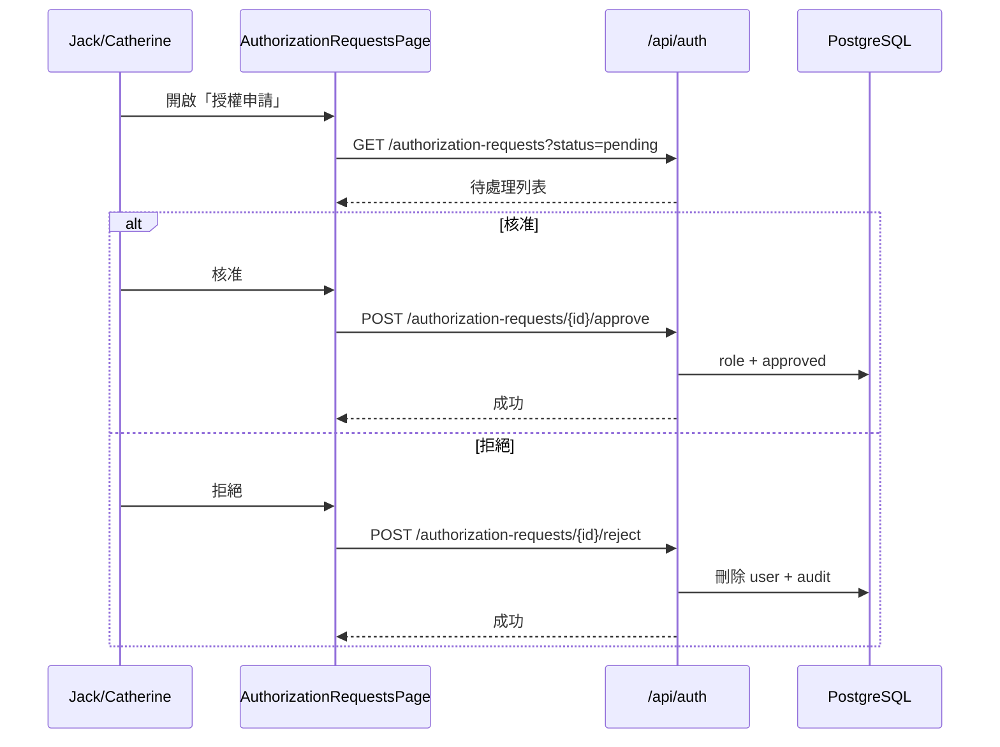

# J5 Business Logic Model — Flows & API

## 中文版

### 1. 註冊與等待授權



### 2. 管理員授權申請佇列（新增）



### 3. 使用者管理（停用 → 刪除）

```text
Admin 使用者設定頁
  ├─ 變更角色（僅 approved 使用者）
  ├─ 停用 → is_active=false
  └─ 刪除（僅 is_active=false 且無 owned diagrams）→ hard delete
```

### 4. API 契約（新增／變更）

| Method | Path | 權限 | 說明 |
|---|---|---|---|
| GET | `/api/auth/roles/catalog` | 公開或已登入 | 動態角色功能目錄（Q7=B） |
| POST | `/api/auth/register` | 公開 | **變更**：body 含 `requested_role`；pending 帳號 |
| GET | `/api/auth/me` | JWT | 含 `authorization_status`；pending 時 permissions 空 |
| PATCH | `/api/auth/me/authorization-request` | JWT + pending | 改選 `requested_role`（Q8=A） |
| GET | `/api/auth/authorization-requests` | J3a.view+ | 列表；`?status=pending` 預設 |
| POST | `/api/auth/authorization-requests/{id}/approve` | J3a.edit + BR-04 | 核准 |
| POST | `/api/auth/authorization-requests/{id}/reject` | J3a.edit + BR-04 | 拒絕＝刪帳號 |
| DELETE | `/api/auth/users/{id}` | J3a.edit + BR-06 | 硬刪（需已停用、無圖） |

既有 `/api/auth/list`、`PUT .../role` 保留；列表需顯示 `authorization_status`、pending 申請摘要。

### 5. 狀態機

```text
[Register] → User.pending + Request.pending
                │
    ┌───────────┼───────────┐
    │ PATCH     │ Approve   │ Reject
    │ requested │           │
    ▼           ▼           ▼
 Request     User.approved  User DELETED
 updated     + role set
```

### 6. 與現有程式對照

| 現況 | 目標 |
|---|---|
| `register` → `role=Developer` | pending + request |
| `AdminPage` 僅使用者列表 | + **授權申請** 頁／區塊 |
| 無 waiting 頁 | `WaitingApprovalPage` |
| 無 catalog API | `/roles/catalog` |

---

## English Version

Registration issues JWT with empty permissions and routes to `/waiting-approval`. Admins use a new **Authorization Requests** queue (`GET /authorization-requests`, approve/reject endpoints) visible from Admin navigation (BR-08). Deactivate-then-delete with diagram ownership guard. API table and state machine in Chinese section; implementation replaces current `/register` → `Developer` behavior.
