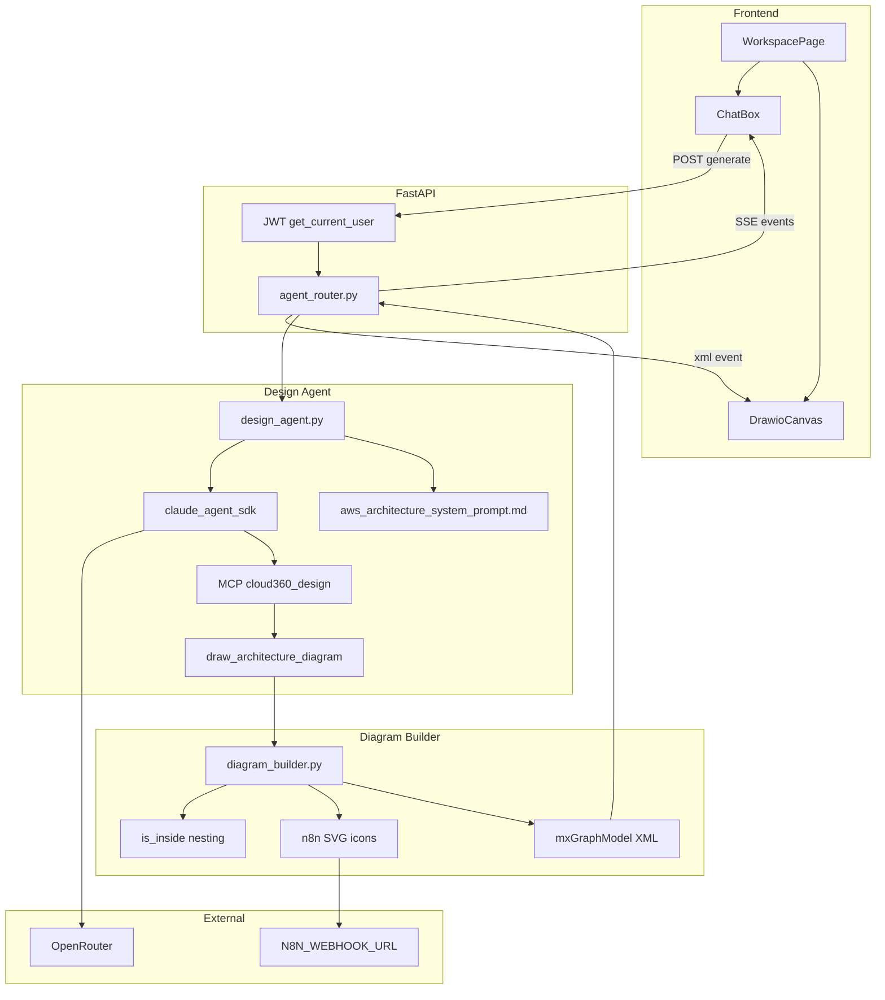
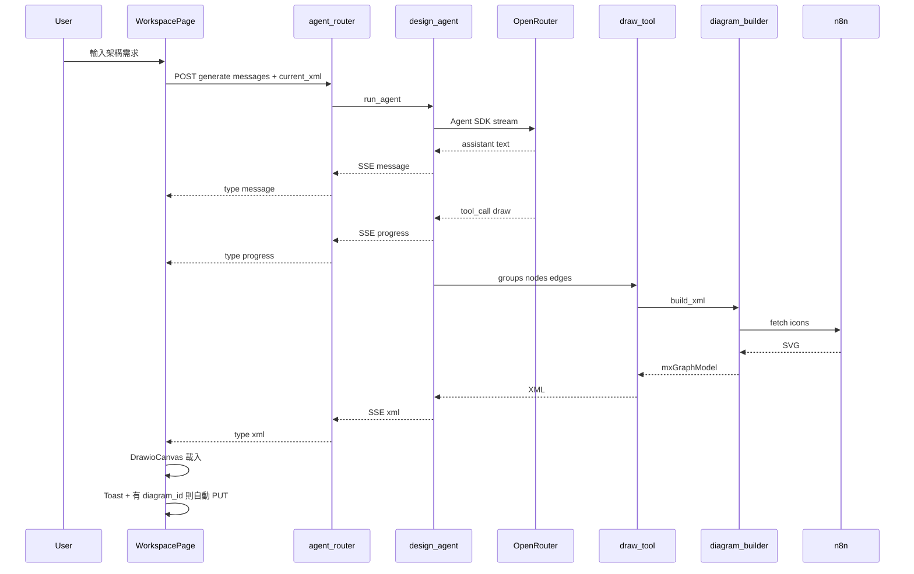
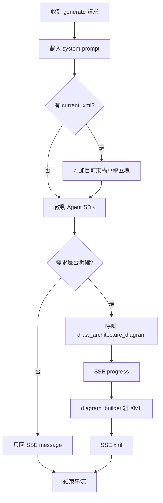

# A1 Code Generation Plan — Anthropic Agent SDK + OpenRouter + User Story Core

> Unit: A1  
> Branch: `luojingting/refactor/a1-agent-sdk-openrouter`  
> Status: **Phase 1 (Agent SDK) CODE DONE — Phase 2 (User Story Core) CODE DONE — awaiting manual E2E (Steps 6 & 8)**  
> Refs: [OpenRouter × Agent SDK](https://openrouter.ai/docs/guides/community/anthropic-agent-sdk) · [Custom Tools](https://code.claude.com/docs/en/agent-sdk/custom-tools)  
> Phase 2 decisions: Q1-A · Q2-B · Q3-A · Q4-A（見 `a1-core-gap-questions.md`；原 `a1-core-gap-fill-plan.md` 已合併至此）

### 1. 改動後結果（Target）

#### 1.1 系統元件圖



**文字版：**

```text
Frontend: WorkspacePage / ChatBox / DrawioCanvas
    |
    | POST /api/architecture/generate + JWT
    v
agent_router.py  ----SSE---->  message | progress | xml | error
    |
    v
design_agent.py
  - prompt: aws_architecture_system_prompt.md
  - runtime: claude-agent-sdk
  - LLM: OpenRouter (ANTHROPIC_BASE_URL + AUTH_TOKEN)
  - MCP: cloud360-design
  - tool: draw_architecture_diagram (groups/nodes/edges)
    |
    v
diagram_builder.py
  - is_inside 巢狀座標
  - n8n 取 SVG icon
  - 組 mxGraphModel XML
```

#### 1.2 請求時序（產圖成功）



**文字版：**

```text
1. User 輸入需求
2. FE POST /generate（messages + 可選 current_xml）
3. design_agent 經 OpenRouter 串流
4. 有文字 → SSE message
5. 呼叫 draw tool → SSE progress
6. diagram_builder + n8n → XML
7. SSE xml → draw.io 顯示
8. Toast「✔ 架構草圖已生成」；有 diagram_id → 自動 PUT XML + chat
```

#### 1.3 兩條執行路徑



**文字版：**

```text
路徑 A（對話）：需求不清 → 只 SSE message
路徑 B（產圖）：需求明確 → tool → progress → diagram_builder → SSE xml
局部修改：有 current_xml 時注入 prompt，再走路徑 B
```

#### 1.4 User Story A1 核心 UX（Phase 2 Target）

```text
產圖成功
  → Toast「✔ 架構草圖已生成」
  → 若已有 diagram_id：自動 PUT 存 XML + 寫 chat
  → 若尚無 diagram_id：不建檔，提示手動「儲存架構圖」
  → CTA stub：前往 IaC／Well-Architected（點擊 →「即將推出」）

產圖／對話失敗
  → 頂部紅框；若內容像區域／服務不相容 → 對齊「資源衝突…」文案
  → CTA stub：對話框重試提示／聯絡架構師（即將推出）

全部重置（新）
  → 確認後清空畫布 XML；一併重置對話為歡迎訊息
  → 有 diagram_id：PUT 空／最小 XML；可 DELETE chat
  → 與「清空對話」並存（後者只清 chat、保留圖）

產圖品質（prompt）
  → system prompt 補強：必辨 WAF/Aurora/HA 等關鍵字；
    明確需求時 groups 含 VPC/AZ/subnet、edges 表資料流
```

#### 1.5 模組職責

| 模組 | 職責 |
|---|---|
| `agent_router.py` | JWT、SSE 封裝、轉發 `design_agent` |
| `design_agent.py` | Agent SDK、OpenRouter、prompt、MCP tool 註冊、事件轉換 |
| `diagram_builder.py` | groups/nodes/edges → 巢狀 → n8n icon → `mxGraphModel` |
| `aws_architecture_system_prompt.md` | 架構師角色、關鍵字／座標指南、Partial Updates、VPC/AZ／連線規則 |
| `WorkspacePage` / `ChatBox` | SSE 消費；有 id 自動存；清空對話 vs 全部重置；成功／失敗 CTA stub |

#### 1.6 Tool 與 SSE 契約

**Tool：** `mcp__cloud360-design__draw_architecture_diagram`

| 參數 | 內容 |
|---|---|
| `groups` | id, name, type(`aws_cloud`/`vpc`/`az`/`public_subnet`/`private_subnet`), x, y, width, height |
| `nodes` | id, name, x, y |
| `edges` | source, target |

**SSE：**

| type | 時機 |
|---|---|
| `message` | LLM 文字回覆 |
| `progress` | 規劃中／取 icon |
| `xml` | 完整 `mxGraphModel` |
| `error` | 失敗 |

#### 1.7 約束

- 僅允許上述一個 draw tool（無 Bash / Read / Write / Edit）
- 不使用參考假圖 XML；局部修改僅注入畫布 `current_xml`
- 前端契約與 API path 不變：`POST /api/architecture/generate`
- 自動存檔僅在已有 `diagram_id` 時（無 id 不自動建檔）
- **程式註解（強制）**：新增／修改的 Python 模組須加繁中註解；變數名、API、程式碼本身維持英文。

### 2. 產出檔案

| 路徑 | 角色 | Phase |
|---|---|---|
| `backend/requirements.txt` | 含 `claude-agent-sdk` | 1 ✅ |
| `backend/.env.example` | OpenRouter × Agent SDK 變數 | 1 ✅ |
| `backend/prompts/aws_architecture_system_prompt.md` | system prompt（座標 + Phase 2 關鍵字／邊界） | 1 ✅ / 2 補強 |
| `backend/services/diagram_builder.py` | n8n + XML 組裝 | 1 ✅ |
| `backend/services/design_agent.py` | Agent SDK + MCP tool | 1 ✅ |
| `backend/services/agent_router.py` | SSE 適配層 → design_agent | 1 ✅ |
| `backend/main.py` | 啟動時映射 OpenRouter env | 1 ✅ |
| `frontend/src/pages/WorkspacePage.tsx` | 自動存、全部重置、CTA stub | 2 |
| `frontend/src/components/ChatBox.tsx` | 清空對話；全部重置入口（若需要） | 2 |
| `aidlc-docs/construction/a1/code/agent-sdk-summary.md` | Phase 1 雙語摘要 | 1 ✅ |
| `aidlc-docs/construction/a1/code/a1-core-gap-summary.md` | Phase 2 雙語摘要 | 2 |

### 3. 執行步驟

#### Phase 1 — Agent SDK（已完成）

##### Step 1 — 依賴與環境
- [x] 1.1 加入 `claude-agent-sdk`（Python ≥ 3.10）
- [x] 1.2 `.env.example`：OpenRouter × Agent SDK 變數
- [x] 1.3 啟動時：`OPENROUTER_API_KEY` → `ANTHROPIC_AUTH_TOKEN`；`ANTHROPIC_API_KEY=""`

##### Step 2 — Prompt 與產圖模組
- [x] 2.1 建立 `aws_architecture_system_prompt.md`
- [x] 2.2 建立 `diagram_builder.py`
- [x] 2.3 模組／函式加繁中註解

##### Step 3 — Design Agent
- [x] 3.1 建立 `design_agent.py`
- [x] 3.2 MCP server `cloud360-design` + tool `draw_architecture_diagram`
- [x] 3.3 tool handler → `diagram_builder` → XML
- [x] 3.4 `allowed_tools` 僅 draw tool
- [x] 3.5 支援 `messages[]` + 可選 `current_xml`
- [x] 3.6 async generator 輸出四種事件
- [x] 3.7 加繁中註解

##### Step 4 — Router
- [x] 4.1 `/generate` 轉發 design_agent，維持 SSE 與 JWT
- [x] 4.2 適配層加繁中註解

##### Step 5 — 文件
- [x] 5.1 `agent-sdk-summary.md`（雙語）
- [x] 5.2 更新 `aidlc-state.md`、`audit.md`、本 plan checkbox

##### Step 6 — Phase 1 驗收（需使用者手動）
- [ ] 6.1 對話可回文字；明確需求可產圖
- [ ] 6.2 XML 含 groups / nodes（icon）/ orthogonal edges
- [ ] 6.3 `current_xml` 局部修改可用
- [ ] 6.4 A2 存檔／分享／WS 正常
- [ ] 6.5 無 Bash 等內建危險 tool

#### Phase 2 — User Story A1 核心補齊（已實作）

##### Step 7 — Prompt 與前端核心 UX
- [x] 7.1 Prompt：關鍵字識別（WAF／Aurora／HA）+ VPC/AZ／連線／資料流硬性指引  
- [x] 7.2 WorkspacePage：有 `diagram_id` 時產圖成功自動 PUT；無 id 僅 Toast + 手動存提示  
- [x] 7.3 「全部重置」確認流程（清 XML + 歡迎訊息；有 id 則寫回 DB／清 chat）；與「清空對話」並存  
- [x] 7.4 成功／失敗 Toast 文案對齊 Story；CTA 按鈕 stub「即將推出」  
- [x] 7.5 `a1-core-gap-summary.md` + audit／state  

##### Step 8 — Phase 2 驗收
- [ ] 8.1 已存檔圖：產圖後重整，XML 已更新（自動存）  
- [ ] 8.2 未存檔圖：產圖後有 Toast，清單無新圖，需手動存  
- [ ] 8.3 清空對話 ≠ 全部重置（前者留圖，後者清圖）  
- [ ] 8.4 CTA 點擊僅「即將推出」  
- [ ] 8.5 明確提 WAF／Multi-AZ 時，產圖傾向含對應節點與 AZ 框架（LLM 行為）

### 4. 風險與 Rollback

| 風險 | 緩解 |
|---|---|
| OpenRouter env 錯誤 | 啟動強制映射；`ANTHROPIC_API_KEY=""` |
| Tool 未觸發 | schema + system prompt 要求需求明確才呼叫 |
| SSE 不相容 | 固定四種 event type |
| 部署 SDK runtime | Python ≥ 3.10；失敗則 `git switch ut` |
| 自動 PUT 覆寫未存手動編輯 | 僅在 SSE `xml` 成功後寫入剛產出的 XML |
| 全部重置誤刪 | `window.confirm`；不清其他 diagram |
| Stub CTA 誤導 | 文案標「即將推出」 |

Rollback：Phase 1 切回 `ut` / revert；Phase 2 單獨 revert 前端／prompt 變更即可。

### 5. 範圍外

- 參考假圖 XML、多 Agent Routing、MCP Registry UI、Azure／Bedrock  
- A2 Undo／游標、多角色留言／Ian 協作  
- 真 IaC／Well-Architected 頁（A3／D）  
- Mermaid／PlantUML、內部 JSON metadata（SRS 全文）  
- 無 `diagram_id` 時自動建檔（Q2-B）

### 6. 批准

**Phase 1（Agent SDK）**：已批准並完成 Code Generation（Step 1–5）；Step 6 手動驗收仍開放。

**Phase 2（User Story 核心）**：已批准並完成 Code Generation（Step 7）；Step 8 手動驗收仍開放。

- ~~**A)** 批准並執行 Step 7–8~~（已執行）  
- **B)** 修改 plan（若驗收後需調整）  
- **C)** 取消
