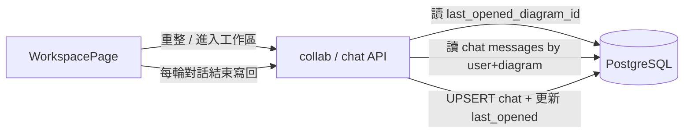

# A4 Code Generation Plan — Chat Persistence (User × Diagram)

> Unit: A4（重整後仍記得對話與上次開啟的架構圖）  
> Branch: `luojingting/refactor/a1-agent-sdk-openrouter`（或另開 feat 分支）  
> Status: **APPROVED & IMPLEMENTED** — 待手動驗收 Step 5  
> Decisions: 1-D 後端 DB（user × diagram）· 2-C 聊天 + 自動選上次圖 · 3-A 先 Story/plan  

## 中文版

### 1. 改動後結果（Target）



**文字版：**

```text
進入工作區 / 重整
  → GET 使用者偏好（last_opened_diagram_id）
  → 自動選該圖、載入 XML
  → GET 該 user×diagram 的 messages[]
  → 還原 ChatBox

每輪對話結束（user + assistant）
  → PUT/POST 儲存 messages[]
  → 更新 last_opened_diagram_id
```

### 2. 資料模型（改動後）

| 表 / 欄位 | 說明 |
|---|---|
| `user_diagram_chats` | PK `(user_id, diagram_id)`；`messages_json` TEXT/JSONB；`updated_at` |
| `users.last_opened_diagram_id` | 可空 FK → `user_diagrams.id`；記錄上次開啟的圖 |

權限：僅 owner 或 `diagram_shares` 內使用者可讀寫該圖聊天。

### 3. API（改動後）

| Method | Path | 說明 |
|---|---|---|
| GET | `/api/collab/workspace/bootstrap` | 回傳 `last_opened_diagram_id`、可選 diagram 摘要、該圖 `messages` |
| GET | `/api/collab/diagrams/{id}/chat` | 取得該圖聊天 |
| PUT | `/api/collab/diagrams/{id}/chat` | 覆寫儲存 `messages[]` |
| DELETE | `/api/collab/diagrams/{id}/chat` | **清空該圖聊天**（不刪圖、不改 XML） |
| PUT | `/api/collab/workspace/last-opened` | body: `{ diagram_id }` |

（可合併 bootstrap，減少 round-trip。）

### 4. 前端行為（改動後）

- 進入 `/workspace`：呼叫 bootstrap → 設 `currentDiagramId`、`xml`、`messages`
- 切換下拉圖表：載入該圖 chat；更新 last-opened
- `handleGenerate` 一輪結束後：PUT chat
- 「新增圖表」：空 messages（歡迎訊息）+ 建立後綁定 diagram_id
- **「清空對話」按鈕**：二次確認 → `DELETE .../chat` → 本地 messages 重設為歡迎訊息；**不**清除畫布 XML / diagram 紀錄

### 5. 產出檔案

| 路徑 | 動作 |
|---|---|
| `backend/models.py` | 新增 `UserDiagramChat`；`User.last_opened_diagram_id` |
| `schema.sql` / migration 說明 | 新表與欄位 |
| `backend/services/collab_router.py` | chat + bootstrap + last-opened API |
| `frontend/src/pages/WorkspacePage.tsx` | 還原／持久化邏輯 |
| `aidlc-docs/construction/database-schema.md` | 補 ERD（需雙語） |
| `aidlc-docs/construction/a4/code/chat-persistence-summary.md` | 雙語摘要 |

### 6. 執行步驟

- [x] 1. DB model + schema
- [x] 2. API：bootstrap / get chat / put chat / **delete chat** / last-opened（含 403）
- [x] 3. WorkspacePage：進入還原、切圖載入、對話後寫回、**清空對話按鈕 + 確認**
- [x] 4. 文件與 audit / state
- [ ] 5. 驗收：重整後同圖同聊天；換圖聊天隔離；清空只清聊天不清圖；無權限 403

### 7. 風險與 Rollback

| 風險 | 緩解 |
|---|---|
| messages 過大 | 限制輪數或字元上限（例如最近 50 輪） |
| 未存檔圖（無 diagram_id） | 僅記憶體；首次「儲存架構圖」後才持久化聊天，或先建空圖 |
| schema 變更 | migration；rollback 刪表／欄位 |

### 8. 範圍外

localStorage 方案、跨使用者共用同一聊天串、A2 Undo／游標。

### 9. 批准

- **A)** 批准並執行  
- **B)** 修改 plan  
- **C)** 取消  

---

## English Version

### 1. Target

Persist chat in DB keyed by **user × diagram**; on workspace entry/refresh, auto-open **last-opened diagram** and restore its `messages[]`. See Mermaid/text flow in Chinese §1.

### 2–4. Model, API, Frontend

Same as Chinese: `user_diagram_chats`, `users.last_opened_diagram_id`, bootstrap/chat/last-opened endpoints including **DELETE chat**, WorkspacePage restore + save-after-turn + **Clear chat button**.

### 5–8. Files, Steps, Risk, Out of Scope

Same as Chinese sections.

### 9. Approval

**A)** Approve and execute · **B)** Change plan · **C)** Cancel  
