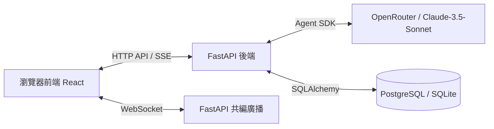

# Cloud-360 前後端技術規格文件 (Frontend & Backend Technical Specification)

> 本文件為 Cloud-360 專案之前後端架構與介面規格定義，採用繁體中文撰寫，提供開發者與 Agent 遵循之規範。

---

## 1. 系統架構簡介

Cloud-360 是一個智慧型雲端架構設計與協同平台，旨在透過 AI Agent 協助架構師、開發人員與 SRE 快速設計雲端架構圖（基於 draw.io XML 格式），同時整合企業級 RBAC 權限控管與多人即時共編機制。

系統採用前後端分離架構：
- **前端 (Frontend)**：單頁應用程式 (SPA)，負責畫布呈現、即時對話、使用者權限控制與多人協作狀態展示。
- **後端 (Backend)**：提供 Web API、WebSocket 即時通訊與 SSE 串流服務，並整合 `claude-agent-sdk` 與 MCP 伺服器，執行 AI 架構生成與修改。



---

## 2. 前端規格定義 (Frontend Specification)

### 2.1 技術選型
- **核心框架**：React 19.2+ (以 Vite 8.0+ 建置)
- **程式語言**：TypeScript 6.0+
- **樣式庫**：TailwindCSS v4.3+ (採用 Vanilla CSS + PostCSS 插件)
- **路由導覽**：React Router DOM v6.22+

### 2.2 主要目錄結構
```text
frontend/src/
├── assets/          # 靜態資源（圖片、圖示）
├── components/      # 共用與核心組件
│   ├── ChatBox.tsx       # AI 對話與串流回應組件
│   ├── DrawioCanvas.tsx  # draw.io 畫布渲染與互動組件
│   ├── Layout.tsx        # 系統框架外觀與導覽列
│   ├── RouteGuard.tsx    # 路由權限守衛
│   ├── ShareModal.tsx    # 架構圖分享 Modal
│   └── Sidebar.tsx       # 側邊欄導覽
├── config/          # 全局配置（如 api.ts）
├── context/         # 全局狀態管理
│   └── AuthContext.tsx   # 身份驗證與 Story 權限 Context
├── hooks/           # 自定義 React Hooks
├── pages/           # 頁面級組件
│   ├── AdminPage.tsx          # 使用者帳號管理頁
│   ├── ForbiddenPage.tsx      # 403 權限不足頁面
│   ├── LoginPage.tsx          # 系統登入頁面
│   ├── RolePermissionsPage.tsx# RBAC Story 權限矩陣設定頁
│   └── WorkspacePage.tsx      # 設計工作區（主畫布 + AI 聊天室）
├── App.tsx          # 路由配置與全局 Provider
└── main.tsx         # 應用程式入口
```

### 2.3 狀態與安全管理

#### 2.3.1 身份驗證與權限上下文 (AuthContext)
前端透過 [AuthContext.tsx](file:///Users/houguanyu/Desktop/Work/Cathaybk/Opendiamonds/cloud-360/frontend/src/context/AuthContext.tsx) 統一管理登入狀態與權限判斷：
- **Token 持久化**：登入成功後，將 `token`、`username` 與 `role` 儲存於 `localStorage` 中。
- **權限緩存與更新**：初始化或重整時，呼叫後端 `/api/auth/me` 取得最新權限矩陣並存於 React state。
- **權限判斷函式**：
  - `can(storyId, action)`：檢查目前使用者角色對於特定 `storyId` 是否具有 `view`、`edit` 或 `review` 權限。
  - `canArch(action)`：架構圖專屬權限檢查（系統將 `A1`、`A2`、`A4` 的權限統一以 `A1` 為基準判定）。

#### 2.3.2 路由守衛 (RouteGuard)
使用 [RouteGuard.tsx](file:///Users/houguanyu/Desktop/Work/Cathaybk/Opendiamonds/cloud-360/frontend/src/components/RouteGuard.tsx) 包裝受保護路由。若使用者未登入，重新導向至 `/login`；若登入但無該頁面對應之 Story 權限，則導向至 `/forbidden` 頁面。

### 2.4 核心組件設計

#### 2.4.1 WorkspacePage (工作區)
- **雙欄佈局**：左側為 `DrawioCanvas`（佔主要寬度），右側為 `ChatBox`（對話面板）。
- **初始化引導 (Bootstrap)**：進入頁面時呼叫後端 `/api/collab/workspace/bootstrap` 一次性載入上次開啟的架構圖（XML）與歷史對話。

#### 2.4.2 DrawioCanvas (架構圖畫布)
- **draw.io 整合**：利用 `<iframe>` 載入 draw.io 編輯器，透過 `window.postMessage` 實現雙向通訊。
- **即時共編 (WebSocket)**：開啟 WebSocket 連接至 `/api/collab/ws/{workspace_id}`，當畫布變動時發送 XML 更新事件，並接收其他協同者的 XML 即時同步呈現。

#### 2.4.3 ChatBox (AI 對話框)
- **SSE 串流接收**：送出對話後，透過 `fetch` 串流讀取 `/api/architecture/generate` 回傳之 `text/event-stream`。
- **事件解析與更新**：
  - `progress` 事件：更新 AI 處理狀態與進度文字。
  - `message` 事件：累加呈現 AI 回覆之 Markdown 文字。
  - `xml` 事件：自動載入 AI 所產出的新架構圖 XML 至 `DrawioCanvas` 中。
  - `error` 事件：呈現錯誤提示。

---

## 3. 後端規格定義 (Backend Specification)

### 3.1 技術選型
- **核心框架**：FastAPI
- **資料庫 ORM**：SQLAlchemy
- **資料驗證**：Pydantic
- **非同步支援**：FastAPI WebSocket, SSE (StreamingResponse)

### 3.2 資料庫 ORM 模型 (Database Models)
核心資料表對應於 [models.py](file:///Users/houguanyu/Desktop/Work/Cathaybk/Opendiamonds/cloud-360/backend/models.py)：

1. **`User` (使用者資料表)**：
   - 記錄使用者帳密 Hash、啟動狀態與目前角色 (`role`)。
   - 透過 `last_opened_diagram_id` 記錄使用者最後一次在工作區開啟的架構圖，以利還原工作狀態。
2. **`UserDiagram` (架構圖資料表)**：
   - 儲存擁有者、架構圖標題、以及 mxGraph XML 內容。
   - 關聯 `shared_users` (多對多)，記錄此架構圖分享給哪些使用者。
3. **`UserDiagramChat` (架構圖對話歷史表)**：
   - 實現 A4 架構圖對話持久化，鍵值為複合主鍵 `(user_id, diagram_id)`。
   - 以 `messages_json` (Text 欄位) 儲存單一用戶於該張架構圖下的歷史對話（格式為 `[{role, content}]`，最大保留 100 輪）。
4. **`RolePermission` (角色權限矩陣表)**：
   - 記錄 `role` 與 `story_id` 對應之 `can_view`、`can_edit`、`can_review` 權限旗標。

### 3.3 基於 Story 的 RBAC 權限管理
- 實作於 [rbac.py](file:///Users/houguanyu/Desktop/Work/Cathaybk/Opendiamonds/cloud-360/backend/services/rbac.py)。
- **權限判定邏輯**：
  - `view` 權限：只要 `can_view`、`can_edit` 或 `can_review` 任一為 `True` 即視為可檢視。
  - `edit` 權限：必須 `can_edit` 為 `True`。
  - `review` 權限：必須 `can_review` 為 `True`。
- **權限一致性**：為維持語意，`A1`（架構圖生成）、`A2`（架構圖編輯）、`A4`（對話持久化）的權限檢查在後端會自動映射至 `A1` 進行統一判斷。
- **API 權限檢查過濾器**：
  - `require_arch_action(action)`：FastAPI 依賴注入，檢查當前登入者是否具備 `A1` Story 下的對應權限 (view/edit/review)。
  - `require_story_action(story_id, action)`：檢查當前登入者是否具備指定 Story ID 下的權限。

### 3.4 AI Agent 與 MCP 架構

#### 3.4.1 Anthropic Agent SDK 整合
- 實作於 [design_agent.py](file:///Users/houguanyu/Desktop/Work/Cathaybk/Opendiamonds/cloud-360/backend/services/design_agent.py)。
- 後端使用 `claude-agent-sdk` 與 Claude-3.5-Sonnet 模型進行對話。
- 透過 OpenRouter 進行請求轉發。配置的環境變數映射關係如下：
  - `ANTHROPIC_BASE_URL` = `https://openrouter.ai/api`
  - `ANTHROPIC_AUTH_TOKEN` = `os.environ.get("OPENROUTER_API_KEY")`
  - `ANTHROPIC_API_KEY` = `""` (必須為空字串，防止 SDK 繞過 OpenRouter 直連 Anthropic)。

#### 3.4.2 MCP 工具 (Model Context Protocol Tools)
- 註冊並注入 MCP 工具 `draw_architecture_diagram`，限制 AI Agent 的安全邊界（禁用任何檔案系統與 Bash 執行權限）。
- 當使用者需求明確時，Agent 會自動呼叫此 in-process MCP 工具，並透過 `diagram_builder.py` 產生符合 draw.io 規格的 mxGraph XML，將其與回應文字一併串流回傳給前端。

### 3.5 WebSocket 協同編輯機制
- 後端維護一個全局 `ConnectionManager` 實例，儲存 `workspace_id`（架構圖 ID）與 WebSocket 連線的映射關係。
- 當某位協同者修改畫布時，前端透過 WebSocket 發送 XML 資料。
- 後端接收後，排除發送者，並將更新後的 XML 廣播給同一個 `workspace_id` 內的所有作用中連線。

---

## 4. API 介面合約 (API Specifications)

### 4.1 身份認證模組 (`/api/auth`)

#### 4.1.1 登入
- **端點**：`POST /api/auth/login`
- **請求格式**：Form Data
  - `username` (string)
  - `password` (string)
- **回應格式** (200 OK)：
  ```json
  {
    "access_token": "JWT_TOKEN_STRING",
    "token_type": "bearer",
    "role": "Project_Architect"
  }
  ```

#### 4.1.2 取得目前使用者與權限
- **端點**：`GET /api/auth/me`
- **標頭要求**：`Authorization: Bearer <token>`
- **回應格式** (200 OK)：
  ```json
  {
    "id": 1,
    "username": "architect_user",
    "role": "Project_Architect",
    "is_active": true,
    "last_opened_diagram_id": 12,
    "permissions": {
      "A1": {
        "view": true,
        "edit": true,
        "review": false,
        "can_view": true,
        "can_edit": true,
        "can_review": false
      },
      "B1": { "view": true, "edit": false, "review": false, "can_view": true, "can_edit": false, "can_review": false }
    }
  }
  ```

---

### 4.2 協同工作與架構圖模組 (`/api/collab`)

#### 4.2.1 進入工作區載入初始狀態 (Bootstrap)
- **端點**：`GET /api/collab/workspace/bootstrap`
- **標頭要求**：`Authorization: Bearer <token>`
- **回應格式** (200 OK)：
  ```json
  {
    "diagram": {
      "id": 12,
      "title": "正式 AWS 架構圖",
      "xml_data": "<mxGraphModel>...</mxGraphModel>",
      "updated_at": "2026-07-12T03:22:16Z",
      "is_owner": true,
      "shared_user_ids": [2, 3]
    },
    "messages": [
      { "role": "assistant", "content": "嗨！我是您的 AI 雲端架構助理 👋..." },
      { "role": "user", "content": "我想建立一個高可用性 Web 系統。" },
      { "role": "assistant", "content": "沒問題，我已經為您規劃了..." }
    ]
  }
  ```
  *(備註：若使用者沒有 `last_opened_diagram_id`，或是該架構圖已被刪除/無權限存取，則 `diagram` 欄位為 `null`，且 `messages` 僅包含歡迎語。)*

#### 4.2.2 取得使用者可存取的架構圖列表
- **端點**：`GET /api/collab/diagrams`
- **標頭要求**：`Authorization: Bearer <token>`
- **回應格式** (200 OK)：
  ```json
  [
    {
      "id": 12,
      "title": "正式 AWS 架構圖",
      "updated_at": "2026-07-12T03:22:16Z",
      "is_owner": true
    },
    {
      "id": 15,
      "title": "他人分享的測試架構",
      "updated_at": "2026-07-11T12:00:00Z",
      "is_owner": false
    }
  ]
  ```

#### 4.2.3 儲存 / 建立架構圖
- **端點**：`POST /api/collab/diagrams`
- **標頭要求**：`Authorization: Bearer <token>`
- **請求格式**：
  ```json
  {
    "title": "新的專案架構",
    "xml_data": "<mxGraphModel>...</mxGraphModel>"
  }
  ```
- **回應格式** (200 OK)：
  ```json
  {
    "id": 16,
    "title": "新的專案架構",
    "xml_data": "<mxGraphModel>...</mxGraphModel>",
    "updated_at": "2026-07-12T11:25:00Z"
  }
  ```

#### 4.2.4 讀取 / 儲存特定架構圖的歷史對話
- **讀取對話端點**：`GET /api/collab/diagrams/{id}/chat`
- **儲存對話端點**：`PUT /api/collab/diagrams/{id}/chat`
  - **請求格式**：
    ```json
    {
      "messages": [
        { "role": "user", "content": "我的對話一" },
        { "role": "assistant", "content": "AI 回覆一" }
      ]
    }
    ```
- **清空對話端點**：`DELETE /api/collab/diagrams/{id}/chat` (僅重設該圖對話，不刪除圖表本身)

#### 4.2.5 更新上次開啟的架構圖 (Last Opened)
- **端點**：`PUT /api/collab/workspace/last-opened`
- **請求格式**：
  ```json
  {
    "diagram_id": 12
  }
  ```
- **回應格式** (200 OK)：
  ```json
  {
    "status": "success",
    "last_opened_diagram_id": 12
  }
  ```

#### 4.2.6 即時共編 WebSocket 連線
- **端點**：`WS /api/collab/ws/{workspace_id}`
- **通訊協議**：
  - 前端傳送純文字（通常為 JSON 字串或變更後的 XML 資料）。
  - 後端將該訊息原封不動地廣播給同一個 `workspace_id`（架構圖 ID）內的其他所有連線。

---

### 4.3 AI 架構圖生成模組 (`/api/architecture`)

#### 4.3.1 發送對話並串流生成架構圖 (Server-Sent Events)
- **端點**：`POST /api/architecture/generate`
- **標頭要求**：`Authorization: Bearer <token>`
- **請求格式**：
  ```json
  {
    "messages": [
      { "role": "user", "content": "請幫我加一個 Redis 快取層" }
    ],
    "current_xml": "<mxGraphModel>...</mxGraphModel>"
  }
  ```
- **回應格式**：`text/event-stream`
- **串流事件結構** (以 `data: <JSON>` 行回傳)：
  - **進度回報**：
    ```json
    { "type": "progress", "content": "AI 正在呼叫 MCP 工具繪製架構圖..." }
    ```
  - **回覆文本累加**：
    ```json
    { "type": "message", "content": "我已經在架構中為您加上了 Redis 快取..." }
    ```
  - **畫布圖表同步更新 (XML)**：
    ```json
    { "type": "xml", "content": "<mxGraphModel>新的繪圖XML...</mxGraphModel>" }
    ```
  - **錯誤回報**：
    ```json
    { "type": "error", "content": "連線逾時，請重試。" }
    ```
