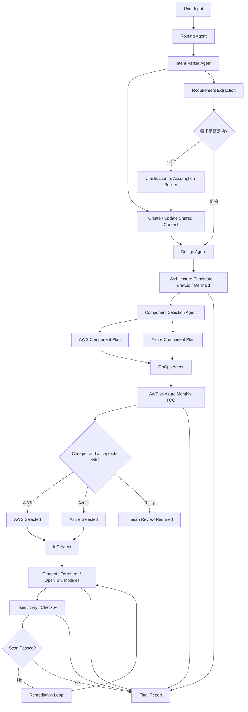

# Cloud-360 System Architecture

## High-Level Architecture

```mermaid
flowchart TB
    User[Cloud Architect / SRE / FinOps / Security] --> Browser[Web Browser]

    Browser --> Desktop[Desktop Web Experience<br/>Full Workspace]
    Browser --> Mobile[Mobile Web / Responsive Web / PWA<br/>Ops Companion]

    Desktop --> Chat[AI Chat]
    Desktop --> DrawIO[draw.io / diagrams.net Canvas<br/>AI Co-editing]
    Desktop --> IaCEditor[Terraform / Policy Editor]
    Desktop --> FinOpsUI[FinOps Dashboard]
    Desktop --> SecUI[Security Posture Dashboard]
    Desktop --> OpsUI[Operations Dashboard]
    Desktop --> ToolAdmin[MCP / Skill Management Console]

    Mobile --> MobileChat[Mobile Web AI Chat]
    Mobile --> Alerts[Alerts / Findings]
    Mobile --> ApprovalUI[Approval Workflow]
    Mobile --> Digest[Cloud Health Digest]
    Mobile --> DiagramRO[Readonly Diagram View]

    Chat --> APIGW[API Gateway]
    DrawIO --> APIGW
    IaCEditor --> APIGW
    FinOpsUI --> APIGW
    SecUI --> APIGW
    OpsUI --> APIGW
    ToolAdmin --> APIGW
    MobileChat --> APIGW
    Alerts --> APIGW
    ApprovalUI --> APIGW
    Digest --> APIGW
    DiagramRO --> APIGW

    APIGW --> Auth[Auth / RBAC / MFA / WebAuthn]
    Auth --> Backend[Backend Service<br/>Python or Java]

    Backend --> Router[Agent Routing Layer<br/>OpenClaw-like Multi-Agent Framework]
    Backend --> Memory[(Shared Context / Memory)]
    Backend --> ArtifactStore[(Artifact Store<br/>draw.io / IaC / Reports)]
    Backend --> Audit[(Audit Log)]
    Backend --> Policy[Policy / Permission Engine]
    Backend --> Approval[Human Approval Gate]
    Backend --> ToolRegistry[(MCP / Skill Registry)]

    Router --> Intent[Intent Parser Agent]
    Router --> Design[Design Agent]
    Router --> Selector[Component Selection Agent]
    Router --> FinOps[FinOps Agent]
    Router --> IaC[IaC Agent]
    Router --> Ops[Operations Agent]
    Router --> Security[Security Policy Advisor Agent]
    Router --> ToolExec[Tool Execution Agent]
    Router --> Guardrail[Guardrail Agent]
    Router --> ToolManager[MCP / Skill Manager Agent]

    DrawIO --> DiagramAdapter[draw.io XML Adapter]
    DiagramAdapter --> ArchGraph[Internal Architecture Graph]
    ArchGraph --> Memory
    ArchGraph --> Design
    ArchGraph --> FinOps
    ArchGraph --> IaC
    ArchGraph --> Ops
    ArchGraph --> Security

    ToolManager --> ToolRegistry
    ToolManager --> Integration
    ToolExec --> ToolRegistry
    ToolExec --> Integration[Cloud Operation Integration Layer]

    Integration --> MCP[MCP Servers]
    Integration --> Skills[AI Skills]
    Integration --> ToolHealth[MCP / Skill Health Checks]
    Integration --> SDK[Cloud SDKs]
    Integration --> CLI[Cloud CLIs]
    Integration --> IaCTools[Terraform / OpenTofu / tfsec / trivy / Checkov]

    Integration --> AWS[AWS APIs]
    Integration --> GCP[GCP APIs]
    Integration --> Azure[Azure APIs]

    AWS --> AWSSignals[CloudWatch / Config / Cost Explorer / IAM Access Analyzer / Security Hub / GuardDuty]
    GCP --> GCPSignals[Cloud Monitoring / Logging / Asset Inventory / Billing / SCC / Org Policy]
    Azure --> AzureSignals[Azure Monitor / Log Analytics / Cost Management / Policy / Defender]

    AWSSignals --> Agentic[Agentic AI Operations]
    GCPSignals --> Agentic
    AzureSignals --> Agentic

    Agentic --> Router
    Agentic --> Alerts
    Agentic --> Digest
```



## Architecture Principles

1. **Web-first**：桌面與手機都以 Web 呈現，Mobile 使用 responsive web / PWA。
2. **AI as co-operator**：AI Chat 不只回答問題，也可共同編輯 draw.io 架構圖、產生 Terraform、分析成本與安全風險。
3. **Agentic AI with guardrails**：Agent 可主動分析與建議，但高風險操作需 human approval。
4. **Diagram as structured context**：draw.io 圖面需轉為 internal architecture graph，供 agents 使用。
5. **Cloud operations through controlled integration layer**：所有 AWS/GCP/Azure 操作經 MCP / SDK / CLI / Skills abstraction。
6. **MCP / Skill lifecycle governance**：MCP servers、tools 與 Skills 必須有 registry、version、owner、permission scope、health check 與 approval workflow。
7. **No secret leakage**：secrets 不得進入 Git、log、prompt、artifact 或 final report。

## Agent Routing Example

User request:

```text
我要一個可乘載 1 萬人同時在線的電商後端，請幫我評估部署在 AWS 與 Azure 上的成本差異，並產出較便宜方案的 Terraform 腳本。
```


