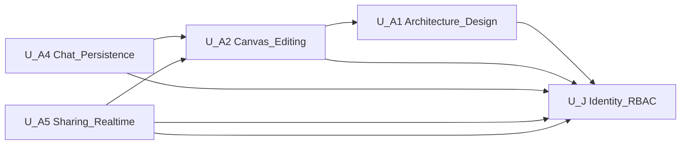

# Unit of Work — Dependency Matrix

> Dependencies among Cloud-360 units covering stories A1 / A2 / A4 / A5 / J.  
> Arrow meaning: **depends on** (consumer → provider).

## 中文版

### 1. Mermaid



### 2. 文字替代

```text
U-A1 depends_on U-J
U-A2 depends_on U-J, U-A1
U-A4 depends_on U-J, U-A2
U-A5 depends_on U-J, U-A2
U-J  depends_on (none within this set)
```

### 3. 依賴矩陣

列 = 消費者；欄 = 提供者。`D` = 硬依賴（執行／權限／資料鍵）；`S` = 軟依賴（產出可選）；空白 = 無。

| Consumer \ Provider | U-J | U-A1 | U-A2 | U-A4 | U-A5 |
|---|---|---|---|---|---|
| **U-J** | — | | | | |
| **U-A1** | D | — | | | |
| **U-A2** | D | S | — | | |
| **U-A4** | D | | D | — | |
| **U-A5** | D | | D | | — |

### 4. 依賴說明

| 邊 | 類型 | 理由 |
|---|---|---|
| U-A1 → U-J | D | generate API 需 JWT；`require_story_action(A1, …)` |
| U-A2 → U-J | D | diagram CRUD／編輯需認證與架構圖權限 |
| U-A2 → U-A1 | S | 局部編輯常以 A1 產出的 XML 為起點；亦可手動畫布起稿 |
| U-A4 → U-J | D | chat／bootstrap 需使用者身分與圖 ACL |
| U-A4 → U-A2 | D | 聊天鍵含 `diagram_id`；無圖則無 A4 語意 |
| U-A5 → U-J | D | 分享與 WS 需身分；細項權限決定 can_edit／view／review |
| U-A5 → U-A2 | D | 分享與共編的對象是 U-A2 管理的 diagram |

### 5. 建議實作／驗收順序

1. **U-J**（地基）  
2. **U-A1**（產圖）  
3. **U-A2**（存圖／編輯）  
4. **U-A4** 與 **U-A5**（可並行；皆依賴 U-A2）

與現況一致：J → A1 → A2／A4／A5 已大致依此落地。

---

## English Version

### 1. Mermaid

Same diagram as Chinese section (`U_J`, `U_A1`, `U_A2`, `U_A4`, `U_A5`).

### 2. Text alternative

```text
U-A1 depends_on U-J
U-A2 depends_on U-J, U-A1
U-A4 depends_on U-J, U-A2
U-A5 depends_on U-J, U-A2
U-J  depends_on (none within this set)
```

### 3. Matrix

Rows = consumer; columns = provider. `D` = hard dependency; `S` = soft; blank = none.

| Consumer \ Provider | U-J | U-A1 | U-A2 | U-A4 | U-A5 |
|---|---|---|---|---|---|
| **U-J** | — | | | | |
| **U-A1** | D | — | | | |
| **U-A2** | D | S | — | | |
| **U-A4** | D | | D | — | |
| **U-A5** | D | | D | | — |

### 4. Edge notes

| Edge | Type | Rationale |
|---|---|---|
| U-A1 → U-J | D | JWT + story permission on generate |
| U-A2 → U-J | D | Auth + architecture ACL on diagram CRUD |
| U-A2 → U-A1 | S | Partial edits usually start from A1 XML |
| U-A4 → U-J | D | User identity + diagram ACL for chat |
| U-A4 → U-A2 | D | Chat keyed by `diagram_id` |
| U-A5 → U-J | D | Share/WS need identity and V/E/R flags |
| U-A5 → U-A2 | D | Share/collab targets U-A2 diagrams |

### 5. Suggested order

1. U-J → 2. U-A1 → 3. U-A2 → 4. U-A4 and U-A5 in parallel.
