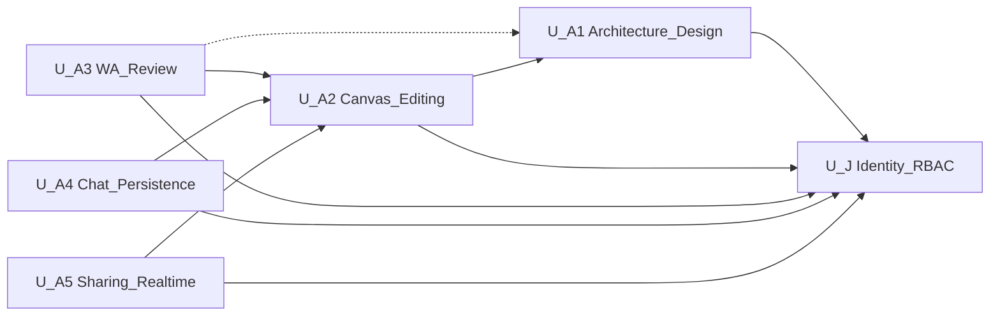

# Unit of Work — Dependency Matrix

> Dependencies among Cloud-360 units covering stories A1 / A2 / A3 / A4 / A5 / J.  
> Arrow meaning: **depends on** (consumer → provider).

## 中文版

### 1. Mermaid



### 2. 文字替代

```text
U-A1 depends_on U-J
U-A2 depends_on U-J, U-A1 (soft)
U-A3 depends_on U-J, U-A2; soft/peer U-A1 (CTA + Agent SDK family)
U-A4 depends_on U-J, U-A2
U-A5 depends_on U-J, U-A2
U-J  depends_on (none within this set)
```

### 3. 依賴矩陣

| Consumer \ Provider | U-J | U-A1 | U-A2 | U-A3 | U-A4 | U-A5 |
|---|---|---|---|---|---|---|
| **U-J** | — | | | | | |
| **U-A1** | D | — | | | | |
| **U-A2** | D | S | — | | | |
| **U-A3** | D | S | D | — | | |
| **U-A4** | D | | D | | — | |
| **U-A5** | D | | D | | | — |

### 4. 依賴說明

| 邊 | 類型 | 理由 |
|---|---|---|
| U-A1 → U-J | D | JWT + A1 權限 |
| U-A2 → U-J | D | diagram ACL |
| U-A2 → U-A1 | S | 局部編輯常以 A1 XML 為起點 |
| U-A3 → U-J | D | A3 view／edit RBAC + JWT |
| U-A3 → U-A2 | D | 評核輸入為 `user_diagrams.xml_data`／選圖 ACL |
| U-A3 → U-A1 | S | 產圖後 CTA；**同 Agent SDK 家族**（獨立 ReviewAgent，不呼叫 DesignAgent） |
| U-A4 → U-J / U-A2 | D | 同上既有 |
| U-A5 → U-J / U-A2 | D | 同上既有 |

### 5. 建議實作／驗收順序

1. U-J → 2. U-A1 → 3. U-A2 → 4. U-A4／U-A5（可並行）→ 5. **U-A3**（依賴圖與 RBAC 已備）

---

## English Version

### Matrix & edges

`U-A3` hard-depends on `U-J` and `U-A2`; soft/peer with `U-A1` (CTA + shared Agent SDK family, no DesignAgent call). Other edges unchanged. Suggested order: … then U-A3 after diagram + RBAC foundations exist.
