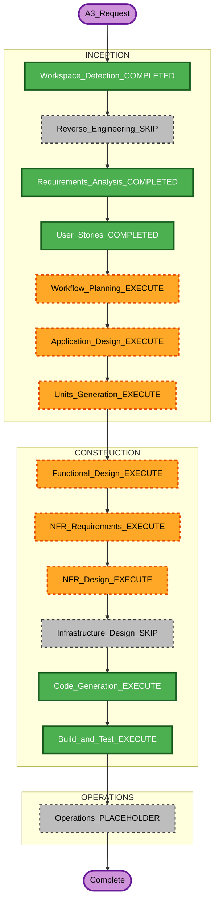

# A3 Execution Plan

> AIDLC Workflow Planning for **Story A3** Well-Architected Review (MVP).  
> Branch: `luojingting/feat/a3-well-architected-review`  
> Context: `a3-well-architected-requirements.md` + revised `stories.md` §A3  
> Generated: 2026-07-23


### Detailed Analysis Summary

#### Transformation Scope (Brownfield)

| 項目 | 內容 |
|---|---|
| Transformation Type | **Application feature**（monolith 內新 Module，非整雲重架構） |
| Primary Changes | 評核規則引擎＋**與 A1 共用 Agent SDK／OpenRouter** 之 LLM 建議、`architecture_reviews` 持久化、Workspace／儀表板入口、A3 RBAC |
| Related Components | `backend/`（新 router／service）、`frontend/`（Workspace CTA、儀表板）、`models`／schema、RBAC seed |

#### Change Impact Assessment

| 面向 | 影響 |
|---|---|
| User-facing | Yes — 產圖後 CTA、Well-Architected 按鈕、評估儀表板 |
| Structural | Low — 新增邏輯 Module `U-A3`；部署仍 monolith |
| Data model | Yes — 新評核表／歷史 |
| API | Yes — 新 REST（發起／查詢評核） |
| NFR | Yes — JWT／A3 RBAC、規則可測、LLM 失敗隔離 |

#### Component Relationships

```text
Primary: U-A3 review service
Depends on: U-A2 (UserDiagram XML), U-J (auth/RBAC), U-A1 (post-generate CTA + **shared Agent SDK runtime**)
LLM path: same Anthropic Agent SDK + OpenRouter as A1 (`design_agent` pattern); A3-specific MCP tool/prompt OK
Consumers: WorkspacePage, Assessment Dashboard (new)
Infra: existing PostgreSQL + OpenRouter; no new deploy topology / no second LLM SDK
```

#### Risk Assessment

| 項目 | 等級 |
|---|---|
| Risk Level | **Medium**（LLM 不確定性；規則覆蓋需迭代） |
| Rollback Complexity | Easy（feature flag／git revert；表可保留） |
| Testing Complexity | Moderate（規則 PBT＋API／權限測試） |

### Workflow Visualization



### Phases to Execute

#### INCEPTION

| Stage | Status | Rationale |
|---|---|---|
| Workspace Detection | COMPLETED | 已執行 |
| Reverse Engineering | SKIP | artifacts 已存在且夠用 |
| Requirements Analysis | COMPLETED | `a3-well-architected-requirements.md` |
| User Stories | COMPLETED | `stories.md` §A3 已修訂 |
| Workflow Planning | EXECUTE（本文件） | A3 路徑規劃 |
| Application Design | **EXECUTE** | 新評核服務、API、儀表板、與 A1／A2／J 邊界 |
| Units Generation | **EXECUTE** | 新增 `U-A3` 至 unit-of-work* |

#### CONSTRUCTION（U-A3）

| Stage | Status | Rationale |
|---|---|---|
| Functional Design | **EXECUTE** | 實體、規則、流程、FE 元件 |
| NFR Requirements | **EXECUTE** | 安全／可測／LLM 失敗隔離 |
| NFR Design | **EXECUTE** | 對應 NFR 落地（輕量） |
| Infrastructure Design | **SKIP** | 無新雲資源；沿用現有 Postgres／OpenRouter／**既有 Agent SDK 執行環境** |
| Code Generation | **EXECUTE** | ALWAYS |
| Build and Test | **EXECUTE** | ALWAYS；擴充 unit／整合指引 |

#### OPERATIONS

| Stage | Status | Rationale |
|---|---|---|
| Operations | PLACEHOLDER | 沿用現有 deploy；無專屬 A3 ops 本迭代 |

### Package Change Sequence

1. **backend** models／schema／review service／API／RBAC seed  
2. **frontend** Workspace CTA／按鈕、Assessment Dashboard  
3. **aidlc-docs/construction/a3/** FD＋code summary  
4. **tests** 規則 PBT＋API authz  

### Success Criteria

- MVP AC（stories ✅ 項）可手動驗收  
- 評核歷史可查；無權限 403  
- PDF／SPOF 明確不在本期  

### Extension Compliance（本階段）

| Extension | Status |
|---|---|
| bilingual-docs | compliant（本計畫雙語） |
| security/baseline | applicable → Construction 強制 |
| property-based | applicable → 規則引擎 |
| resiliency | N/A（未啟用） |
