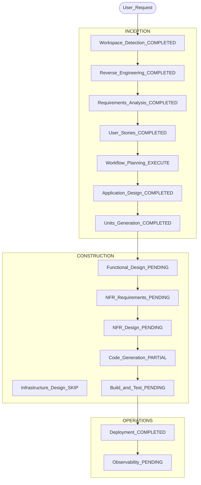

# Execution Plan

> AIDLC Workflow Planning for Cloud-360 (brownfield, developed scope A1/A2/A4/A5/J).  
> Generated 2026-07-17 after reverse-engineering artifacts.

## 中文版

### Detailed Analysis Summary

#### Transformation Scope (Brownfield)

| 項目 | 內容 |
|---|---|
| Transformation Type | **Application-focused**（非整雲重架構）；持續補齊已開發 story AC 與 Construction／Operations 文件 |
| Primary Changes | 補 E2E 驗收、WS JWT、A2／A5 缺口 AC、Construction artifacts、build-and-test |
| Related Components | `backend/`、`frontend/`、`deploy/`、`aidlc-docs/construction/`、CI workflows |

#### Change Impact Assessment

| 面向 | 影響 |
|---|---|
| User-facing | Yes — 工作區、共編、Admin 權限行為 |
| Structural | No — 維持 monolith；unit 為邏輯 Module |
| Data model | Low — schema 已有；除非新 story |
| API | Low／Medium — 強化 WS 認證；其餘穩定 |
| NFR | Yes — security baseline、測試覆蓋、觀測性 |

#### Component Relationships

```text
Primary: backend + frontend (U-A1..U-A5, U-J)
Infrastructure: deploy/, docker-compose, GitHub Actions
Shared: aidlc-docs, schemas, scripts
Dependent: OpenRouter, PostgreSQL, Cloudflare Tunnel
```

#### Risk Assessment

| 項目 | 等級 |
|---|---|
| Risk Level | **Medium**（AI 外部依賴 + 共編安全缺口 + 測試薄） |
| Rollback Complexity | Easy／Moderate（git revert；staging compose 可回滾映像） |
| Testing Complexity | Moderate → Complex（需補 e2e／property-based） |

### Workflow Visualization



### 文字替代

```text
INCEPTION: WD RE RA US WP AD UG = mostly COMPLETED (this plan closes RE+WP)
CONSTRUCTION: FD/NFR pending for units; CG partial (A1/A4/J core); BT pending
OPERATIONS: Deploy done; Observability/playbooks pending
```

### Phases to Execute

#### 🔵 INCEPTION

- [x] Workspace Detection — COMPLETED
- [x] Reverse Engineering — COMPLETED（本批產出 `reverse-engineering/`）
- [x] Requirements Analysis — COMPLETED（SRS）
- [x] User Stories — COMPLETED（`stories.md`）
- [x] Workflow Planning — COMPLETED（本文件）
- [x] Application Design — COMPLETED（baseline：`system-architecture.md`、`frontend-backend-specification.md`、`unit-of-work*.md`）
- [x] Units Generation — COMPLETED（已開發範圍 A1/A2/A4/A5/J；A3/B–H 未建 unit）

#### 🟢 CONSTRUCTION（建議下一步）

| Stage | 狀態 | 建議 |
|---|---|---|
| Functional Design | PENDING | 優先 U-A2、U-A5、U-J（缺目錄） |
| NFR Requirements／Design | PENDING | 對齊 security／property-based extensions |
| Infrastructure Design | SKIP | 已有 deploy／ADR-0007；無新雲端 IaC |
| Code Generation | PARTIAL | 補 AC 缺口與文件；非從零產碼 |
| Build and Test | PENDING | 建立 `construction/build-and-test/` + 擴測 |

#### 🟡 OPERATIONS

- [x] Deployment — COMPLETED（ADR-0007）
- [ ] Observability／Incident Playbooks — PENDING（`operations/` 骨架已有）

### 建議執行順序（近期）

1. 使用者確認本 execution plan  
2. Construction：補 `a2/`、`a5/`、`j/` code summary + functional-design（最小集）  
3. 補 WS JWT + 手動 E2E（A1／A4／J）  
4. Build-and-test 文件與 CI 測試擴充  
5. Operations：observability／playbooks 內容  

### Extension Compliance（本階段）

| Extension | 狀態 | 說明 |
|---|---|---|
| bilingual-docs | compliant | 本批 artifacts 雙語 |
| security/baseline | N/A→watch | RE／WP 文件階段；實作缺口見 WS JWT |
| property-based | non-compliant（deferred） | 核心模組尚無 PBT；列入 Build-and-Test |
| resiliency/baseline | undecided | 1.0.1 新增；尚未寫入 `aidlc-state` opt-in |

---

## English Version

### Summary

Brownfield Cloud-360: close Inception by completing reverse-engineering and this execution plan. Application design and units for A1/A2/A4/A5/J already exist. Next: Construction functional/NFR docs for thin units, finish AC gaps (WS JWT, E2E), build-and-test, then observability.

### Risk

Medium — external LLM dependency, incomplete WS auth, thin tests. Rollback via git + staging image revert.

### Phase checklist

Inception stages marked completed in the Chinese section. Construction: FD/NFR/BT pending; CG partial; Infrastructure Design skip. Operations: deploy done; observability pending.
