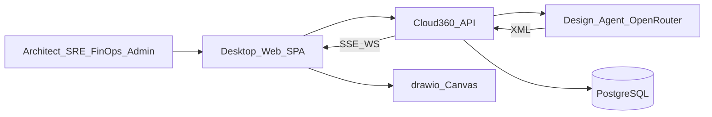

# Business Overview

> Reverse-engineered from the Cloud-360 brownfield codebase (2026-07-17).  
> 由現有程式碼反推的業務總覽。

## 中文版

### 業務情境圖



### 文字替代

```text
User -> Web SPA -> FastAPI
FastAPI -> Design Agent (OpenRouter) + PostgreSQL
Web <-> draw.io canvas; API streams SSE / WebSocket back to Web
```

### 業務描述

- **業務描述**：Cloud-360 是 AI-native 多雲架構設計與協作平台。目前已落地的業務核心是「用自然語言產製／編輯 draw.io 架構圖」，並以登入與 RBAC 控制誰能產圖、存圖、共編與管理權限。
- **業務交易（已實作）**：
  1. **登入／取得權限** — 驗證帳密，簽發 JWT，回傳角色與 story 細項權限。
  2. **產製架構圖** — 使用者輸入 NL；Agent 產出 draw.io XML；前端畫布呈現。
  3. **編輯／儲存架構圖** — 局部 AI 修改、手動編輯、CRUD、多檔切換。
  4. **對話持久化** — 依 user×diagram 存聊天；重整後還原上次圖與對話。
  5. **分享與即時共編** — 授權協作者；WebSocket 同步 XML。
  6. **管理角色／細項矩陣** — Admin 指派角色、編輯角色×Story 檢視／編輯／審核。
- **業務辭典**：
  - **Architecture Diagram**：draw.io／mxGraph XML 架構圖。
  - **Story Permission**：角色對 User Story（如 A1）的 view／edit／review。
  - **Workspace Bootstrap**：進工作區一次載入 last-opened 圖 + 聊天。
  - **Collab Session**：同一 diagram 的 WebSocket 共編連線。

### 元件層業務說明

| 元件 | 目的 | 職責 |
|---|---|---|
| `frontend/` | 使用者工作台 | 登入、Sidebar 權限、Workspace、Admin、畫布與聊天 UI |
| `backend/` | 業務 API | 認證、RBAC、產圖 Agent、圖／聊天／分享／WS |
| `deploy/` | Staging 部署 | compose、cloudflared、環境範本 |
| `scripts/` | Repo 契約 | `validate_repo_contract.py` |
| `aidlc-docs/` | 方法論產物 | SRS、stories、ADRs、construction／operations 文件 |

---

## English Version

### Business context

Cloud-360 is an AI-native multi-cloud architecture design and collaboration platform. The implemented core is natural-language generation/editing of draw.io diagrams, gated by JWT login and story-level RBAC.

### Business transactions (implemented)

1. Login / permission bootstrap  
2. Generate architecture diagram (NL → XML via Agent SDK)  
3. Edit / save diagrams (partial AI + CRUD + multi-file)  
4. Persist chat per user×diagram + last-opened restore  
5. Share + real-time XML collaboration  
6. Admin role assignment + role×story matrix  

See Chinese section for dictionary terms and component-level business descriptions.
