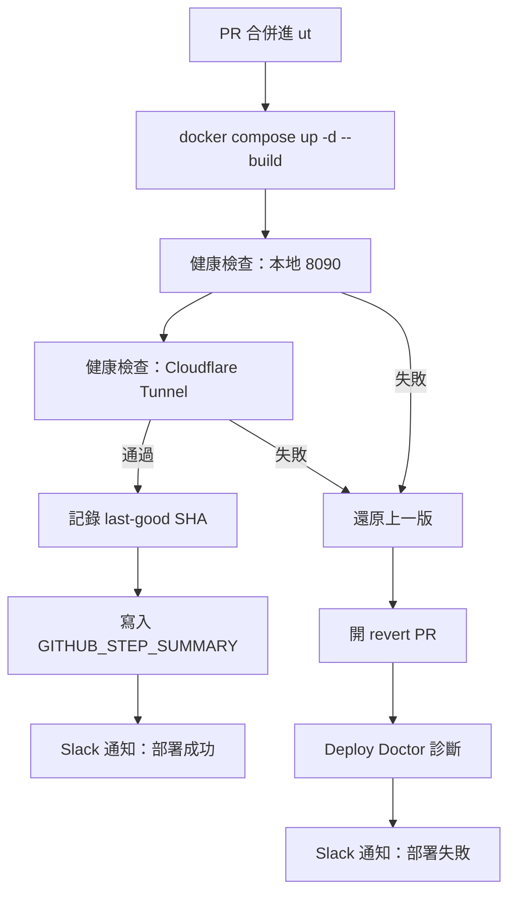

# 部署完成 Slack 通知 — 需求釐清問題

> AIDLC Requirements Analysis 階段產出。請在每題的 `[Answer]:` 後填入選項字母；若選項都不合適，選最後一個「其他」並在後面描述。

## 現況盤點（Workspace Detection 結果）

- **專案型態**：Brownfield，既有部署管線 `.github/workflows/deploy.yml`。
- **觸發條件**：PR 合併進 `ut`（或手動 `workflow_dispatch`）→ self-hosted runner（192.168.10.10）跑 `docker compose up -d --build`。
- **既有的成功路徑**：兩道健康檢查（本地 8090、經 Cloudflare Tunnel 的 `cloud360.danniel.cc`）通過後，記錄 last-good SHA，並寫 `$GITHUB_STEP_SUMMARY`。
- **既有的失敗路徑**：`rollback` job 會還原上一版、開 revert PR、把失敗丟給 Deploy Doctor agent。
- **既有 Slack 整合**：**無**。repo 內唯一的 webhook 是 `N8N_WEBHOOK_URL`，用途是抓服務圖示 SVG（`backend/services/diagram_builder.py`），與通知無關。
- **Secret 管理慣例**：全部放 GitHub Actions secrets（見 ADR-0007），repo contract 禁止 commit 憑證字串。

### 通知的掛載點



文字版（若 Mermaid 無法渲染）：

```
PR 合併進 ut
  -> docker compose up -d --build
  -> 健康檢查 1：本地 8090
  -> 健康檢查 2：Cloudflare Tunnel
     -> 通過：記錄 last-good SHA -> 寫 STEP_SUMMARY -> [Slack 通知：成功]
     -> 失敗：還原上一版 -> 開 revert PR -> Deploy Doctor 診斷 -> [Slack 通知：失敗]
```

---

## Question 1

要用哪一種方式把訊息送進 Slack？

A) **Incoming Webhook**：在 Slack 建一個 webhook URL，存成 GitHub secret `SLACK_WEBHOOK_URL`，workflow 用 `curl` 送 JSON。最少依賴、不需裝 GitHub App，但一個 webhook 綁死一個 channel。

B) **Slack App bot token + `slackapi/slack-github-action`**：存 `SLACK_BOT_TOKEN`，用官方 action 送訊息。可動態指定 channel、可更新既有訊息（例如部署中 → 部署完成同一則訊息改寫），但要在 Slack workspace 建 App 並授權。

C) **GitHub 官方 Slack App（`/github subscribe`）**：在 Slack 頻道下指令訂閱本 repo 的 workflow 事件，完全不改 workflow 檔。設定最快，但訊息格式固定、無法客製內容（帶不進 `cloud360.danniel.cc` 連結或部署耗時）。

D) 其他（請在 `[Answer]:` 後描述）

[Answer]: B

## Question 2

哪些部署結果要發通知？

A) **只有成功**：部署成功時發一則。

B) **成功 + 失敗**：兩種結果都發，失敗的訊息帶上 workflow run 連結。

C) **成功 + 失敗 + 回滾結果**：除了成敗，連 `rollback` job 的結果（是否成功還原、revert PR 連結、Deploy Doctor issue 連結）也一併通知。

D) 其他（請在 `[Answer]:` 後描述）

[Answer]: C

## Question 3

通知的 channel 怎麼安排？**請務必在 `[Answer]:` 後寫出實際的 channel 名稱**（例如 `#cloud360-deploy`），這是我無法自行決定的。

A) **全部送同一個 channel**（成功與失敗都進同一個）。

B) **分流兩個 channel**：成功送部署紀錄用的 channel、失敗送告警用的 channel。

C) 其他（請在 `[Answer]:` 後描述）

[Answer]: A , Channel Name : #nemoclaw, Channel ID : C0B5XEQDVR7

## Question 4

部署失敗時要不要在 Slack 上 mention 人？

A) **不 mention**：只發訊息，靠使用者自己看。

B) **`@here`**：通知該 channel 當下在線的人。

C) **mention 特定人或群組**：例如 `@danniel` 或一個 user group（請在 `[Answer]:` 後寫出要 mention 的對象）。

D) 其他（請在 `[Answer]:` 後描述）

[Answer]: @here
 
## Question 5

成功通知裡要放哪些資訊？（可複選，請在 `[Answer]:` 後列出所有要的字母）

A) commit SHA 與 commit 標題

B) 觸發的 PR 編號、標題與合併者

C) 公開網址 `https://cloud360.danniel.cc` 與內網 `http://192.168.10.10:8090`

D) 部署耗時

E) GitHub Actions workflow run 連結

F) 其他（請在 `[Answer]:` 後描述）

[Answer]:  A, B, C, D, E

---

## 需要你在 Slack 端先準備的東西

這部分我沒有權限代勞，取決於 Question 1 的選擇：

- 選 **A**：在 Slack 建立 Incoming Webhook，把 URL 交給我存成 GitHub secret（或你自己在 repo Settings → Secrets 建 `SLACK_WEBHOOK_URL`）。
- 選 **B**：在 Slack 建立 App、開 `chat:write` scope、把 Bot 加進目標 channel，取得 `SLACK_BOT_TOKEN`。
- 選 **C**：在目標 channel 執行 `/github subscribe opendiamonds/cloud-360 workflows`，我不需要改任何檔案。

## Security baseline 檢核（hard constraint）

- Slack webhook URL 與 bot token 一律存 GitHub Actions secrets，**不得**寫進 workflow 檔或任何 commit — repo contract 會擋下憑證字串。
- 通知內容不得帶入 `deploy/.env` 的任何值（`JWT_SECRET`、`POSTGRES_PASSWORD`、`OPENROUTER_API_KEY`）。
- 送往 Slack 屬於對外送出資料，訊息只放 commit、PR、URL 這類非機敏資訊。
