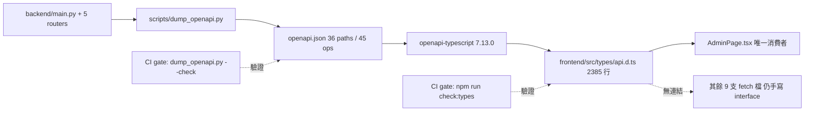
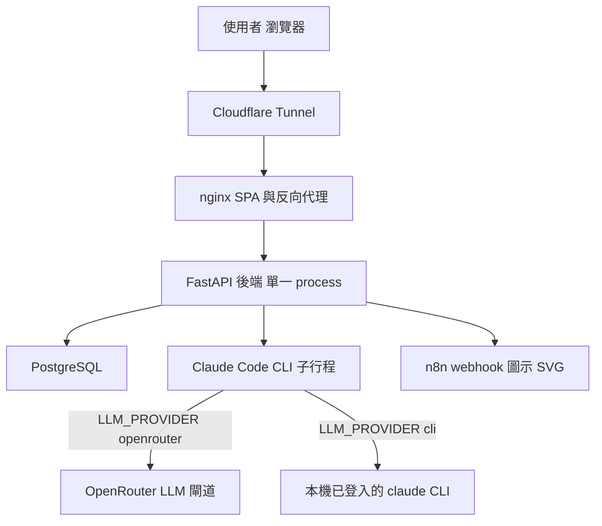
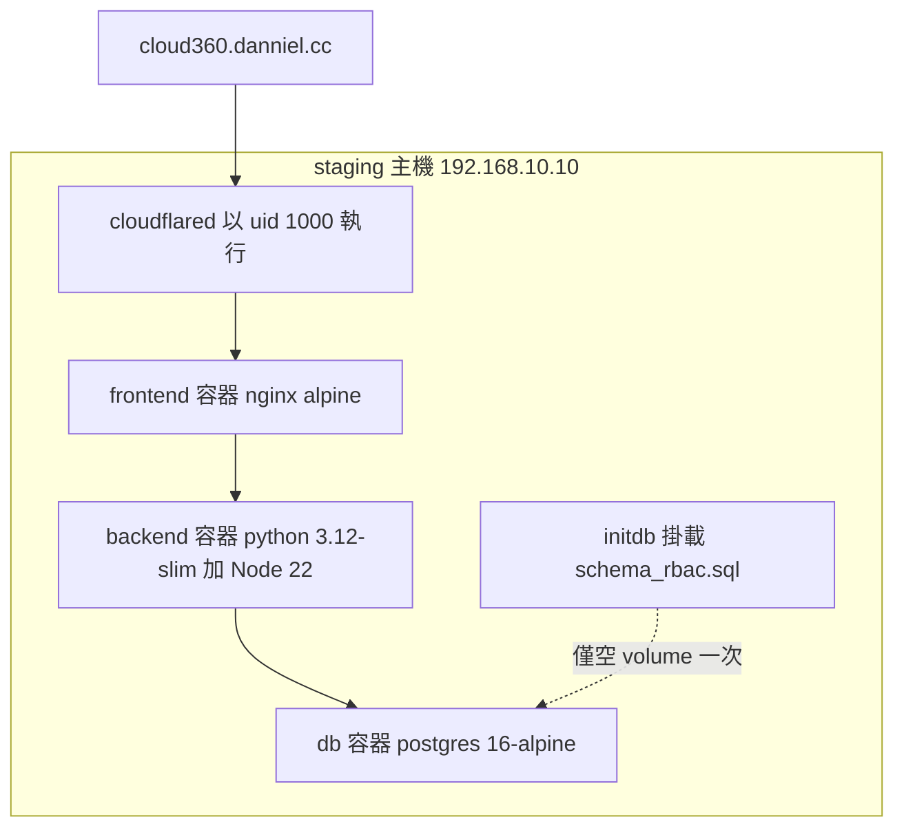
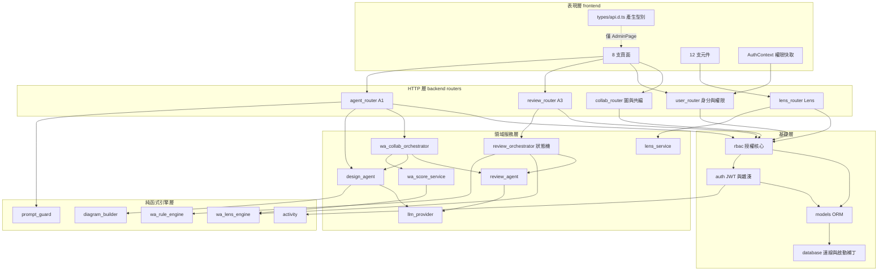
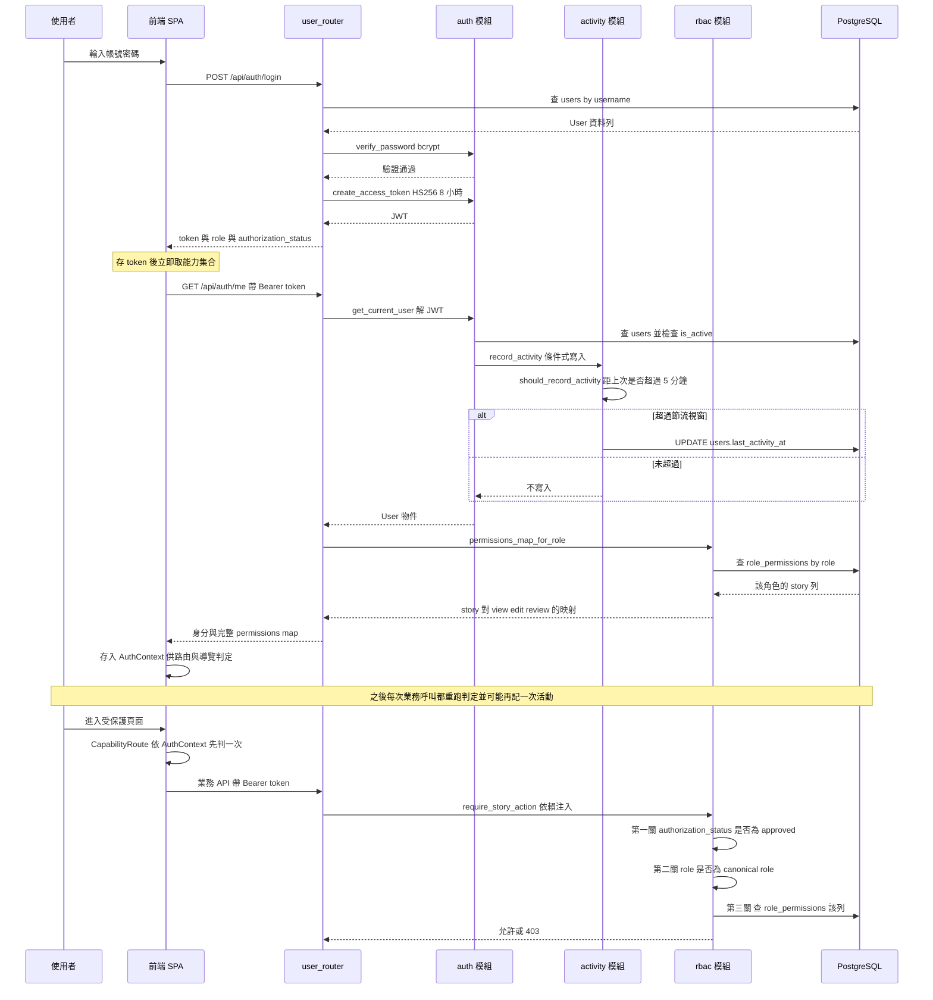
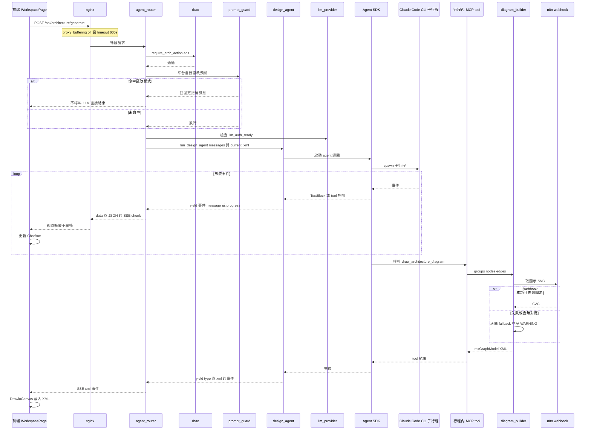
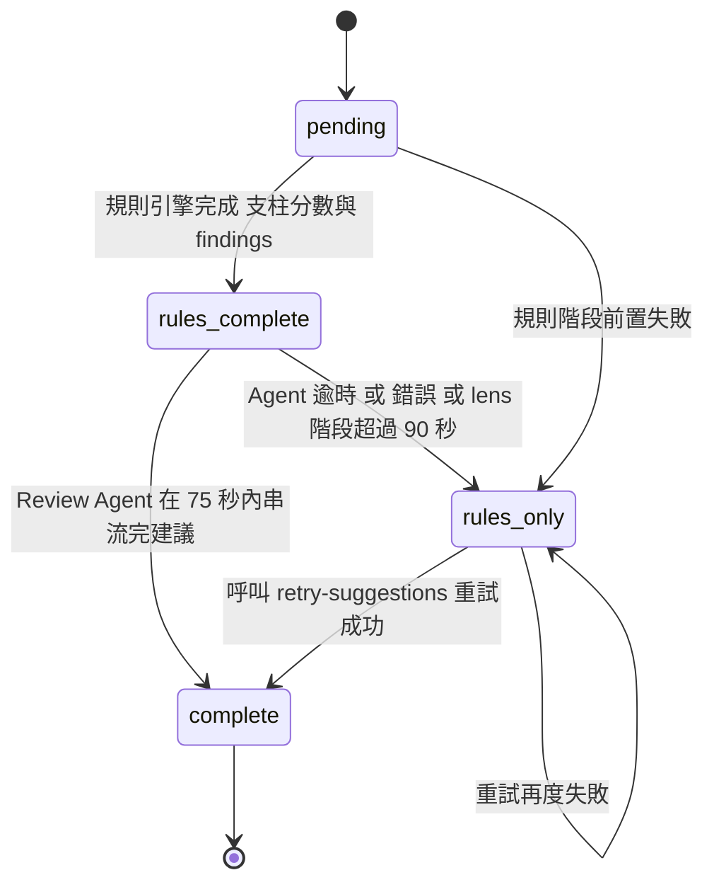

# Architecture — Cloud-360

> 逆向工程產出。基準 commit `c3de2c8`（branch `danniel/fix/production-path-check-noop`，2026-08-17）。
> 每張 Mermaid 圖後方都附「文字 fallback」段落，內容與圖等價。

## 架構風格與判定依據

**判定結論：Modular Monolith + SPA。**（與前一版判定相同，本次重新查證後維持。）

支撐這個判定的觀察事實：

| 觀察 | 證據 |
|---|---|
| 後端是**單一 process**，5 個 router 掛在同一個 `FastAPI` app | `backend/main.py` 的 5 個 `include_router` |
| 全部模組共用**同一個** `SessionLocal` 與**同一個** PostgreSQL 實例 | `backend/database.py` 單一 engine |
| **無訊息佇列、無背景 worker、無快取層** | 依賴清單無 celery／redis／rabbitmq 等 |
| 前端是**獨立部署**的 Vite SPA，經 nginx 同源反向代理 | `frontend/nginx.conf` 將 `/api/` 轉發 `backend:8000` |
| 唯一的跨行程邊界是 LLM 子行程與兩個外部 HTTP 呼叫 | `claude-agent-sdk` spawn `claude` CLI；OpenRouter；n8n webhook |

**被排除的替代判定：**

- **微服務**：排除。沒有任何服務邊界上的獨立部署單元、獨立資料庫或網路呼叫；
  5 個 router 是模組邊界不是服務邊界，跨模組呼叫都是同 process 的 Python import。
- **分層單體（layered monolith）**：部分成立但不精確。`review`／`lens`／`wa_*` 家族確實有
  乾淨的 router → service → model 分層，但 `user_router.py` 與 `collab_router.py` 把商業邏輯
  直接寫在 HTTP handler 內、沒有獨立 service 層。分層**不是全域一致的**，因此以「模組化單體」
  描述其邊界特性比以「分層」描述更貼近實況。

## 本次掃描最值得下游注意的三件事

這三件事對後續設計決策有直接影響，先於細節列出。

### 一、跨語言型別契約鏈已建好，但採用率只有 1/10

系統已經有一條**建置期的跨語言契約鏈**，且兩端各有一道 CI gate：

**文字 fallback（型別契約鏈）**：後端 5 個 router 的 `response_model` 由
`backend/scripts/dump_openapi.py` **從程式碼**（非 live 端點）dump 成 repo 根目錄的
`openapi.json`（3.1.0，36 paths／45 operations／29 schemas）。前端以
`openapi-typescript@7.13.0` 把該規格產成 `frontend/src/types/api.d.ts`（2,385 行）。
兩端各有一道 CI gate：backend job 的 `dump_openapi.py --check`
（由程式碼重 dump 並與 committed 規格比對）與 frontend job 的 `npm run check:types`
（重產型別到暫存檔並與 committed 型別檔逐位元比對）。

**但這條鏈只有一個消費者。** `api.d.ts` 全 repo 只被 `AdminPage.tsx` import
（`components['schemas']['UserSchema']`、`['UserListPage']`）；其餘 **9 支做 `fetch()` 的檔
仍各自手寫本地 interface**，與後端 `response_model` 之間沒有任何編譯期連結。

**這對設計決策的直接含義**：

- 「後端加欄位、前端漏接」這條失敗路徑，**在 `AdminPage` 上已被封住，在其餘 9 支上完全沒有守門**。
  評估任一變更「有沒有型別保護」時，答案取決於碰到的是哪一支檔，不能一概而論。
- 基礎設施已經就位（產生器、gate、腳本都在），把第 2、3 支檔接上去的**邊際成本遠低於建立這條鏈的成本**。
  這是「已就位、尚未擴散」而非「做不到」。
- **產生器版本字串有兩份手寫副本**且無機制鎖住一致：`package.json` 的 `gen:types` 與
  `frontend/scripts/check-api-types.mjs:21` 的 `GENERATOR` 常數各寫一次
  `openapi-typescript@7.13.0`。腳本註解自承「兩處若不一致，這道 gate 會比對到不同產生器的
  輸出而誤報」。

### 二、WebSocket 與 SSE 是三道機械檢查的共同盲區

系統有兩類**不在 `openapi.json` 內**的對外介面，因此**三道既有的機械檢查同時碰不到它們**：

| 介面 | 位置 | 為何檢查碰不到 |
|---|---|---|
| **WebSocket** `/api/collab/ws/{workspaceId}` | `collab_router.py` 的 `ConnectionManager`；前端 `useCollaboration.ts` | FastAPI 不把 WebSocket 路由寫進 OpenAPI 規格 |
| **SSE 事件名**（10 種，見下） | `agent_router.py`、`review_router.py`、`review_orchestrator.py`、`wa_collab_orchestrator.py` | 事件名是 response body 內的字串值，不是 schema 結構 |

碰不到它們的三道檢查：`dump_openapi.py --check`、`check-api-types.mjs`、
`tcms_validate.py` 的 API 比對 —— **三者的輸入都是 `openapi.json`**。

後端實際產生的 SSE 事件型別共 **10 種**：`message`、`progress`、`xml`、`xml_preview`、
`score`、`rules_done`、`lens_done`、`suggestion_delta`、`complete`、`error`。
契約目前**只由 `agent_router.py` 的 docstring**（標注「契約（前端依賴，請勿變更）」）表達。

#### 這個盲區已經產生了一個實際的失效，且沒有任何機制發現它

本次掃描實測到一組**雙向皆已死的契約**，是這個盲區的具體證據，非推測：

| 事實 | 證據 |
|---|---|
| 前端有一個分支處理 SSE 事件 `type === 'unsupported'` | `AssessmentPage.tsx:632`，並據以 `setPhase('unsupported')` |
| 前端另有一處判斷 review 狀態為 `unsupported` | `AssessmentPage.tsx:1195` |
| **後端從未產生 `"type": "unsupported"` 的 SSE 事件** | 全 `backend/` grep 該字串，只有一處命中 |
| **後端從未把 review 狀態寫成 `unsupported`** | `review_orchestrator.py` 的 status 賦值點只有 `pending`／`rules_complete`／`rules_only`／`complete` 四種 |
| 後端唯一的 `unsupported` 出現在封存查詢的過濾集合中 | `review_orchestrator.py:121` 的 `status.in_(("complete", "rules_only", "unsupported"))` |

也就是說：**前端兩段程式碼在等一個永遠不會到來的事件**，後端保留了一個永遠不會被寫入的
狀態值。六道 CI 檢查、`tsc -b`、ESLint、14 個 e2e case 全綠，**沒有一個能發現它**。

**對前一版 codekb 的更正**：前一版 `architecture.md` 把 `unsupported` 畫成 A3 狀態機的
一個終態（「圖形無法辨識雲別或不支援」）。**在本次基準 commit 上，該狀態不可達。**
下方「交易三」的狀態機圖已據實修正為四狀態。

### 三、`diagram_builder` 的 n8n 圖示取得已不再靜默降級（PR #499 已修正）

前一版 codekb 與 `project.md` 都把 `fetch_icon_from_n8n()` 記為全 repo 唯一的靜默降級點：
n8n 不可達或查無圖示時回灰底佔位 SVG、API 仍回 200，**使用者看到「圖產出來了但 icon 都是
灰塊」，而沒有任何地方說得出為什麼**。

**本次複驗程式碼：該路徑已修正。** PR #499（`功能(llm): 新增 LLM_PROVIDER，本機可改用已登入的
claude CLI`）已於 2026-08-16 合併進 `ut`，`fetch_icon_from_n8n()`
（`diagram_builder.py:1586`）現在對下列每一條降級路徑都記 `logger.warning`：

| 降級路徑 | 現況 |
|---|---|
| 回應非 200 | **記 WARNING**（含 service name、provider、status code）。原始碼註解逐字寫明「這條路徑原本靜默 return，是最難查的一種降級」 |
| 目錄回應查無對應項 | **記 WARNING**（含目錄項數、service name、provider） |
| 目錄項匹配到但不含 SVG 內容 | **記 WARNING**（含 entry 名稱） |
| 回應解析失敗 | **記 WARNING** |
| 請求本身失敗（逾時、連線錯誤） | **記 WARNING** |
| `N8N_WEBHOOK_URL` 未設定 | 直接回 fallback，**不記錄**（設計上的正常路徑，非異常） |

**殘留的一條窄路徑（本次新發現）**：當回應為 JSON 物件（`isinstance(data, dict)`）、
`_svg_from_entry(data)` 取不到 SVG、且 `data["data"]` 不是 dict 或同樣取不到 SVG 時，
控制流會**正常離開 `try` 區塊**（不觸發任何 `except`），落到函式最後的 `return fallback_svg`，
**這一條沒有 WARNING**。相較修正前這是明顯收斂的殘留面，但「靜默降級點為零」的說法
在本 commit 上仍不成立。

**API 回應仍為 200**（降級不失敗，是刻意的設計），因此**沒有任何自動化層會發現灰塊**——
log 是目前唯一的訊號，而 log 需要有人去看。

## 系統脈絡

**文字 fallback（系統脈絡）**：使用者瀏覽器經 Cloudflare Tunnel 進入 nginx；nginx 同時
負責提供 SPA 靜態資產與把 `/api/` 反向代理到 FastAPI 後端。後端對外只有三個下游：
PostgreSQL（唯一持久層）、由 Agent SDK spawn 的 Claude Code CLI 子行程、以及選填的
n8n webhook（取得動態圖示 SVG，失敗時有灰底 fallback 並記 WARNING）。

**LLM 存取有兩種模式**（`llm_provider.py`，223 LOC，本次新增）：`openrouter`（部署預設，
子行程連 OpenRouter 閘道）與 `cli`（本機模式，改用開發者已 `claude login` 的憑證，
容器內不可用）。該模組的 docstring 逐項解釋為何 `cli` 模式必須**刪除**而非清空衝突的
環境變數 —— 清空成空字串仍會被 SDK 視為已設定。

**只有 nginx 對外曝露**，後端與資料庫都不直接對外。

## 執行期組件拓撲

**文字 fallback（執行期拓撲）**：staging 為單機 docker compose stack，四個容器：
`cloudflared`（以 uid 1000 執行以讀取 0400 憑證）、`frontend`（nginx alpine，唯一對外）、
`backend`（python 3.12-slim 基底，映像內含 Node 22 與全域 `@anthropic-ai/claude-code`）、
`db`（postgres 16-alpine）。`schema_rbac.sql` 以 initdb 腳本掛載到 db 容器，
**僅在資料 volume 為空時執行一次**（虛線代表這個一次性關係）。對外主機名為
`cloud360.danniel.cc`，經 Cloudflare Tunnel 進入。

另有兩份 compose：repo 根的 `docker-compose.yml`（本機開發，只起 `db` 與 `adminer`，
資料庫為 postgres **15**-alpine —— 與 staging 的 16 不一致）與
`deploy/docker-compose.test.yml`（CI `ui-regression` 的短生命週期全端 stack，值全內嵌）。

**部署設定的唯一產生點是 `deploy/render-env.sh`**（寫出 14 個變數，並擋下含 `$` 的憑證，
因為 docker compose 會對 `--env-file` 的值做內插而無聲截斷）。

## 分層與模組邊界

**文字 fallback（分層）**：五層。表現層為 React SPA（8 頁面、12 元件，加上
`AuthContext` 作為前端權限快取，以及只被 `AdminPage` 使用的產生型別檔）。HTTP 層為 5 個
FastAPI router。領域服務層有兩個編排器（A3 狀態機 `review_orchestrator`、A1↔A3 協作
`wa_collab_orchestrator`）、兩個 LLM agent、兩個服務模組與 LLM 供應商切換層 `llm_provider`。

純函式引擎層（`wa_rule_engine`、`wa_lens_engine`、`diagram_builder`、`activity`、
`prompt_guard`）**不讀資料庫、不連外**（`diagram_builder` 的 n8n 呼叫與 `activity` 的
寫入器為僅有的例外），是全系統最容易測試的部分，也是 property-based 測試的落點。

基礎層有授權核心 `rbac`、驗證核心 `auth`、ORM `models` 與連線兼啟動補丁 `database`。
**五個 router 全部依賴 `rbac`** —— 這是全系統唯一的全域橫切依賴。

**本次新增的一條依賴邊**：`auth.get_current_user` → `activity.record_activity`。
這使「取得目前使用者」這個原本純讀取的動作**變成有條件的寫入路徑**（節流 5 分鐘），
是本輪架構上最值得注意的變化，詳見下方橫切關注點。

### 邊界品質評估

| 邊界 | 內聚度 | 耦合度 | 評語 |
|---|---|---|---|
| `wa_rule_engine` / `wa_lens_engine` | 高 | 極低 | 純函式、無 I/O。邊界最乾淨，可獨立演化 |
| `activity` / `prompt_guard` / `llm_limits` | 高 | 極低 | 政策常數 + 純判定函式，新增模組皆循此形狀 |
| `diagram_builder` | 高 | 低 | **1,818 LOC，全 repo 最大模組**（前一版記為 288，已大幅成長）。唯一 I/O 是 n8n webhook |
| `review_router` → `review_orchestrator` → `review_agent` | 高 | 低 | 分層明確，狀態機集中在一處 |
| `lens_router` → `lens_service` | 高 | 低 | 薄 router、獨立 service |
| `llm_provider` | 高 | 中 | 被兩個 agent 依賴；封裝了環境變數的微妙語意（刪除 vs 清空） |
| `rbac` | 高 | 高（被動） | 被 5 個 router 依賴是設計意圖，非缺陷 |
| `user_router` | 中 | 中 | **884 LOC，商業邏輯直寫 handler，無 service 層** |
| `collab_router` | 中 | 中 | **527 LOC，同上；另含 WebSocket 廣播狀態** |
| `database` | 低 | 高 | 混合三件事：連線管理、seed、runtime DDL 補丁（現為 **4** 支補丁） |

## 橫切關注點

### 授權（RBAC）— 四層同步

RBAC 是全系統最重要的橫切關注點，同時出現在**四個地方**，四層讀同一份 `role_permissions` 資料：

1. **後端 guard**：FastAPI `Depends`（`require_story_action`／`require_arch_action`）
2. **前端路由**：`CapabilityRoute storyId=... action=...`
3. **前端導覽**：`Sidebar` 的 `can()` 判定
4. **註冊頁角色目錄**：`GET /api/auth/roles/catalog`（**公開端點，無驗證**）

**架構後果**：任何 story 或角色的增減都是**四點同步**。這是設計上的必然（前端要能在
不打 API 的情況下決定顯示什麼），但代表新增能力時的檢查清單有四項而非一項。

### 架構圖三合一規則

`A1`／`A2`／`A4` 三個 story 在執行期被視為**同一功能**：判定時三者一律改讀 `A1`
（`ARCH_CANONICAL_STORY`），寫入權限矩陣時三者同步寫。這是一個埋在 `rbac.py` 內的
語意規則，讀矩陣資料時若不知道這條規則會誤判 `A2`／`A4` 的實際效力。

### 帳號活動記錄（本輪新增的橫切關注點）

`auth.get_current_user` 在驗證通過後呼叫 `activity.record_activity`。這條路徑的架構特性：

| 特性 | 內容 | 架構含義 |
|---|---|---|
| 觸發面 | **任何**帶有效憑證的請求，不限登入 | 這是真正的橫切關注點，不是單一端點的行為 |
| 節流 | `ACTIVITY_WRITE_THROTTLE` = 5 分鐘（滑動視窗，基準為上次成功寫入時刻） | 以精度換寫入量；避免每個請求都變成一次 DB 寫入 |
| 逾期判定 | `OVERDUE_THRESHOLD` = 90 天，純函式 `is_overdue()` | 判定邏輯與寫入邏輯分離，可獨立測試 |
| 空值語意 | `nullable=True` 且**刻意不設 `server_default`** | 有預設值會讓「從未活動」與「剛建立」不可區分 |

**對下游的提醒**：`get_current_user` 已不是純讀取。任何「在請求鏈上再掛一個副作用」的
設計提案，都要先確認它與這條既有寫入路徑的交互（交易邊界、失敗處理、節流視窗）。

### 串流（SSE）

兩條 SSE 管線（A1 產圖、A3 評核）是系統最複雜的部分，並對基礎設施產生要求：
`frontend/nginx.conf` 為此特別關閉 `proxy_buffering` 並設 600 秒 timeout。
**任何反向代理層的變更都必須保留這兩項設定**，否則串流會被緩衝或中斷。

事件名的契約強度見上方「三件事」之二 —— **無任何機械檢查**。

### 錯誤處理策略

觀察到一致的「**降級而非失敗**」策略：

- A3 評核的 Agent 階段逾時（75 秒；lens 階段 90 秒）→ 狀態落為 `rules_only`，
  規則結果仍完整回傳，且提供 `retry-suggestions` 端點重試。
- `diagram_builder` 取圖示 SVG 失敗 → 用灰底 fallback，**並記 WARNING**（PR #499 後）。
- 無 DB lens 資料 → 回退到 `backend/lenses/` 的三份 JSON。
- LLM 憑證未就緒 → `llm_auth_ready()` 為 false 時回明確錯誤訊息，不是不明失敗。

`try/except` 的分布也一致：`user_router.py` **0 個**（全靠 `raise HTTPException` 快速失敗）；
`review_router.py`(4)、`collab_router.py`(5) 的 `try/except` 皆在外部呼叫邊界。

### 持久化

單一 PostgreSQL，7 個實體表 + 1 個 association table。**執行期 schema 的真實來源是 ORM 加上
啟動時的 DDL 補丁**（`database.py` 的**四個** `_ensure_*_schema()` 加一支
`_apply_security_reviewer_j3a_view`），不是任何一份 `.sql` 檔。
這一點是重大架構張力，詳見下方「架構約束與已知張力」。

## Interaction Diagrams

本節以圖描繪業務交易如何跨元件實現。三張圖分別涵蓋：授權判定鏈（含活動記錄）、
A1 串流產圖、A3 評核狀態機。

### 交易一：登入、RBAC 判定鏈與活動記錄

**文字 fallback（登入、RBAC 判定鏈與活動記錄）**：

1. **登入**：前端送帳密到 `POST /api/auth/login`。`user_router` 查 `users` 表，
   交給 `auth` 模組以 bcrypt 驗證密碼，通過後簽發 HS256 JWT（8 小時效期），
   回傳 token、role 與 `authorization_status`。
2. **取能力集合與記活動**：前端立刻打 `GET /api/auth/me`。`get_current_user` 解 JWT 取 `sub`，
   回查使用者並檢查 `is_active`（停用者在此被擋為 403）。**接著呼叫
   `activity.record_activity`**：先以 `should_record_activity` 判斷距上次寫入是否超過
   5 分鐘的節流視窗，超過才 UPDATE `users.last_activity_at`。這條路徑在**每個**帶有效
   憑證的請求上都會走一次，不限 `/me`。然後 `rbac.permissions_map_for_role`
   查該角色在 `role_permissions` 的所有列，回傳 `{story_id: {view, edit, review}}`。
3. **前端判定**：路由由 `CapabilityRoute` 依 `AuthContext` 判定，導覽由 `Sidebar` 的
   `can()` 判定。**這一層是體驗優化，不是安全邊界**。
4. **後端判定（真正的安全邊界）**：每次業務呼叫都重跑三關 ——
   第一關檢查 `authorization_status` 是否為 `approved`（否則直接 403，
   不論矩陣怎麼設定）；第二關檢查 role 是否為 canonical role；
   第三關查 `role_permissions` 對應列。`view` 的判定為
   `can_view OR can_edit OR can_review`。若 story 屬 `A1`／`A2`／`A4`，先改讀 `A1`。

### 交易二：A1 對話產圖的 SSE 串流

**文字 fallback（A1 SSE 串流）**：前端 `POST /api/architecture/generate`，經 nginx
（已關閉緩衝、timeout 600 秒）到 `agent_router`。router 先過 `require_arch_action("edit")`
授權，**再過 `prompt_guard` 的平台自我竄改預檢** —— 命中時不呼叫 LLM，直接回固定拒絕訊息。
接著確認 LLM 憑證就緒（`llm_provider.llm_auth_ready()`），呼叫
`design_agent.run_design_agent`，後者透過 `claude-agent-sdk` **spawn 一個 Claude Code CLI
子行程**（依 `LLM_PROVIDER` 走 OpenRouter 或本機已登入的 claude CLI）。

agent 產生的每個事件（`message`／`progress`）都即時 yield 出來，由 router 包成
`data: {JSON}` 的 SSE chunk 送到前端更新聊天框。當 agent 決定畫圖時，呼叫 in-process MCP tool
`draw_architecture_diagram`，該 tool 委派 `diagram_builder` 把 groups／nodes／edges
組成 draw.io `mxGraphModel` XML；組裝過程會打 n8n webhook 取圖示 SVG，
**失敗或查無對應時改用灰底 fallback 並記 WARNING，不中斷流程**。最終以 `xml` 型別事件回傳，
前端載入 `DrawioCanvas`。

**跨行程邊界提醒**：這條鏈路有一個容易被忽略的硬依賴 —— backend 容器內**必須有
Node 22 與全域安裝的 `@anthropic-ai/claude-code`**，否則 `claude-agent-sdk`
無法 spawn 子行程，A1 與 A3 建議階段全部失效。

### 交易三：A3 評核狀態機（本次已據實修正為四狀態）

**文字 fallback（A3 狀態機）**：評核建立時狀態為 `pending`。正常路徑先跑離線規則引擎，
完成後狀態轉為 `rules_complete`（此時支柱分數與 findings 已可用，SSE 已送出 `rules_done`
事件）。接著進入 lens 與 Review Agent 階段：成功串流完建議則轉 `complete`；Agent 逾時
（`AGENT_TIMEOUT_SEC` = 75 秒，lens agent 為 90 秒）或發生錯誤則轉 `rules_only`
—— **這是降級不是失敗，規則結果完整保留**。`rules_only` 狀態可透過
`POST /api/architecture/reviews/{review_id}/retry-suggestions` 重試（該端點會先檢查狀態
必須是 `rules_only`，否則回 `invalid_status` 錯誤）；重試成功轉 `complete`，
失敗則留在 `rules_only`。

**與前一版 codekb 的差異（重要）**：前一版把 `unsupported` 畫為第五個狀態。
**本次實測 `review_orchestrator.py` 的全部 status 賦值點，只有
`pending`／`rules_complete`／`rules_only`／`complete` 四種，`unsupported` 從未被寫入。**
前端仍保有處理它的分支（`AssessmentPage.tsx:632`、`:1195`），是無法到達的程式碼。
詳見上方「三件事」之二。

**同圖只保留一筆有效評核**：建立新評核時會 `_archive_previous()` 把該圖先前處於
`complete`／`rules_only`／`unsupported` 的評核封存（該過濾集合含一個永不出現的值）。

**SSE 事件序**（前端契約）：`rules_done` → `lens_done` → 多個 `suggestion_delta` →
`complete`；任一階段可改送 `error`。

## 架構約束與已知張力

### 張力一：Schema 的真實來源有三處，且不一致（最高優先，本輪部分緩解）

| 來源 | 宣稱角色 | 實際地位 |
|---|---|---|
| `schema_rbac.sql`（531 行） | 新環境唯一要跑的完整部署腳本；掛為 initdb | **缺 J5 全部物件** |
| `backend/models.py` + `database.py` 的 4 支 `_ensure_*_schema()` | ORM 定義與啟動補丁 | **執行期的實際權威** |
| `schema.sql`（78 行） | 精簡核心 DDL 參考 | 嚴重落後，缺 3 個表 |

**具體後果**：`users.authorization_status` 與 `role_authorization_requests` 表
**只存在於 `database.py::_ensure_j5_schema()`**。新環境用 initdb 建出來的 `users` 表
沒有 `authorization_status` 欄位、`role` 仍是 `NOT NULL`；J5 授權流程能運作純粹依賴
後端啟動時執行 `ALTER TABLE ... ADD COLUMN IF NOT EXISTS` 與 `ALTER COLUMN role DROP NOT NULL`。

**本輪的正面對照**：`users.last_activity_at` 的加入**有循 `project.md` 的 blocking 規則**
落到 `schema_rbac.sql`（531 行，較前一版的 523 行成長），並新增了對應的
`_ensure_last_activity_schema()` 補丁。這是「三處同步」被正確執行的一個實例，
與 J5 的既存違反形成對比 —— 亦即**規則本身可行，J5 是歷史欠帳而非結構性做不到**。

**設計新欄位時，仍必須同時落三處**（ORM／`_ensure_*_schema()` 補丁／`schema_rbac.sql`），
並更新 `DEPLOY.md` 的表清單。

### 張力二：權限矩陣是資料，不是程式碼

矩陣可由 `J3b.edit` 在 Admin UI 即時修改，改完立刻生效。這是刻意的彈性設計，但代價是：

- 執行期行為無法只從程式碼推斷，必須查 DB。
- 預設矩陣有**兩份來源**（`schema_rbac.sql` 的 INSERT 與
  `backend/services/rbac_seed_data.py` 的 **308 筆 tuple**，本次以 `ast.literal_eval` 實測確認
  為 11 角色 × 28 story），後者的 docstring 宣稱由前者產生，
  **但該產生腳本不存在於 repo，CI 也無一致性檢查**。
- `schema_rbac.sql` 有無條件的 `DELETE FROM role_permissions;`，
  使「重跑腳本取得新 DDL」與「保留 Admin UI 調整」互斥 —— 而張力一的修法正好需要重跑。

### 張力三：前後端資料契約只有 1/10 由機制維持

見上方「三件事」之一。`AdminPage` 已接上產生型別鏈並有兩道 CI gate；
**其餘 9 支做 `fetch()` 的檔仍是手寫鏡像**，漏改不會有任何工具報錯。

### 張力四：一個未受保護的業務端點

`/api/collab/ws/{workspace_id}` 是唯一沒有任何 `Depends` guard 的業務端點。
WebSocket 連線層不做 JWT 檢查，任何知道 workspace id 的連線都能收到共編廣播。
且如上所述，**它也在機械檢查的盲區內**，兩件事疊加。

### 張力五：`schema_rbac.sql` 與 `rbac_seed_data.py` 之外，`diagram_builder` 已成為新的體積焦點

`diagram_builder.py` 由前一版的 288 LOC 成長為 **1,818 LOC**，取代 `wa_rule_engine.py`(973)
成為全 repo 最大模組。它仍是純函式（唯一 I/O 是 n8n webhook），內聚度高，
但體積成長六倍值得在後續變更時留意其內部是否已可再分層。

### 對新變更的架構約束（給下游 stage 的檢查清單）

任何觸及 `users` 表或 Admin 頁的變更，必須同時滿足：

1. **三處 schema 同步**：`backend/models.py`、`database.py` 的 `_ensure_*_schema()` 補丁、
   `schema_rbac.sql`（用 `IF NOT EXISTS` 等可重跑安全寫法）。
2. **`DEPLOY.md` 表清單同步**（`project.md` blocking 規則）。
3. **時間戳慣例**：既有時間戳一律 `DateTime(timezone=True)`。
   注意 `last_activity_at` **刻意不設 `server_default`**（要區分「從未活動」與「剛建立」），
   與其他 `server_default=func.now()` 的欄位不同 —— 新欄位要先想清楚屬於哪一類。
4. **前後端契約**：`AdminPage` 走產生型別（改 `response_model` 後必須重跑
   `npm run gen:types` 並 commit，否則 `check:types` gate 紅燈），
   其餘 9 支檔仍是手寫，改到誰就要手動同步誰。
5. **規格漂移雙 gate**：任何改變 `response_model` 或路由的變更，同一個 PR 內必須一併
   更新 `openapi.json`（`dump_openapi.py`）與 `api.d.ts`（`gen:types`），
   否則 backend job 的 `dump_openapi.py --check` 與 frontend job 的 `check:types` 會擋下。
6. **`AdminPage` 的 hook 形狀**：受 `react-hooks/set-state-in-effect` 規則約束，
   資料抓取被迫拆成純抓取的 `fetchUserList`（不碰 state）與呼叫端在 `.then/.catch/.finally`
   內更新 state 的 `fetchUsers`，`useEffect` 內另用 `cancelled` flag。
   **新增資料源必須沿用此形狀，否則 CI lint 紅燈。**
7. **RBAC 四層同步**：若涉及新 story 或新角色，後端 guard、前端路由、前端導覽、
   註冊頁目錄四處都要動。
8. **若變更觸及 WebSocket 或 SSE 事件名**：**沒有任何機械檢查會保護你**。
   必須以人工審查 + e2e 斷言補上，並更新 `agent_router.py` 的 docstring 契約段。
