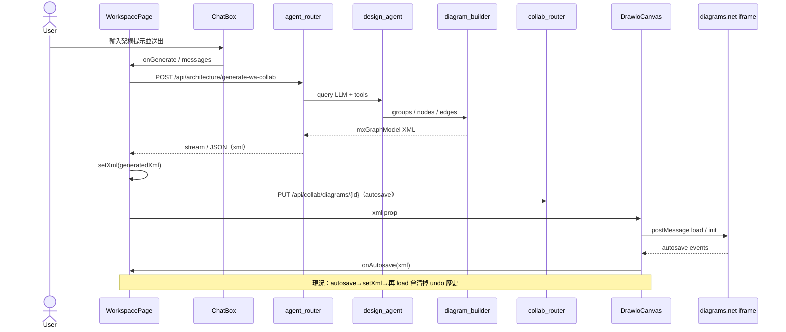
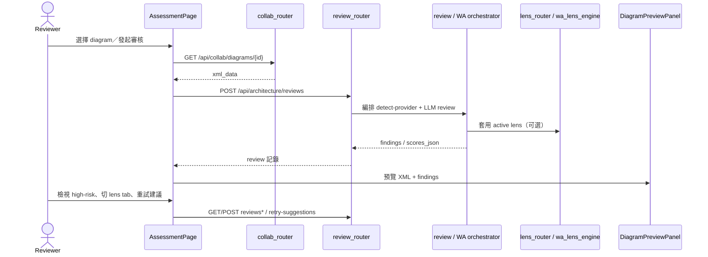

# 系統架構（Architecture）

> Reverse Engineering 合成產物｜repo `cloud`｜commit `8c90f40`｜intent `260806-a1-a3-ux`

## 架構風格與邊界

Cloud-360 現況為 **模組化單體（modular monolith）** 的雙程序部署：

| 邊界 | 技術 | 職責 |
|---|---|---|
| Frontend SPA | React 19 + Vite + React Router 6 | 路由、RBAC 門禁 UI、A1 Workspace、A3 Assessment、管理頁、draw.io iframe 宿主 |
| Backend API | FastAPI + SQLAlchemy + PostgreSQL | 認證／授權、agent 編排、圖 XML 組裝、協作 CRUD／WS、WA review／lens |
| Embed 畫布 | embed.diagrams.net（iframe） | 互動式圖編輯；經 `postMessage` 與 `DrawioCanvas` 交換 XML |
| LLM 執行層 | claude-agent-sdk（經 OpenRouter 環境映射） | `design_agent` 產生架構結構；`review_agent`／orchestrator 產生審核結果 |

持久化單一 PostgreSQL；無獨立微服務邊界。Router 以 prefix 劃分公開 API 面，服務層（`services/*`）承載領域邏輯。

## 元件關係圖

```mermaid
flowchart TB
  subgraph FE["Frontend SPA"]
    Layout["Layout + Sidebar"]
    WP["WorkspacePage A1"]
    AP["AssessmentPage A3"]
    DC["DrawioCanvas"]
    AuthCtx["auth-context RBAC"]
    Layout --> WP
    Layout --> AP
    WP --> DC
    AP --> DC
    AuthCtx --> Layout
  end

  subgraph BE["Backend FastAPI"]
    AR["agent_router /api/architecture"]
    RR["review_router /api/architecture"]
    LR["lens_router /api/architecture"]
    CR["collab_router /api/collab"]
    UR["user_router /api/auth"]
    DA["design_agent"]
    DBB["diagram_builder"]
    WO["wa_collab_orchestrator / review_orchestrator"]
    RBAC["rbac + auth"]
    AR --> DA --> DBB
    AR --> WO
    RR --> WO
    UR --> RBAC
    CR --> RBAC
  end

  PG[(PostgreSQL)]
  LLM["LLM via claude-agent-sdk / OpenRouter"]
  DIO["embed.diagrams.net"]

  WP -->|API"| AR
  WP -->|API / WS"| CR
  AP -->|"API"| RR
  AP -->|"API"| LR
  AP -->|"API"| CR
  DC <-->|"postMessage XML"| DIO
  DA --> LLM
  WO --> LLM
  CR --> PG
  RR --> PG
  UR --> PG
  LR --> PG
```

文字 fallback：使用者經 `Layout`／`Sidebar` 進入 A1 或 A3；A1 呼叫 `/api/architecture/generate*` 與 `/api/collab`，畫布 XML 經 `DrawioCanvas` ↔ diagrams.net；A3 呼叫 `/api/architecture/reviews` 與 lens API；後端用 `design_agent`＋`diagram_builder` 組 XML，用 review／WA orchestrator 寫入 PostgreSQL。

## Interaction Diagrams

### A1：產生架構圖 → 畫布



### A3：WA Review 流程



## 改善機會（含 A1／A3 UX hotspots）

下列項目必須納入後續 bugfix 設計；它們落在既有邊界內，不需拆服務：

1. **App Sidebar 不可收合** — `Layout.tsx` 固定掛載 `Sidebar`（`w-64`）；`WorkspacePage` 僅有 `chatCollapsed`，無 app-level 側欄收合 → 建議在 `Layout`／`Sidebar` 引入可持久化的 collapse，並通知 `DrawioCanvas` 的 `layoutEpoch`。
2. **Edges 與圖示重疊** — `diagram_builder.py` 的 edge 無 exit／entry port；edge `parent` 恆為 `"1"`；node 用 image shape → 正交邊常穿越圖示；應為連線端點指定 port／waypoints，並修正 parent 語意。
3. **Draw.io save／exit 未處理** — `DrawioCanvas` 目前僅處理 init＋autosave，`ui=min`；缺 save／exit／export 事件橋接 → 需擴充 `postMessage` 協議與明確儲存 UX。
4. **Undo 損壞** — autosave 回呼 `setXml` 再 `postMessage load` 會重置 iframe 歷史，且焦點常在 iframe 外 → 應區分「遠端合併載入」與「本機編輯中」，避免無差別 reload。
5. **無 prompt refusal** — `design_agent`／`agent_router` 未拒絕要求變更 Cloud-360 DB／API key／credential／系統值的提示 → 應在 routing／system prompt 層加硬性拒絕與稽核。
6. **Sidebar 扁平 IA** — 核心／管理區為平鋪連結；`RolePermissionsPage` 已有 pillar 概念，導覽未對齊 A→A1／A3、J→admin 巢狀 → 側欄應改為 story-group nesting。
