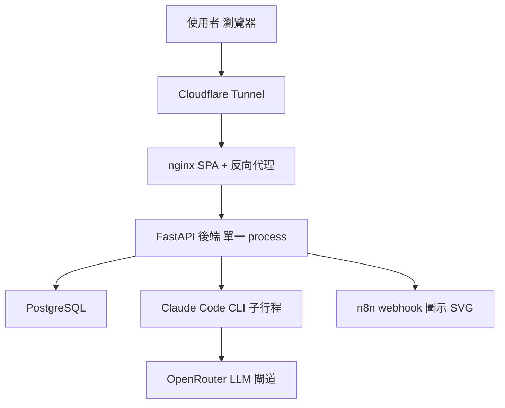
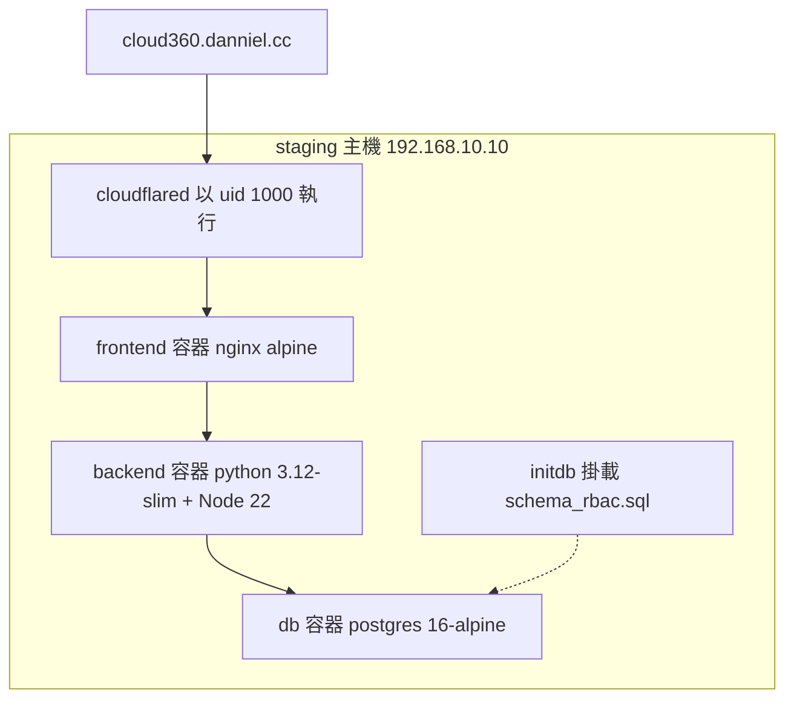
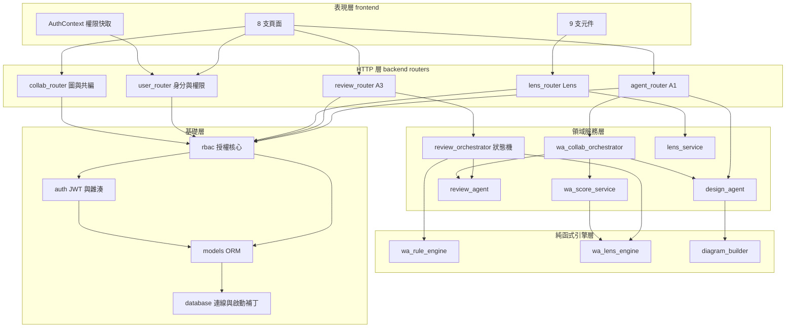
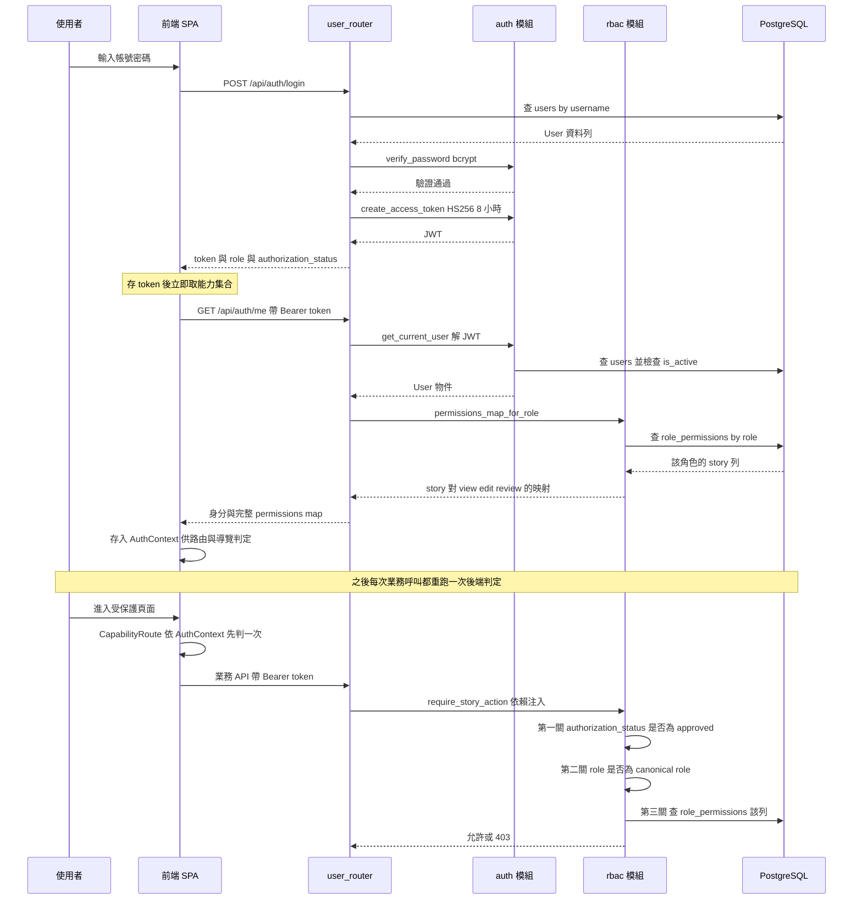
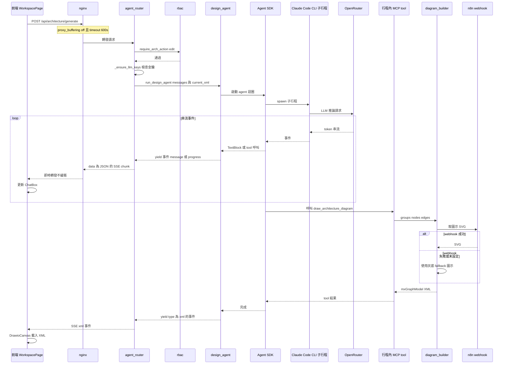
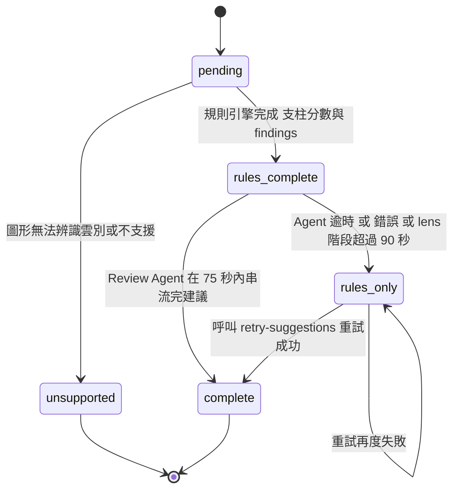

# Architecture — Cloud-360

> 逆向工程產出。基準 commit `8c90f40372ac810cc8f6ef41c46fc7a723031a1e`（branch `ut`，2026-08-08）。
> 每張 Mermaid 圖後方都附「文字 fallback」段落，內容與圖等價。

## 架構風格與判定依據

**判定結論：Modular Monolith + SPA。**

支撐這個判定的觀察事實：

| 觀察 | 證據 |
|---|---|
| 後端是**單一 process**，5 個 router 掛在同一個 `FastAPI` app | `backend/main.py` 的 5 個 `include_router` |
| 全部模組共用**同一個** `SessionLocal` 與**同一個** PostgreSQL 實例 | `backend/database.py` 單一 engine |
| **無訊息佇列、無背景 worker、無快取層** | 依賴清單無 celery／redis／rabbitmq 等 |
| 前端是**獨立部署**的 Vite SPA，經 nginx 同源反向代理 | `frontend/nginx.conf` 將 `/api/` 轉發 `backend:8000` |
| 唯一的跨行程邊界是 LLM 子行程與兩個外部 HTTP 呼叫 | `claude-agent-sdk` spawn `claude` CLI；OpenRouter；n8n webhook |

**被排除的替代判定：**

- **微服務**：排除。沒有任何服務邊界上的獨立部署單元、獨立資料庫或網路呼叫；
  5 個 router 是模組邊界不是服務邊界，跨模組呼叫都是同 process 的 Python import。
- **分層單體（layered monolith）**：部分成立但不精確。`review`／`lens`／`wa_*` 家族確實有
  乾淨的 router → service → model 分層，但 `user_router.py` 與 `collab_router.py` 把商業邏輯
  直接寫在 HTTP handler 內、沒有獨立 service 層。分層**不是全域一致的**，因此以「模組化單體」
  描述其邊界特性比以「分層」描述更貼近實況。

## 系統脈絡

**文字 fallback（系統脈絡）**：使用者瀏覽器經 Cloudflare Tunnel 進入 nginx；nginx 同時
負責提供 SPA 靜態資產與把 `/api/` 反向代理到 FastAPI 後端。後端對外只有三個下游：
PostgreSQL（唯一持久層）、由 Agent SDK spawn 的 Claude Code CLI 子行程（該子行程再連
OpenRouter 作為 LLM 閘道）、以及選填的 n8n webhook（取得動態圖示 SVG，失敗時有灰底 fallback）。
**只有 nginx 對外曝露**，後端與資料庫都不直接對外。

## 執行期組件拓撲

**文字 fallback（執行期拓撲）**：staging 為單機 docker compose stack，四個容器：
`cloudflared`（以 uid 1000 執行以讀取 0400 憑證）、`frontend`（nginx alpine，唯一對外）、
`backend`（python 3.12-slim 基底，映像內含 Node 22 與全域 `@anthropic-ai/claude-code`）、
`db`（postgres 16-alpine）。`schema_rbac.sql` 以 initdb 腳本掛載到 db 容器，
**僅在資料 volume 為空時執行一次**（虛線代表這個一次性關係）。對外主機名為
`cloud360.danniel.cc`，經 Cloudflare Tunnel 進入。本機開發環境用另一份 compose，
資料庫為 postgres **15**-alpine —— 與 staging 的 16 不一致。

## 分層與模組邊界

**文字 fallback（分層）**：五層。表現層為 React SPA（8 頁面、9 元件，加上
`AuthContext` 作為前端權限快取）。HTTP 層為 5 個 FastAPI router。領域服務層有兩個編排器
（A3 狀態機 `review_orchestrator`、A1↔A3 協作 `wa_collab_orchestrator`）、兩個 LLM agent
與兩個服務模組。純函式引擎層（`wa_rule_engine`、`wa_lens_engine`、`diagram_builder`）
**不讀資料庫、不連外**，是全系統最容易測試的部分，也是 property-based 測試的落點。
基礎層有授權核心 `rbac`、驗證核心 `auth`、ORM `models` 與連線兼啟動補丁 `database`。
**五個 router 全部依賴 `rbac`** —— 這是全系統唯一的全域橫切依賴。

### 邊界品質評估

| 邊界 | 內聚度 | 耦合度 | 評語 |
|---|---|---|---|
| `wa_rule_engine` / `wa_lens_engine` / `diagram_builder` | 高 | 極低 | 純函式、無 I/O。邊界最乾淨，可獨立演化 |
| `review_router` → `review_orchestrator` → `review_agent` | 高 | 低 | 分層明確，狀態機集中在一處 |
| `lens_router` → `lens_service` | 高 | 低 | 薄 router、獨立 service |
| `rbac` | 高 | 高（被動） | 被 5 個 router 依賴是設計意圖，非缺陷 |
| `user_router` | 中 | 中 | **831 LOC，商業邏輯直寫 handler，無 service 層** |
| `collab_router` | 中 | 中 | **527 LOC，同上；另含 WebSocket 廣播狀態** |
| `database` | 低 | 高 | 混合三件事：連線管理、seed、runtime DDL 補丁 |

## 橫切關注點

### 授權（RBAC）— 四層同步

RBAC 是全系統最重要的橫切關注點，同時出現在**四個地方**，四層讀同一份 `role_permissions` 資料：

1. **後端 guard**：FastAPI `Depends`（`require_story_action`／`require_arch_action`）
2. **前端路由**：`CapabilityRoute storyId=... action=...`
3. **前端導覽**：`Sidebar` 的 4 個 `can()` 判定
4. **註冊頁角色目錄**：`GET /api/auth/roles/catalog`（**公開端點，無驗證**）

**架構後果**：任何 story 或角色的增減都是**四點同步**。這是設計上的必然（前端要能在
不打 API 的情況下決定顯示什麼），但代表新增能力時的檢查清單有四項而非一項。

### 架構圖三合一規則

`A1`／`A2`／`A4` 三個 story 在執行期被視為**同一功能**：判定時三者一律改讀 `A1`
（`ARCH_CANONICAL_STORY`），寫入權限矩陣時三者同步寫。這是一個埋在 `rbac.py` 內的
語意規則，讀矩陣資料時若不知道這條規則會誤判 `A2`／`A4` 的實際效力。

### 串流（SSE）

兩條 SSE 管線（A1 產圖、A3 評核）是系統最複雜的部分，並對基礎設施產生要求：
`frontend/nginx.conf` 為此特別關閉 `proxy_buffering` 並設 600 秒 timeout。
**任何反向代理層的變更都必須保留這兩項設定**，否則串流會被緩衝或中斷。

### 錯誤處理策略

觀察到一致的「**降級而非失敗**」策略：

- A3 評核的 Agent 階段逾時（75 秒；lens 階段 90 秒）→ 狀態落為 `rules_only`，
  規則結果仍完整回傳，且提供 `retry-suggestions` 端點重試。
- `diagram_builder` 取圖示 SVG 失敗 → 用灰底 fallback，不中斷產圖。
- 無 DB lens 資料 → 回退到 `backend/lenses/` 的三份 JSON。

### 持久化

單一 PostgreSQL，7 個表。**執行期 schema 的真實來源是 ORM 加上啟動時的 DDL 補丁**
（`database.py` 的三個 `_ensure_*_schema()`），不是任何一份 `.sql` 檔。
這一點是重大架構張力，詳見下方「架構約束與已知張力」。

## Interaction Diagrams

本節以圖描繪業務交易如何跨元件實現。三張圖分別涵蓋：授權判定鏈、A1 串流產圖、A3 評核狀態機。

### 交易一：登入與 RBAC 判定鏈

**文字 fallback（登入與 RBAC 判定鏈）**：

1. **登入**：前端送帳密到 `POST /api/auth/login`。`user_router` 查 `users` 表，
   交給 `auth` 模組以 bcrypt 驗證密碼，通過後簽發 HS256 JWT（8 小時效期），
   回傳 token、role 與 `authorization_status`。**登入 handler 目前不寫入任何資料** ——
   系統對「使用者何時登入過」零紀錄。
2. **取能力集合**：前端立刻打 `GET /api/auth/me`。`get_current_user` 解 JWT 取 `sub`，
   回查使用者並檢查 `is_active`（停用者在此被擋為 403）。接著 `rbac.permissions_map_for_role`
   查該角色在 `role_permissions` 的所有列，回傳 `{story_id: {view, edit, review}}`。
   前端存入 `AuthContext`。
3. **前端判定**：路由由 `CapabilityRoute` 依 `AuthContext` 判定，導覽由 `Sidebar` 的
   `can()` 判定。**這一層是體驗優化，不是安全邊界**。
4. **後端判定（真正的安全邊界）**：每次業務呼叫都重跑三關 ——
   第一關檢查 `authorization_status` 是否為 `approved`（否則直接 403，
   不論矩陣怎麼設定）；第二關檢查 role 是否為 canonical role；
   第三關查 `role_permissions` 對應列。`view` 的判定為
   `can_view OR can_edit OR can_review`。若 story 屬 `A1`／`A2`／`A4`，先改讀 `A1`。

### 交易二：A1 對話產圖的 SSE 串流

**文字 fallback（A1 SSE 串流）**：前端 `POST /api/architecture/generate`，經 nginx
（已關閉緩衝、timeout 600 秒）到 `agent_router`。router 先過 `require_arch_action("edit")`
授權，再檢查 LLM 金鑰是否設定（未設定回 500）。接著呼叫 `design_agent.run_design_agent`，
後者透過 `claude-agent-sdk` **spawn 一個 Claude Code CLI 子行程**，子行程連 OpenRouter
做推論。agent 產生的每個事件（`message`／`progress`）都即時 yield 出來，由 router 包成
`data: {JSON}` 的 SSE chunk 送到前端更新聊天框。當 agent 決定畫圖時，呼叫 in-process MCP tool
`draw_architecture_diagram`，該 tool 委派 `diagram_builder` 把 groups／nodes／edges
組成 draw.io `mxGraphModel` XML；組裝過程會打 n8n webhook 取圖示 SVG，
**失敗或未設定時改用灰底 fallback 圖示，不中斷流程**。最終以 `xml` 型別事件回傳，
前端載入 `DrawioCanvas`。

**跨行程邊界提醒**：這條鏈路有一個容易被忽略的硬依賴 —— backend 容器內**必須有
Node 22 與全域安裝的 `@anthropic-ai/claude-code`**，否則 `claude-agent-sdk`
無法 spawn 子行程，A1 與 A3 建議階段全部失效。

### 交易三：A3 評核狀態機

**文字 fallback（A3 狀態機）**：評核建立時狀態為 `pending`。若圖形無法辨識或不支援，
落入終態 `unsupported`。正常路徑先跑離線規則引擎，完成後狀態轉為 `rules_complete`
（此時支柱分數與 findings 已可用，SSE 已送出 `rules_done` 事件）。接著進入 lens 與
Review Agent 階段：成功串流完建議則轉 `complete`；Agent 逾時（`AGENT_TIMEOUT_SEC = 75` 秒，
lens agent 為 90 秒）或發生錯誤則轉 `rules_only` —— **這是降級不是失敗，規則結果完整保留**。
`rules_only` 狀態可透過 `POST /api/architecture/reviews/{review_id}/retry-suggestions`
重試（該端點會先檢查狀態必須是 `rules_only`，否則回 `invalid_status` 錯誤）；
重試成功轉 `complete`，失敗則留在 `rules_only`。

**同圖只保留一筆有效評核**：建立新評核時會 `_archive_previous()` 把該圖先前處於
`complete`／`rules_only`／`unsupported` 的評核封存。

**SSE 事件序**（前端契約）：`rules_done` → `lens_done` → 多個 `suggestion_delta` →
`complete`；任一階段可改送 `error`。

## 架構約束與已知張力

### 張力一：Schema 的真實來源有三處，且不一致（最高優先）

| 來源 | 宣稱角色 | 實際地位 |
|---|---|---|
| `schema_rbac.sql`（523 行） | 新環境唯一要跑的完整部署腳本；掛為 initdb | **缺 J5 全部物件** |
| `backend/models.py` + `database.py::_ensure_*_schema()` | ORM 定義與啟動補丁 | **執行期的實際權威** |
| `schema.sql`（79 行） | 精簡核心 DDL 參考 | 嚴重落後，缺 3 個表 |

**具體後果**：`users.authorization_status` 與 `role_authorization_requests` 表
**只存在於 `database.py::_ensure_j5_schema()`**。新環境用 initdb 建出來的 `users` 表
沒有 `authorization_status` 欄位、`role` 仍是 `NOT NULL`；J5 授權流程能運作純粹依賴
後端啟動時執行 `ALTER TABLE ... ADD COLUMN IF NOT EXISTS` 與 `ALTER COLUMN role DROP NOT NULL`。

**這是既有的 `project.md` blocking 規則違反**，也是任何「在 `users` 加欄位」的變更
會踩到的同一條路徑。設計新的欄位時，**必須同時落三處**（ORM／`_ensure_*_schema()` 補丁／
`schema_rbac.sql`），並更新 `DEPLOY.md` 的表清單。

### 張力二：權限矩陣是資料，不是程式碼

矩陣可由 `J3b.edit` 在 Admin UI 即時修改，改完立刻生效。這是刻意的彈性設計，但代價是：

- 執行期行為無法只從程式碼推斷，必須查 DB。
- 預設矩陣有**兩份來源**（`schema_rbac.sql` 的 308 列 INSERT 與
  `backend/services/rbac_seed_data.py` 的 308 筆 tuple），後者的 docstring 宣稱由前者產生，
  **但該產生腳本不存在於 repo，CI 也無一致性檢查**。
- `schema_rbac.sql` 第 178 行有無條件的 `DELETE FROM role_permissions;`，
  使「重跑腳本取得新 DDL」與「保留 Admin UI 調整」互斥 —— 而張力一的修法正好需要重跑。

### 張力三：前端與後端的資料契約靠人工維持

前端**沒有集中式 API client**：32 處原生 `fetch()` 散落 8 支頁面與元件，各自手寫
`Authorization` header、錯誤解包與提示。後端 `UserSchema` 與前端 `DbUser` interface
是兩份手寫鏡像，無型別產生機制。**新增欄位必須兩邊各改一次，沒有任何機制會在漏改時報錯。**

### 張力四：一個未受保護的業務端點

`/api/collab/ws/{workspace_id}` 是 46 個端點中唯一沒有任何 `Depends` guard 的業務端點。
WebSocket 連線層不做 JWT 檢查，任何知道 workspace id 的連線都能收到共編廣播。

### 對新變更的架構約束（給下游 stage 的檢查清單）

任何觸及 `users` 表或 Admin 頁的變更，必須同時滿足：

1. **三處 schema 同步**：`backend/models.py`、`database.py` 的 `_ensure_*_schema()` 補丁、
   `schema_rbac.sql`（用 `IF NOT EXISTS` 等可重跑安全寫法）。
2. **`DEPLOY.md` 表清單同步**（`project.md` blocking 規則）。
3. **時間戳慣例**：既有時間戳一律 `DateTime(timezone=True)` + `server_default=func.now()`
   （SQL 側 `TIMESTAMPTZ DEFAULT now()`）。新欄位循此慣例即與既有風格一致。
4. **前後端契約兩處手改**：`user_router.py` 的 `UserSchema` 與 `AdminPage.tsx` 的 `DbUser`。
5. **`AdminPage` 的 hook 形狀**：受 `react-hooks/set-state-in-effect` 規則約束，
   資料抓取被迫拆成純抓取的 `fetchUserList`（不碰 state）與呼叫端在 `.then/.catch/.finally`
   內更新 state 的 `fetchUsers`，`useEffect` 內另用 `cancelled` flag。
   **新增資料源必須沿用此形狀，否則 CI lint 紅燈。**
6. **RBAC 四層同步**：若涉及新 story 或新角色，後端 guard、前端路由、前端導覽、
   註冊頁目錄四處都要動。
