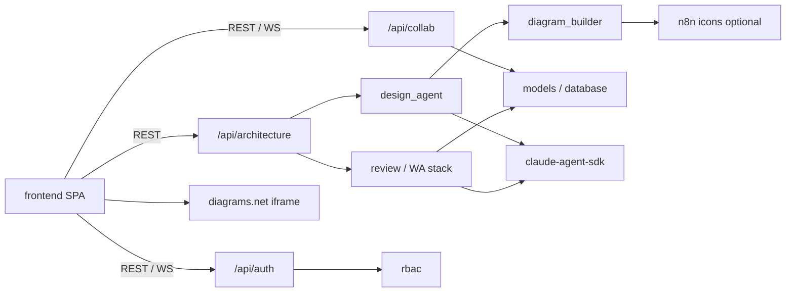

# 相依關係（Dependencies）

> Reverse Engineering 合成產物｜repo `cloud`｜commit `8c90f40`

## 外部相依

### Runtime／服務

| 相依 | 類型 | 耦合方式 | 風險 |
|---|---|---|---|
| PostgreSQL | 資料庫 | SQLAlchemy DSN／環境變數 | Schema 漂移須同步 `schema_rbac.sql`＋`DEPLOY.md` |
| embed.diagrams.net | SaaS embed | iframe URL＋`postMessage` | UI 參數（如 `ui=min`）與事件契約變更會影響 A1；目前僅覆蓋 init／autosave |
| OpenRouter／LLM | AI 供應商 | `OPENROUTER_API_KEY` → Agent SDK env | 金鑰外洩、模型行為漂移；**缺 prompt refusal** 放大濫用面 |
| n8n icon 端點（diagram_builder） | HTTP | 依服務名拉圖示 | 網路失敗時圖示降級 |
| Cloudflare Tunnel | 邊緣曝露 | Staging 維運（ADR-0007） | Tunnel／憑證誤設影響對外可用性 |

### Frontend npm（生產相依）

`react`、`react-dom`、`react-router-dom`、`html2canvas`、`jspdf`。其餘為開發／建置（Vite、TS、ESLint、Tailwind、Playwright）。

### Backend pip

見 `backend/requirements.txt`：FastAPI 生態、SQLAlchemy、認證套件、`claude-agent-sdk`、`hypothesis`、`httpx`、`python-dotenv`。

不得將 secrets 提交至 git；contract 掃描會擋常見 credential 字樣。

## 內部跨套件相依

關鍵內部邊：

| From | To | 性質 |
|---|---|---|
| `WorkspacePage` | `agent_router` + `collab_router` + `DrawioCanvas` | A1 主路徑；狀態雙寫（React state＋DB＋iframe） |
| `AssessmentPage` | `review_router` + `lens_router` + `collab_router` | A3；讀圖再審核 |
| `design_agent` | `diagram_builder` | 產生品質完全依賴 builder 幾何／edge 規則 |
| `Layout` | `Sidebar` | 全域導覽；**尚無 collapse 介面**，頁面級僅有 chat 收合 |
| ORM／startup ensure | `schema_rbac.sql` | 部署契約；變更必須雙端同步 |

## 循環與脆弱點

- **無經典套件循環**，但 A1 存在**狀態回寫環**：iframe autosave → `setXml` → iframe `load` → 歷史清空（邏輯環，非 import 環）。
- Frontend 對 diagrams.net 為硬性執行時相依；離線或第三方變更無二級編輯器。
- Agent 路徑與平台安全語意耦合不足（refusal 缺失）→ 內部 API 雖有 RBAC，仍可能被提示誘導產生不當操作建議。
- 測試相依：backend Hypothesis／unittest；frontend 僅 Playwright e2e——單元層對 `DrawioCanvas`／Sidebar IA 的防護薄弱。
