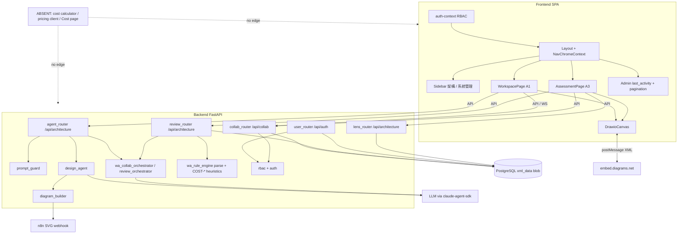
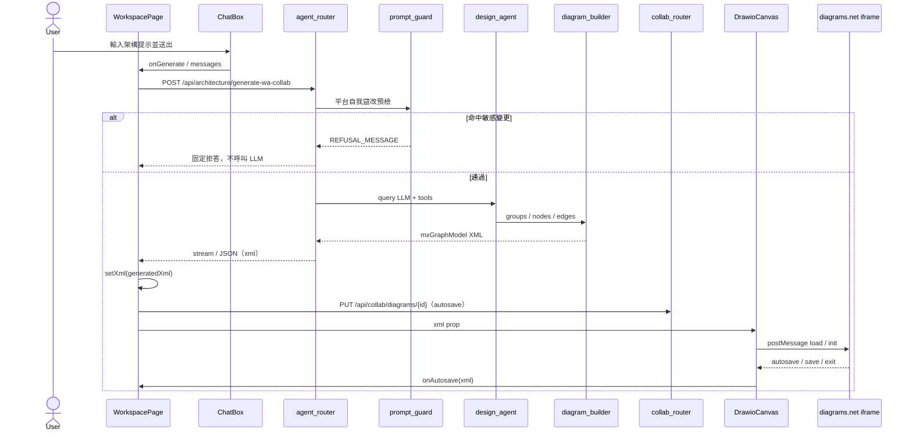
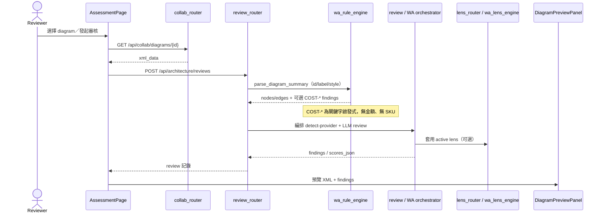
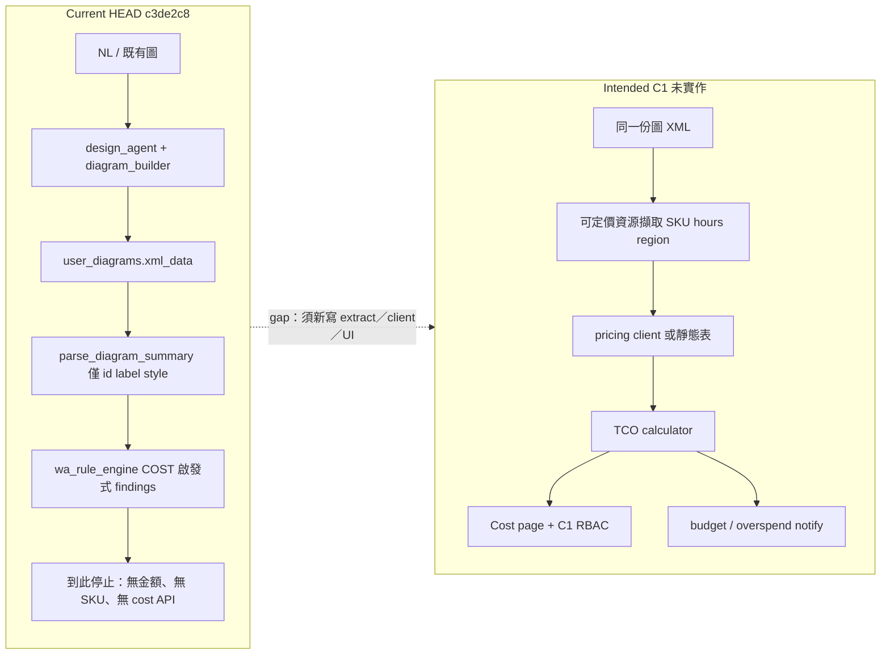

# 系統架構（Architecture）

> Reverse Engineering 合成產物｜repo `cloud`｜HEAD `c3de2c8`｜intent `260819-cost-finops`｜mode **Modify overlay for C1**（保留 2026-08-06 模組化單體總覽；訂正已過時的 A1／A3 hotspot；疊加 C1 現況 vs 意圖）

## 架構風格與邊界

Cloud-360 現況為 **模組化單體（modular monolith）** 的雙程序部署：

| 邊界 | 技術 | 職責 |
|---|---|---|
| Frontend SPA | React 19 + Vite + React Router 6 | 路由、RBAC 門禁 UI、A1 Workspace、A3 Assessment、管理頁、draw.io iframe 宿主；Sidebar 可收合（`NavChromeContext`） |
| Backend API | FastAPI + SQLAlchemy + PostgreSQL | 認證／授權、agent 編排、圖 XML 組裝、協作 CRUD／WS、WA review／lens、`prompt_guard` |
| Embed 畫布 | embed.diagrams.net（iframe） | 互動式圖編輯；經 `postMessage` 與 `DrawioCanvas` 交換 XML（含 save／exit） |
| LLM 執行層 | claude-agent-sdk（`LLM_PROVIDER`：OpenRouter 映射或 claude CLI） | `design_agent` 產生架構結構；`review_agent`／orchestrator 產生審核結果 |

持久化單一 PostgreSQL；**無獨立微服務邊界、無 cost／pricing 服務**。Router 以 prefix 劃分公開 API 面（仍為五組：`/api/architecture`、`/api/collab`、`/api/auth`），服務層（`backend/services/*`）承載領域邏輯。

C1 在架構上是 **缺席的 bounded context**：沒有 calculator 元件、沒有 pricing port、沒有 Cost UI。最接近的既有模組是 A3 的 `wa_rule_engine.parse_diagram_summary`（給 WA 用的精簡 mxCell 摘要）與 `cost_optimization` 啟發式 findings——**不是 TCO**。

## 元件關係圖

<!--
文字 fallback：使用者經 Layout／可收合 Sidebar（架構、系統管理兩組）進入 A1 或 A3；A1 經 prompt_guard 後呼叫 /api/architecture/generate* 與 /api/collab，畫布 XML 經 DrawioCanvas ↔ diagrams.net（含 save／exit）；diagram_builder 可向 n8n 取 SVG。A3 呼叫 reviews／lens；wa_rule_engine 從 XML 做關鍵字啟發式（含 COST-*），寫入 PostgreSQL。沒有任何邊連到 cost calculator、pricing client 或 Cost 頁——那些元件不存在。
-->

## Interaction Diagrams

### A1：產生架構圖 → 畫布（仍成立，已含 guard 與儲存事件）

<!--
文字 fallback：A1 提示先經 prompt_guard；通過後 design_agent → diagram_builder 產出 mxGraph XML，Workspace 寫入 collab 並載入 iframe。DrawioCanvas 處理 save／exit（HEAD 已接 data.event === 'save'|'exit'）。成功卡 CTA 為繼續編輯、IaC coming-soon、導向 A3；沒有成本 CTA。
-->

### A3：WA Review 流程（含 COST-* 啟發式；不是 TCO）

<!--
文字 fallback：A3 讀 xml_data，用 parse_diagram_summary 做精簡 mxCell 摘要，再跑 WA orchestrator。detect_provider 與 AssessmentPage 的 AWS／GCP／Azure 下拉是雲別覆寫（auto_detect_provider: false），不是成本 Manual Override。COST-* findings 不是 TCO。
-->

### C1：現況路徑 vs 意圖路徑（本 overlay 必備）

現況在「圖 XML + WA 成本啟發式 findings」終止；**沒有 TCO calculator**。下圖左為 HEAD 實際資料流，右為設計意圖（repo 內不存在，不得當成已實作）。

<!--
文字 fallback（現況）：A1 把 groups/nodes/edges 寫成 mxCell（無 sku／size／hours）；持久化只有 xml_data。A3 的 parse_diagram_summary 抽出 id、label、style，wa_rule_engine 用關鍵字產生 COST-OVERSIZE-HINT、COST-NO-LIFECYCLE、COST-NAT-HINT、GCP-COST-NO-COMMIT、AZ-COST-NO-COMMIT。流程在此停止。沒有 /api/cost*、沒有 calculator、沒有 Cost 頁、沒有 inbox。
文字 fallback（意圖，未實作）：從圖抽出可定價資源 → 查價（public list 或覆寫）→ TCO calculator → Cost UI（Sidebar C 組、C1 守衛）與預算通知。意圖邊不得畫成現有元件。
-->

## 改善機會與 hotspot 狀態

**已關閉（相對 2026-08-06 codekb，勿再當開帳）**

1. **Sidebar 可收合** — `NavChromeContext.tsx` + `localStorage` key `cloud360.nav.sidebarCollapsed`；收合為 icon rail `w-14`（`Sidebar.tsx`）。
2. **Sidebar A／J 分組** — 展開時「架構」（`/workspace`、`/assessment`）與「系統管理」（三個 admin 路徑）。仍**無 C／FinOps 組**。
3. **Edges exit／entry** — `diagram_builder.compute_edge_waypoints` 寫入 `exitX/Y`、`entryX/Y`。殘項：edge `parent` 仍 `"1"`。
4. **Draw.io save／exit** — `DrawioCanvas.tsx` 處理 `data.event === 'save'|'exit'`。
5. **prompt refusal** — `backend/services/prompt_guard.py` 已存在。

**仍開／未重驗（A1／A3 殘項）**

- Undo：程式註解稱已避免 autosave echo load（`DrawioCanvas.tsx`）；本 scan **未重跑 UX 驗證**。
- Edge `parent` 恆 `"1"`。

**C1 新 hotspot（本 intent 設計起點）**

1. 圖契約無 SKU：`DRAW_INPUT_SCHEMA` required 僅 `id,name,x,y`；`user_diagrams` 無平行資源表。
2. Public pricing client 與成本 Manual Override **ABSENT**（勿把 A3 provider select 當成覆寫單價）。
3. UI 掛點全缺：無 `/cost`、無 `CostPage`、成功卡無成本 CTA、`DefaultRedirect` 無 C1。
4. 無 inbox／budget／overspend primitive；超支警告須從零開始。
5. RBAC 種子領先執行期：`user_can(..., "C1", ...)` 通用函式可用，但無 router 以 C1 守衛。
6. 若新增 cost／budget 表，必須同步 `schema_rbac.sql`、`DEPLOY.md`、`database.py` `_ensure_*`（今日無 C1 DDL，尚無增量義務）。
