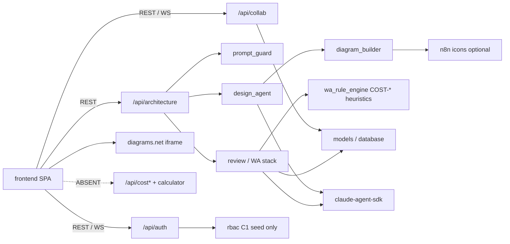

# 相依關係（Dependencies）

> Reverse Engineering 合成產物｜repo `cloud`｜HEAD `c3de2c8`｜intent `260819-cost-finops`｜mode **Modify overlay for C1**

## 外部相依

### Runtime／服務

| 相依 | 類型 | 耦合方式 | 風險 |
|---|---|---|---|
| PostgreSQL | 資料庫 | SQLAlchemy DSN／環境變數 | Schema 漂移須同步 `schema_rbac.sql`＋`DEPLOY.md`；今日**無** cost／budget／inbox 表 |
| embed.diagrams.net | SaaS embed | iframe URL＋`postMessage` | 事件契約變更影響 A1；HEAD 已覆蓋 init／autosave／**save／exit** |
| OpenRouter 或 claude CLI | AI 供應商 | `LLM_PROVIDER` + `OPENROUTER_API_KEY` 或本機 CLI 登入 | 金鑰外洩、模型行為漂移；`prompt_guard` 已縮小平台竄改面 |
| n8n icon 端點 | HTTP | `diagram_builder.py` `POST` `N8N_WEBHOOK_URL`（**Basic Auth**） | 網路失敗時圖示降級；憑證缺 `$` 規則見 env contract |
| convert.diagrams.net／exp.draw.io | HTTP | `review_router.py` PNG export | 第三方可用性；**不是**價目表 |
| Cloudflare Tunnel | 邊緣曝露 | Staging 維運（ADR-0007） | Tunnel／憑證誤設影響對外可用性 |
| 雲端 Public Price List | **ABSENT** | 無 `pricing.amazonaws`、無 `cloudbilling`、無 `retailprices`、無 boto3 | C1 若要查價必須**新寫** client 或靜態表；repo 內零硬編碼 USD |

`httpx.(get|post)` 在 `backend/` 實際呼叫僅上表兩處（n8n、PNG），皆非計價。

### Frontend npm（生產相依）

`react`、`react-dom`、`react-router-dom`、`html2canvas`、`jspdf`。其餘為開發／建置（Vite、TS、ESLint、Tailwind、Playwright）。無成本／圖表專用函式庫。

### Backend pip

見 `backend/requirements.txt`：FastAPI `==0.141.1`、Pydantic `==2.13.4`、SQLAlchemy、認證套件、`claude-agent-sdk`、`hypothesis`、`httpx`、`python-dotenv`。

不得將 secrets 提交至 git；contract 掃描會擋常見 credential 字樣。

## 內部跨套件相依

<!--
文字 fallback：前端只打 /api/auth、/api/collab、/api/architecture。architecture 經 prompt_guard 到 design_agent → diagram_builder（可選 n8n）與 WA review 棧（含 wa_rule_engine 啟發式）。沒有實線連到 /api/cost* 或 calculator——虛線表示缺口。RBAC 有 C1 種子但無執行期 cost router。
-->

關鍵內部邊：

| From | To | 性質 |
|---|---|---|
| `WorkspacePage` | `agent_router` + `collab_router` + `DrawioCanvas` | A1 主路徑；狀態雙寫（React state＋DB＋iframe）；成功卡不連成本 |
| `AssessmentPage` | `review_router` + `lens_router` + `collab_router` | A3；讀圖再審核；provider 下拉是雲別 |
| `design_agent` | `diagram_builder` | 產生品質依賴 builder 幾何／edge 規則；輸出無 SKU |
| `review_*` | `wa_rule_engine.parse_diagram_summary` | A3 摘要；label／style 關鍵字，不可當定價輸入 |
| `Layout` | `Sidebar` + `NavChromeContext` | 全域導覽；**已有 collapse**；無 C 組 |
| `rbac_seed_data` | `RolePermissionsPage` | C1 矩陣欄可見；無產品消費者 |
| ORM／startup ensure | `schema_rbac.sql` | 部署契約；C1 加表時 blocking 同步 |

## 循環與脆弱點

- **無經典套件循環。** 2026-08-06 記載的 A1 狀態回寫環（autosave → `setXml` → iframe `load`）：程式註解稱已避免 echo load；本 round **未重驗**，列為殘項而非已證關閉。
- Frontend 對 diagrams.net 為硬性執行時相依；離線或第三方變更無二級編輯器。
- Agent 路徑已有 `prompt_guard`；濫用面縮小，但仍無成本域的輸入驗證（因為沒有成本 API）。
- **C1 假相依風險**：把 `COST-*` findings 或 `detect_provider` 接成 TCO 會形成錯誤耦合。正確邊界是新的 extract＋pricing port，與 WA 啟發式分開。
- 測試相依：backend Hypothesis／unittest + **一支** `TestClient`（auth list）；frontend 僅 Playwright e2e——無成本頁可測。
