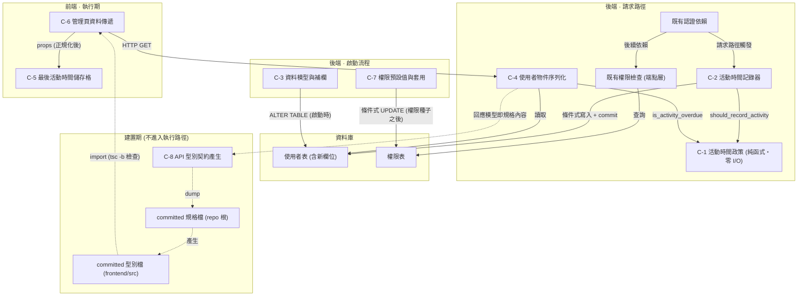

# Component Dependency — 依賴矩陣與資料流

> Stage: application-design（Inception 2.6）· Intent: 260802-last-login-column
> 上游來源：`../requirements-analysis/requirements.md`（下稱 requirements）、`../user-stories/stories.md`（下稱 stories）、`../practices-discovery/team-practices.md`（下稱 team-practices）、codekb `architecture.md`。
> 元件定義見 `components.md`，介面簽章見 `component-methods.md`。
> **本文件為 iteration 3 + Revision 1**。Revision 1（2026-08-09）新增建置期元件 C-8（虛線邊 = 建置期，不進入執行路徑）。

## 依賴圖

**文字 fallback**（供無法算繪 Mermaid 的環境）：

分五層。前端有 C-6（管理頁）與 C-5（儲存格）。後端請求路徑有既有認證依賴、既有的端點層權限檢查、C-2（記錄器）、C-4（序列化）、C-1（政策，純函式零 I/O）。後端啟動流程有 C-3（資料模型與補欄）與 C-7（權限預設值與套用）—— **這兩個只在服務啟動時執行，不在請求路徑上**。資料庫有使用者表與權限表。

十五條依賴（其中**四條為建置期**，圖上以虛線表示）：C-6 經既有 HTTP 端點取得資料自 C-4；C-6 正規化後以 props 傳給 C-5；既有認證依賴在請求路徑上觸發 C-2，並接續既有的權限檢查；C-2 呼叫 C-1 判斷是否該寫；C-2 對使用者表執行條件式寫入並提交；C-4 呼叫 C-1 判斷是否逾期；C-4 自使用者表讀取；權限檢查查詢權限表；C-3 在啟動時對使用者表補欄；C-7 在啟動時對權限表做條件式的目標更新（**必須排在既有權限種子之後**，且只更新不插入 —— 順序或插入行為錯誤會清空整份權限矩陣，見 `components.md` C-7）。

**建置期與執行期是分開的兩層**（Revision 1）：圖中的**虛線邊全部發生在建置期** —— C-4 的回應模型即規格內容、C-8 dump 出規格檔、規格檔產生型別檔、型別檔被前端 import 並由 `tsc -b` 檢查。**這四條邊不存在於執行路徑上**：生產環境跑起來之後，C-8 已經不在了。它的價值在於讓 C-4 與 C-6 之間的形狀落差在建置時就失敗。

**C-1 沒有任何對外依賴** —— 圖上不存在由 C-1 射出的箭頭。這是本設計的核心性質而非巧合：所有業務規則集中在一個誰都不依賴的葉節點上。

**C-3 與 C-7 都是啟動期補丁，但形狀不完全相同**：兩者都是「不重跑整份初始化腳本」這個約束的產物（requirements C-3），也都可重複執行。**但關鍵差異是位置與寫入語意** —— C-3 位於既有補欄補丁處、以 `IF NOT EXISTS` 建立缺少的欄位；C-7 必須位於權限種子**之後**、且**只更新不插入**。把 C-7 當成 C-3 的複製品是 iteration 2 揭露的 Critical 來源（見 `components.md` C-7）。

---

## 依賴矩陣

行為依賴方，列為被依賴方。「—」表示無依賴。

| ↓依賴 / 被依賴→ | C-1 | C-2 | C-3 | C-4 | C-5 | C-6 | C-7 | C-8 |
|---|---|---|---|---|---|---|---|---|
| **C-1 政策** | — | — | — | — | — | — | — | — |
| **C-2 記錄器** | 同步呼叫 | — | 寫入 | — | — | — | — | — |
| **C-3 資料模型** | — | — | — | — | — | — | — | — |
| **C-4 序列化** | 同步呼叫 | — | 讀取 | — | — | — | — | — |
| **C-5 儲存格** | — | — | — | — | — | — | — | — |
| **C-6 頁面** | — | — | — | HTTP | props | — | — | 型別（建置期） |
| **C-7 權限套用** | — | — | — | — | — | — | — | — |
| **C-8 型別產生** | — | — | — | 規格內容（建置期） | — | — | — | — |

**矩陣的五個可驗證性質**：

1. **C-1、C-3、C-5、C-7 四列全空** —— 皆為葉節點，不依賴任何元件。C-1 是規則、C-3 是資料、C-5 是純呈現、C-7 是啟動期補丁，四者都不知道有誰在用它們。
2. **無循環** —— 承上，那四個元件皆為 sink；其餘三個元件之間，C-2 與 C-4 互不依賴，只有 C-6→C-4 一條單向邊。沒有任何元件能經由任何路徑回到自己。
   （iteration 2 Finding N6：初版寫「矩陣上三角全空」作為證明，但 C-2 列 × C-3 欄的「寫入」正落在上三角 —— 結論為真而論據無效，已改為上述可逐格核對的證明。）
3. **C-2 與 C-4 互不依賴** —— 寫入路徑與讀取路徑完全解耦，只透過 C-1（共用規則）與 C-3（共用資料）間接關聯。兩條路徑可以獨立實作、獨立測試、獨立變更。
4. **C-8 只有一條入邊與一條出邊，且皆為建置期**（Revision 1）—— 它依賴 C-4（規格內容來源），C-6 依賴它（型別）。**執行期的依賴矩陣完全不變**：把 C-8 那一列與那一欄拿掉，剩下的就是 Revision 1 之前的矩陣。這是「工具鏈引入不影響執行期架構」的可驗證形式。
5. **C-7 與其他元件零耦合** —— 它與 C-3 操作同一個資料庫但不同的表，彼此沒有程式碼依賴。這代表權限變更可以與欄位變更獨立驗證。

---

## 通訊模式

| 依賴邊 | 模式 | 說明 |
|---|---|---|
| C-2 → C-1、C-4 → C-1 | 同步函式呼叫 | 程序內，純計算，無 I/O |
| C-2 → 使用者表 | 同步寫入 + 提交 | 條件式；判定為否時此邊不發生 |
| C-4 → 使用者表 | 同步讀取 | 隨既有的使用者查詢一併取得，非額外查詢 |
| C-6 → C-4 | 同步 HTTP | 既有端點，未新增往返 |
| C-6 → C-5 | props 傳遞 | 程序內，傳遞前正規化 |
| 認證依賴 → C-2 | 同步呼叫 | 請求路徑上 |
| C-3 → 使用者表 | 啟動期 DDL | **不在請求路徑上**；位於既有補欄補丁處 |
| C-7 → 權限表 | 啟動期 DML | **不在請求路徑上**；**必須位於既有權限種子之後** |
| C-4 → C-8、C-8 → 規格檔、規格檔 → 型別檔、型別檔 → C-6 | **建置期**，非執行期 | 生產環境跑起來後這**四條**邊都不存在 |

**全部同步、全部程序內**（唯一的跨程序邊是既有的 HTTP）。無事件、無佇列、無背景任務 —— 理由見 `services.md` 與 `decisions.md` AD-1。

---

## 資料流

### 流程一：記錄活動時間（寫入路徑）

1. 任一認證請求進入，既有認證依賴驗證憑證並查出使用者物件 —— **此時完整的使用者資料與資料庫工作階段皆已在手**
2. C-2 以該物件既有的欄位值與當下時刻（帶時區 UTC）呼叫 C-1
3. C-1 回傳「距上次寫入未達 5 分鐘」→ 流程結束，**不觸碰資料庫**（絕大多數請求走這條）
4. C-1 回傳「已達間隔」→ C-2 更新欄位並**提交**；失敗則**先復原再記錄**，不影響原始請求
5. 原始請求接續既有的權限檢查與端點邏輯

**兩個關鍵性質**：步驟 2 不產生任何查詢（判定所需的值來自認證流程已取得的物件）。步驟 4 的提交與復原是契約而非實作細節 —— 既有的工作階段供應器兩者都不做，若 C-2 也不做，唯讀端點的寫入會被整個丟棄（見 `component-methods.md` C-2）。

### 流程二：顯示活動時間（讀取路徑）

1. 稽核者開啟管理頁，C-6 呼叫既有的使用者清單端點
2. 既有的端點層權限檢查決定該請求是否被允許 —— 該角色能通過這關，**前提是 C-7 已在啟動時套用權限變更**
3. C-4 自使用者表取得資料（隨既有查詢，非額外往返）
4. C-4 對每位使用者以當下時刻呼叫 C-1 判定逾期，產出布林值
5. 回應帶回時間戳（UTC）與逾期旗標
6. C-6 把兩個值正規化後傳給 C-5，C-5 依 refined-mockups 已定的五種狀態呈現

**關鍵性質**：步驟 4 的判定是**每次請求即時計算**，不是儲存值。逾期狀態因此永遠反映請求當下。

### 流程三：啟動期的兩個補丁

1. 服務啟動，既有的初始化流程執行
2. C-3 對使用者表補上新欄位（可重複執行，已存在則無動作）
3. 既有的使用者種子與**權限種子**執行（權限表為空時建立完整的預設矩陣）
4. C-7 對權限表做條件式的目標更新（只動一列，**只更新不插入**；以既有的「最後異動者」欄位判斷是否已套用過）
5. 服務開始接受請求

**步驟 3 與 4 的順序不可對調**：C-7 若排在權限種子之前並具備插入能力，會讓權限表在種子執行前就非空，導致種子直接跳過 —— 整份預設矩陣不會被建立。詳見 `components.md` C-7。

**這條流程是流程一與流程二的前提**：欄位不存在則流程一寫入失敗、流程二讀取失敗；權限未套用則流程二在步驟 2 就被擋下。因此 requirements C-2 的「部署後須完成一次重啟」不是維運建議，而是本設計成立的必要條件（stories AC-1.7）。

### 三條流程的關係

寫入路徑與讀取路徑**在程式碼上沒有任何直接依賴**，只共用 C-1 的規則與使用者表的資料。啟動期流程與兩者皆無程式碼依賴，只有執行順序上的前置關係。這代表：

- 寫入路徑故障不影響顯示 —— 顯示的只會是較舊的值，不會出錯
- 讀取路徑不需要知道寫入是否發生過 —— 無紀錄態是它正常處理的輸入之一
- C-7 的失敗不影響欄位功能 —— 只是該角色進不了頁面（但那正是 US-3 的全部內容）

---

## 共用資源

| 資源 | 共用者 | 競爭風險 |
|---|---|---|
| 使用者表的新欄位 | C-2（寫）、C-4（讀）、C-3（啟動時建立） | 讀到剛好在寫的舊值 —— 無害，下次查詢即更新 |
| 資料庫工作階段 | C-2 借用認證流程既有的工作階段 | 借用不獨佔：C-2 提交但不關閉；失敗必復原以免污染後續使用 |
| 權限表 | 既有權限檢查（讀）、C-7（啟動時寫）、既有的權限調整與重置端點（請求期寫） | 啟動期與請求期不重疊，但**重置端點會刪光整表重寫**，抹除 C-7 的套用標記與管理員調整 —— 屬既有行為，見 `components.md` C-7 的已知限制 |
| 門檻常數 | C-2、C-4 皆經 C-1 取用 | 單一定義處，無不一致風險 |

**併發寫入**（iteration 1 Finding 9 修正）：兩個請求同時判定為「該寫入」時，兩者都會發出更新。各自持有自己算出的當下時刻，資料庫的列鎖保證更新序列化，但**不保證後提交者的時刻較大** —— 最終值是後提交者的時刻，與兩者的較大值可能有次毫秒級的偏差。在 5 分鐘的節流語意下這個偏差沒有實務影響，因此不需要鎖。

（初版寫成「最後值仍然正確（單調前進）」是錯的：列鎖排序的是寫入動作，不是寫入的值。結論不變，但論據已更正為真。）

---

## 對既有元件的影響面

| 既有元件 | 影響 | 破壞性 |
|---|---|---|
| 認證依賴 | 尾端新增一次條件式呼叫（含提交） | 無 —— 既有回傳值與例外行為不變；失敗路徑必復原，不污染後續 |
| 三個使用者物件端點（清單、啟停用、角色調整） | 回應各新增兩欄（**三處都必須同步處理**） | **有風險** —— 三處皆為手寫具名引數構造，漏改即為 stories AC-1.5 失敗；見 `components.md` C-4 |
| 使用者資料表 | 新增一個可為空欄位 | 無 —— 既有查詢與寫入不受影響 |
| 權限表 | 一列的值變更 | 無 —— 條件式的目標更新，其他列不動；順序契約見 `components.md` C-7 |
| 管理頁 | 新增一欄與小螢幕佈局 | 無 —— 載入態、錯誤態、既有欄位（含角色欄空值呈現）皆不動 |

**部署順序無硬性約束 —— 但前提是 C-6 做了正規化**（iteration 1 Finding 10）：回應形狀的變更是向後相容的新增，因此後端先上或前端先上都不會壞。前端先上時新欄位為 `undefined`，**由 C-6 的正規化收斂為空值與否**（見 `component-methods.md` C-6）；後端先上時多出的欄位被前端忽略。

初版宣稱「前端先上時新欄位為 `undefined`（顯示為無紀錄態）」，但 C-5 的 props 型別不含 `undefined` —— 那個論證當時只是碰巧成立（前端資料抓取無型別驗證）。現在由 C-6 的正規化契約使它真正成立。

---

## Revision 1（2026-08-11）— C-9 加入依賴矩陣

| ↓依賴 / 被依賴→ | C-1 | C-2 | C-3 | C-4 | C-5 | C-6 | C-7 | C-8 | C-9 |
|---|---|---|---|---|---|---|---|---|---|
| **C-9 分頁** | — | — | 讀取（計數與分頁查詢） | 構造 envelope | — | — | — | — | — |
| **C-6 頁面**（Revision 1 更新） | — | — | — | HTTP | props | — | — | 型別（建置期） | props ＋ 回呼 |
| **C-8 型別產生**（Revision 1 更新） | — | — | — | 規格內容（建置期） | — | — | — | — | 規格內容（建置期） |

其餘各列（C-1〜C-5、C-7）對 C-9 皆為 `—`，且 C-9 不被 C-1〜C-5、C-7 依賴。

### 新增的依賴邊

| 依賴邊 | 模式 | 說明 |
|---|---|---|
| C-9 → 使用者表 | 同步讀取（兩次查詢） | 一次計數取 `total`、一次帶 offset／limit 取 `items`。`total` **不得**由 `len(items)` 導出（AC-5.2） |
| C-9 → C-4 | 程序內構造 | C-9 擁有 envelope 的三個分頁值，C-4 擁有 `items` 內每一列的欄位；兩者在同一個回應構造點交會 |
| C-6 → C-9（前端） | props ＋ 回呼 | 頁面持有 `page` state，把三個分頁值與 `isBusy` 傳給控制項，控制項以 `onPageChange` 回呼交回 |
| C-8 → C-9 | 規格內容（建置期） | envelope 為具名 schema，其三個分頁欄位隨型別產生進入前端型別。**這條邊是 AD-10 選 envelope 而非回應標頭的決定性理由** —— 標頭不進回應 schema，此邊不存在 |

### 對既有拓樸的影響

- **無循環**：C-9 只依賴 C-4 與資料表；C-6 與 C-8 依賴 C-9；C-9 不依賴 C-6 或 C-8。
- **不改變任何既有邊**：C-2 → C-1、C-4 → C-1／C-3、C-6 → C-4／C-5／C-8、C-8 → C-4 全數不變。
- **C-9 橫跨前後端**，與 C-8 同為跨層元件。這在單元切分時需注意：它的後端部分與前端部分**驗證方式不同**（端點測試 vs e2e），units-generation 須依「驗證方式與失敗模式是否同類」的既有判準決定要不要拆（承 `project.md` 的 `cid:units-generation:c6`）。
