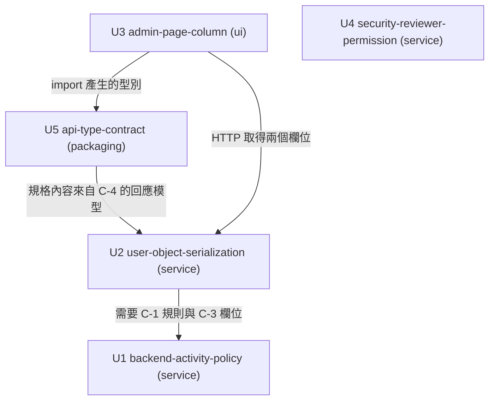

# Unit of Work Dependency — 依賴 DAG 與整合點

> Stage: units-generation（Inception 2.7）· Intent: 260802-last-login-column
> 上游來源：`../application-design/component-dependency.md`（依賴矩陣）、`components.md`、`component-methods.md`、`services.md`、`decisions.md`、`../requirements-analysis/requirements.md`（下稱 requirements）、`../user-stories/stories.md`（下稱 stories）、`../practices-discovery/team-practices.md`（下稱 team-practices）。
> 單元定義見 `unit-of-work.md`。

## 本檔只描述拓樸

**不推薦實作順序，不指出關鍵路徑。** 下方的「可並行集合」是在陳述**哪些單元之間沒有依賴**這個事實，不是在建議先做什麼 —— 多條合法的拓樸序都存在，選哪一條是下一站 Delivery Planning 的經濟決策。

## 依賴圖



**文字 fallback**（供無法算繪 Mermaid 的環境）：

五個節點。四條有向邊：U2 依賴 U1（需要 C-1 的判定規則與 C-3 的欄位）；U5 依賴 U2（規格內容來自 C-4 定義的回應模型）；U3 依賴 U2（經 HTTP 取得兩個欄位）；U3 依賴 U5（import 產生的型別）。

**U4 在圖上沒有任何邊 —— 這是事實，不是遺漏。** 它動的是權限表，其他單元動的是使用者表；**在程式碼依賴層面**與任何單元都沒有關係。

**但程式碼依賴不是全部** —— 見下方「非 DAG 的驗收依賴」。

## 機器可讀的邊定義

```yaml
units:
  - name: backend-activity-policy
    kind: service
    depends_on: []
  - name: user-object-serialization
    kind: service
    depends_on: [backend-activity-policy]
  - name: admin-page-column
    kind: ui
    depends_on: [user-object-serialization, api-type-contract]
  - name: security-reviewer-permission
    kind: service
    depends_on: []
  - name: api-type-contract
    kind: packaging
    depends_on: [user-object-serialization]
```

**已驗證的性質**（以腳本檢查，非人工目測）：5 個單元名稱無重複；所有 `kind` 值合法；所有 `depends_on` 中的名稱皆為已宣告的單元；無自我依賴；**無循環**。

## 依賴矩陣

行為依賴方，列為被依賴方。

| ↓依賴 / 被依賴→ | U1 | U2 | U3 | U4 | U5 |
|---|---|---|---|---|---|
| **U1** 規則與活動記錄 | — | — | — | — | — |
| **U2** 使用者物件序列化 | 規則與欄位 | — | — | — | — |
| **U3** 管理頁欄位 | — | HTTP 契約 | — | — | 型別（建置期） |
| **U4** 權限開通 | — | — | — | — | — |
| **U5** API 型別契約 | — | 規格內容 | — | — | — |

**三個可逐格核對的性質**：

1. **U1 與 U4 兩列全空** —— 皆不依賴任何單元。
2. **U4 那一欄也全空** —— 沒有任何單元在**程式碼依賴層面**依賴它。U4 與 DAG 完全解耦；但**驗收層面另有一條非 DAG 的依賴**，見下方專節。
3. **無循環** —— U1 與 U4 為 sink；U2 只射向 U1；U5 只射向 U2；U3 射向 U2 與 U5。沒有任何單元能經由任何路徑回到自己。

## 整合點

| 整合點 | 提供方 | 消費方 | 契約形式 | 誰驗證 |
|---|---|---|---|---|
| 時間門檻判定 | U1（C-1） | U2 | 純函式呼叫（程序內） | U1 的純函式測試 |
| 使用者表新欄位 | U1（C-3） | U2 | 資料庫欄位 | U1 的補欄；U2 的端點測試會讀到 |
| 使用者物件回應形狀 | U2（C-4） | U3、U5 | HTTP 回應的欄位集合 | **U2 的測試客戶端測試**（team-practices 規則 B） |
| 產生的型別 | U5（C-8） | U3 | TypeScript 型別宣告 | `tsc -b`（用法對型別檔）+ **U5 的型別檔漂移檢查**（型別檔對規格檔） |
| API 規格 | U2（C-4 的回應模型） | U5 | 由程式碼取得的規格檔 | **U5 的規格檔漂移檢查** |
| 權限表的目標列 | U4（C-7） | 既有的權限檢查機制 | 資料列 | U4 的雙向測試（**僅涵蓋種子預設值，不涵蓋既有環境套用**） |

**整合點的驗證強度不一致，這是已知且已記載的**：使用者物件回應形狀有可執行的斷言；型別契約有兩道 gate；但 U4 在既有環境的套用**沒有自動化驗證**，以啟動日誌三態記錄加部署後人工核對承接。

## 可並行的集合

**再次強調：以下是在陳述「哪些之間沒有依賴」，不是在建議順序。**

- **U1 與 U4 之間沒有依賴** —— 兩者可完全並行，零耦合、不同資料表。
- **U4 與任何單元之間都沒有程式碼依賴** —— 就建置而言它可以在任何時間點獨立進行（驗收面的約束見下節）。
- U2 需要 U1 的規則與欄位就緒；U5 需要 U2 的回應模型定案；U3 需要 U2 與 U5 兩者。

**存在多條合法的拓樸序** —— 例如 U4 可以插在任何位置，U1 與 U4 的相對先後也不受約束。下一站會依經濟考量（價值、風險、回饋速度）從中選一條，本站不預選。

## 非 DAG 的驗收依賴（來自 stories，本站保留而非丟棄）

stories 的「優先序與依賴總覽」**刻意區分**三類依賴，其中一類不進 DAG 但必須帶到下游：

> **驗收依賴（可平行開發，但驗收時需對方到位）：US-3（權限）..> US-1** —— 稽核者需有權限才能驗收「看得到」

對應到單元：**U1／U2／U3 交付的「稽核者看得到最後活動時間」，其驗收需要 U4 已到位** —— 否則主要 persona（`Security_Reviewer`）進不了管理頁，無從驗收已交付的價值。管理者視角不受此限。

**這不是程式碼依賴，不進 yaml edge block**（那裡只放建置依賴）。但在本專案的 deploy-on-merge 之下它是真實的：每個 Bolt 合併即部署，若顯示鏈先上而權限未上，那次部署對主要 persona 而言是不可驗收的。**這是下一站排序時的輸入，本站不替它決定順序。**

另有一項非邏輯依賴的交付約束（同樣來自 stories）：**US-1、US-2、US-4 修改同一段前端程式碼，必須序列合併以避免衝突**。該約束的對象是**同一段前端程式碼**（stories 原文為「動同一段 JSX」），而 JSX 由 C-5／C-6 全部擁有＝U3。因此這是**單元內部**的合併約束，不跨單元 —— 三則故事本身確實跨 U1／U2／U3，但**衝突面只在 U3**。

## 共用資源與跨單元的注意事項

| 資源 | 涉及單元 | 需要協調的點 |
|---|---|---|
| 使用者資料表 | U1（建立欄位、寫入）、U2（讀取） | U1 的補欄是 U2 能讀到欄位的前提 |
| 使用者回應模型 | U2（定義）、U5（取規格）、U3（用型別） | U2 的形狀變動會連帶要求 U5 重產、U3 重編譯 |
| 啟動流程 | U1（補欄補丁）、U4（權限套用補丁） | **兩者都掛在啟動流程，但順序約束不同**：U1 的補欄位於既有補欄處；**U4 必須在既有權限種子之後**。兩者互不影響，但 U4 的位置錯了會清空整份權限矩陣 |
| CI 的兩個 job | U5（各加一道漂移檢查） | backend job 檢查規格檔、frontend job 檢查型別檔；分屬兩處是因為 backend job 沒有 node |
| repo 根目錄 | U5（規格檔） | 檔名與確切路徑本站未定，須不觸犯 repo contract 的禁止路徑規則 |

## 一次部署、多單元

所有單元共用同一次部署（application-design 已定不新增服務與部署單元）。這代表：

- 單元之間**沒有部署順序約束** —— 它們一起上線
- 但 **U1 與 U4 的變更需要服務重啟才生效**（皆在啟動流程），這是 requirements C-2 的直接後果
- U5 **不部署** —— 其產出物在建置期被消費（型別檔編譯掉、規格檔留在 repo）

---

## Revision 1（2026-08-11）— C-9 併入後的拓樸複驗

**四條邊、五個單元、`kind` 值、yaml edge block —— 全部不變。** C-9 拆兩半併入 U2／U3（Q4=A）後，逐條複驗如下：

| 既有邊 | C-9 是否改變它 | 複驗 |
|---|---|---|
| U2 → U1 | 否 | C-9 後端讀的是同一張使用者表、用的是 C-4 已經在用的欄位；不新增對 C-1／C-3 的依賴，也不移除既有依賴 |
| U5 → U2 | **強化但不改變方向** | 規格內容現在多了 `UserListPage` schema 與兩個查詢參數的範圍約束，來源仍是 U2 |
| U3 → U2 | **強化但不改變方向** | 前端現在除了兩個欄位，還要 envelope 的三個分頁值；仍是同一條 HTTP 邊 |
| U3 → U5 | 否 | 型別檔現在多含 `UserListPage`；仍是同一條建置期型別邊 |

**無新增邊**：C-9 前端依賴 C-9 後端這件事，在拆分後**變成 U3 → U2 的既有邊**（同一個端點、同一條 HTTP 邊），不需要新的邊。這正是 Q4=A 相對於「獨立成 U6」的拓樸優勢 —— 後者會產生 U6 內部的前後端依賴，以及 U3 → U6 與 U6 → U2 兩條新邊。

**U4 仍為零邊**：C-9 不觸及權限表。

**yaml edge block 未被本輪修訂觸碰**（腳本複驗：5 單元、4 條邊、`kind` 全合法、無自我依賴、無循環 —— 與 Revision 1 之前逐條相同）。

### 非 DAG 的驗收依賴（Revision 1 追加一條）

`stories.md` Revision 1 新增 **US-5 ..> US-4** 的驗收依賴：AC-5.7 要在小螢幕卡片佈局上驗收兩種佈局的分頁控制，而卡片由 US-4 交付。US-5 的兩半分屬 U2 與 U3，US-4 屬 U3 —— 因此**這條驗收依賴落在 U3 內部**，不跨單元、不進 DAG。

**這使 U3 內部的合併約束由三則故事變為四則** —— `stories.md` 對 US-5 建立的是「US-1／US-2／US-4／US-5 動同一段 JSX，須序列合併進 trunk」這個**集合層級**的約束，**並未指定四者之間的先後**。本站只記載約束的**規模**由三變四，**不推導也不重述任何具體順序**（2.7 的界線：MUST NOT recommend an implementation order）。序列的實際排法屬下一站的經濟決策，單一來源為 `stories.md` 的優先序與依賴總覽。

> **更正（reviewer Revision 1 Finding 1｜Major）**：本段初稿以「US-1 的欄面 → US-2 的標示 → US-4 的卡片佈局 → US-5 的分頁控制」的箭頭鏈呈現，那是一個 `stories.md` 未建立的具體順序 —— 該檔對 US-5 只有「須序列合併」（集合層級）與「互動須在 US-4 之前**定案**」（設計決策時點，非合併時點）兩項約束。已改為只述規模。

### 對下一站的輸入（Revision 1 更新）

- **U2 與 U3 的複雜度雙雙上修**（M→L、L→XL），而它們原本就分屬 B2 與 B3。下一站需重新判斷 B3 是否仍是單一 Bolt 的合理規模 —— XL 的 U3 加上 U5，是本計畫最大的一塊。
- **U3 內部的合併序列由三則故事變為四則**（見上）。
- **U2 的端點測試從「首支測試客戶端測試」變成「首支測試客戶端測試 ＋ 分頁邊界斷言」** —— 一次性基礎設施成本不變，但斷言面擴大。
