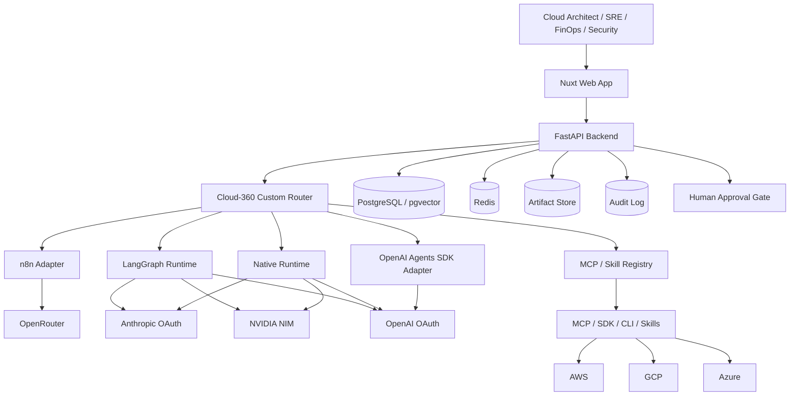

# Cloud-360 Software Architecture

> 本文件必須同時包含中文版與英文版。
> This document must include both Chinese and English versions.

## 中文版

## 1. 目的

本 SA（Software Architecture）文件定義 Cloud-360 的第一階段技術架構、主要元件、runtime 分配、模型供應商策略、資料流、部署拓撲與安全邊界。本文是 SRS 與 SD 之間的架構契約，用於指導 MVP 開發與後續 PR 審查。

## 2. 架構原則

- **Web-first**：Desktop Web 提供完整工作台；Mobile Web / Responsive Web / PWA 提供 chat、alert、approval 與 readonly diagram。
- **Provider-neutral**：Cloud-360 不綁定單一 LLM provider 或 agent framework。
- **Router-owned governance**：Cloud-360 Custom Router 掌控 intent、policy、approval、audit、tool permission 與 runtime selection。
- **Human approval gate**：高風險 cloud operation 必須經 human approval，不允許 AI 未授權直接執行 production write / delete / deploy。
- **Spec-driven**：SRS、SA、SD、ADR 與 repo contract validator 共同定義開發邊界。

## 3. 推薦技術棧

- Frontend：Nuxt、Vue 3、TypeScript、Tailwind CSS、shadcn-vue / Reka UI、Pinia、Mermaid、draw.io / diagrams.net embed。
- Backend：Python 3.12+、FastAPI、Pydantic、SQLAlchemy / SQLModel、Alembic。
- Worker / Queue：Redis、Celery 或 Dramatiq。
- Database：PostgreSQL、pgvector。
- Artifact Storage：S3-compatible object storage，用於 draw.io XML、Terraform / OpenTofu output、reports 與 exports。
- IaC / Security：OpenTofu、Terraform provider ecosystem、Checkov、Trivy、OPA / Conftest、Infracost。
- DevOps：GitHub Actions、Docker Compose、pnpm、uv、pytest、ruff、Vitest、Playwright。

## 4. Agent / Workflow runtime 分配

Cloud-360 採用 Custom Router + pluggable runtime adapter 設計：

- **Cloud-360 Custom Router**：主控層，負責 intent classification、runtime selection、model selection、policy、approval gate、audit log、MCP / Skill permission。
- **LangGraph**：核心多步 Agent workflow，例如 Architecture Design、FinOps、Security Review、IaC Generation、Operations Optimization。
- **n8n + OpenRouter**：外部自動化、webhook、notification、ticket、approval notification、daily / weekly report、低代碼 AI workflow。
- **NVIDIA Developer / NIM**：高頻推論、批次摘要、cloud inventory / finding summarization、企業內部或低延遲 inference backend。
- **Anthropic OAuth**：高品質 reasoning，適合 architecture trade-off、security policy review、ADR / SRS、Terraform review。
- **OpenAI OAuth**：AI Chat、handoff、tracing、tool calling prototype；OpenAI Agents SDK 僅作 OpenAI runtime adapter。
- **ADK**：MVP 暫緩；未來若建立 GCP / Gemini / Vertex AI specialist agent 再導入。

## 5. 高階系統架構

## 6. 主要資料流

1. 使用者在 Web App 透過 AI Chat、draw.io canvas 或 dashboard 發出需求。
2. FastAPI Backend 建立 request context，載入 project、diagram、cloud account scope、policy 與 conversation state。
3. Custom Router 判斷 intent、risk level、可用 tools、需要的 runtime 與模型 provider。
4. 若為多步流程，交給 LangGraph；若為外部通知或流程整合，交給 n8n；若為簡單推理，交給 Native Runtime。
5. Tool Execution 必須經 MCP / Skill Registry、permission model、risk classification 與 approval gate。
6. 產出結果寫入 audit log、artifact store、database，並回傳 Web App。

## 7. 安全與治理邊界

- 所有 destructive / write / deploy / IAM / RBAC / firewall / KMS / storage policy 操作預設需要 human approval。
- Agent 不直接持有長期 cloud credentials；credential scope 應由 backend 與 tool execution layer 管控。
- n8n 不得直接執行高風險 production cloud write；只能處理 notification、approval workflow、ticket 與外部 automation。
- 所有 tool call、approval、agent run、artifact generation 都必須 audit。

## 8. MVP 邊界

第一階段優先建立：

- Nuxt Web App skeleton。
- FastAPI Backend skeleton。
- Custom Router contract。
- LangGraph runtime adapter placeholder。
- n8n + OpenRouter webhook adapter。
- NVIDIA / Anthropic / OpenAI provider adapters。
- PostgreSQL / Redis / Docker Compose local dev。
- 基礎 health check、chat endpoint、mock agent response。

## English Version

## 1. Purpose

This SA (Software Architecture) document defines the first-stage technical architecture, major components, runtime allocation, model-provider strategy, data flow, deployment topology, and security boundaries for Cloud-360. It is the architecture contract between the SRS and SD documents and guides MVP implementation and pull-request review.

## 2. Architecture Principles

- **Web-first**: Desktop Web provides the full workspace; Mobile Web / Responsive Web / PWA provides chat, alerts, approvals, and readonly diagrams.
- **Provider-neutral**: Cloud-360 must not be locked into a single LLM provider or agent framework.
- **Router-owned governance**: The Cloud-360 Custom Router owns intent, policy, approval, audit, tool permission, and runtime selection.
- **Human approval gate**: High-risk cloud operations require human approval. AI must not perform unauthorized production write, delete, or deploy actions.
- **Spec-driven**: SRS, SA, SD, ADRs, and the repository contract validator define the development boundary.

## 3. Recommended Technical Stack

- Frontend: Nuxt, Vue 3, TypeScript, Tailwind CSS, shadcn-vue / Reka UI, Pinia, Mermaid, draw.io / diagrams.net embed.
- Backend: Python 3.12+, FastAPI, Pydantic, SQLAlchemy / SQLModel, Alembic.
- Worker / Queue: Redis, Celery or Dramatiq.
- Database: PostgreSQL, pgvector.
- Artifact Storage: S3-compatible object storage for draw.io XML, Terraform / OpenTofu output, reports, and exports.
- IaC / Security: OpenTofu, Terraform provider ecosystem, Checkov, Trivy, OPA / Conftest, Infracost.
- DevOps: GitHub Actions, Docker Compose, pnpm, uv, pytest, ruff, Vitest, Playwright.

## 4. Agent / Workflow Runtime Allocation

Cloud-360 uses a Custom Router with pluggable runtime adapters:

- **Cloud-360 Custom Router**: Control plane for intent classification, runtime selection, model selection, policy, approval gate, audit log, and MCP / Skill permissions.
- **LangGraph**: Core multi-step agent workflows such as Architecture Design, FinOps, Security Review, IaC Generation, and Operations Optimization.
- **n8n + OpenRouter**: External automation, webhooks, notifications, tickets, approval notifications, daily / weekly reports, and low-code AI workflows.
- **NVIDIA Developer / NIM**: High-throughput inference, batch summarization, cloud inventory / finding summarization, and enterprise or low-latency inference backend.
- **Anthropic OAuth**: High-quality reasoning for architecture trade-offs, security policy review, ADR / SRS, and Terraform review.
- **OpenAI OAuth**: AI Chat, handoff, tracing, and tool-calling prototypes; the OpenAI Agents SDK is only an OpenAI runtime adapter.
- **ADK**: Deferred for MVP; introduce it later only for GCP / Gemini / Vertex AI specialist agents.

## 5. High-Level System Architecture

## 6. Primary Data Flow

1. The user sends a request through AI Chat, the draw.io canvas, or dashboards in the Web App.
2. The FastAPI Backend builds request context from project, diagram, cloud account scope, policy, and conversation state.
3. The Custom Router determines intent, risk level, available tools, runtime, and model provider.
4. Multi-step workflows go to LangGraph; external automation goes to n8n; simple reasoning goes to the Native Runtime.
5. Tool execution must pass through the MCP / Skill Registry, permission model, risk classification, and approval gate.
6. Results are written to audit logs, artifact storage, and the database, then returned to the Web App.

## 7. Security and Governance Boundaries

- All destructive, write, deploy, IAM, RBAC, firewall, KMS, and storage-policy operations require human approval by default.
- Agents must not directly hold long-lived cloud credentials; credential scope must be controlled by the backend and tool execution layer.
- n8n must not directly execute high-risk production cloud writes; it should handle notifications, approval workflows, tickets, and external automation.
- All tool calls, approvals, agent runs, and artifact generation must be audited.

## 8. MVP Boundary

The first stage prioritizes:

- Nuxt Web App skeleton.
- FastAPI Backend skeleton.
- Custom Router contract.
- LangGraph runtime adapter placeholder.
- n8n + OpenRouter webhook adapter.
- NVIDIA / Anthropic / OpenAI provider adapters.
- PostgreSQL / Redis / Docker Compose local dev.
- Basic health check, chat endpoint, and mock agent response.
